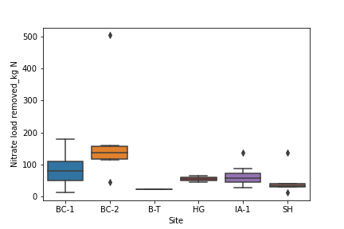

# ABE 516 Project
**Gabe Johnson**, PhD Student in Agricultural and Biosystems Engineering and Sustainable Agriculture

This website demonstrates the use of data science concepts learned in ABE 516 applied to my PhD disseration research on saturated buffers. Saturated buffers are an edge-of-field practice for reducing nitrate loss in agricultural subsurface drainage. Current research has shown these practices to be effective at removing nitrate from drainage water, but overall effectiveness is limited by the total amount of flow treated. My larger research project is focused on optimization of these practices for nitrate load reduction, analyzing the effectiveness over a longer period (5+ years), and using empirical data to predict future performance at existing or new sites.

# Research Question
The specific research question for this course project is:

**Can saturated buffer nitrate load reduction be predicted from design parameters?**

Our lab has been monitoring multiple saturated buffer sites for several years, resulting in a database of 40+ site-years of performance effectiveness data. From past and ongoing work, we know the major drivers of the performance are the length of the distribution pipe (which effectively controls the size of the practice and greatly impacts the volume of water that can be treated) and the size of the contributing drainage area. The larger the drainage area, the larger the flow and nitrate load. Thus, as the pipe length and drainage area increase, the total nitrate load removed increases. From our large dataset, we would like to be able to estimate the nitrate load removal for a new site (or an existing site in a new year) given the design parameters and other information such as precipitation. 

# Data Description
Data for this project consists of saturated buffer flow data (flow in, flow treated, flow bypassed), nitrate concentration data from inlet and outlet points (the saturated buffer control structure and various groundwater monitoring wells), and nitrate load data. Nitrate load (mass) is calculated from flow (volume) and concentration data (mass per volume) for annual sampling dates. 

We use pressure transducers to monitor water level in control structures at each site. This data is stored on a server shared with our partners at the USDA-ARS National Laboratory for Agriculture and the Environment. This data is used with weir flow equations to calculate flow data. Water samples are analyzed for nitrate concentration both by our ISU lab and NLAE. This data is generated into excel and csv files for each sample data that get combined into one file for the year. 

## Data wrangling
### Description
Data wrangling consists of processing flow and nitrate concentration data into clean, quality-controlled files, calculating nitrate load, and summarizing data for individual site-years and across site-years. 

Flow:
* hourly flowrates (in, bypass, treated) calculated from monitored water levels and processed for missing or extreme data
* cumulative flow volumes calculated 

Nitrate Concentration:
* raw concentration data files processed to extract sampling dates and concentration values for sample locations
* creation of clean dataframe or csv file of concentration summarized by sample data and inlet and outlet concentrations

NO3-N Load:
* incremental and cumulative loads (in, diverted, treated) calculated from cumulative flows and clean nitrate concentration data

Site-Year Summary Data:
* Annual summary metrics (total NO3-N load removed, total flow treated, percent NO3-N load reduction, and many others) calculated and organized into one tidy dataframe or csv file

### Implementation
Flow data wrangling can be seen in [this jupyter notebook](./project-wrangling-1.md).

Nitrate concentration data wrangling can be seen in [this jupyter notebook](./project-wrangling-2.md)

Nitrate load and summary data wrangling can be seen in [this jupyter notebook](./project-wrangling-3.md)

# Data Exploration




# Models
insert here

# Results
insert here

# Discussion
insert here

_______________________________________________________

# Template Code left temporarily for reference

> This is a blockquote following a header.
>
> When something is important enough, you do it even if the odds are not in your favor.

### Header 3

```js
// Javascript code with syntax highlighting.
var fun = function lang(l) {
  dateformat.i18n = require('./lang/' + l)
  return true;
}
```

```ruby
# Ruby code with syntax highlighting
GitHubPages::Dependencies.gems.each do |gem, version|
  s.add_dependency(gem, "= #{version}")
end
```


###### Header 6

| head1        | head two          | three |
|:-------------|:------------------|:------|
| ok           | good swedish fish | nice  |
| out of stock | good and plenty   | nice  |
| ok           | good `oreos`      | hmm   |
| ok           | good `zoute` drop | yumm  |

### There's a horizontal rule below this.

* * *

### Here is an unordered list:

*   Item foo
*   Item bar
*   Item baz
*   Item zip

### And an ordered list:

1.  Item one
1.  Item two
1.  Item three
1.  Item four

### And a nested list:

- level 1 item
  - level 2 item
  - level 2 item
    - level 3 item
    - level 3 item
- level 1 item
  - level 2 item
  - level 2 item
  - level 2 item
- level 1 item
  - level 2 item
  - level 2 item
- level 1 item

### Small image


### Large image


```
Long, single-line code blocks should not wrap. They should horizontally scroll if they are too long. This line should be long enough to demonstrate this.
```

```
The final element.
```
