# ABE 516 Project Data Exploration and Modeling

## Import libraries


```python
#imports
import pandas as pd
import seaborn as sns
import matplotlib.pyplot as plt
import math
import numpy as np
import datetime as dt


# allow plots to appear directly in the notebook
%matplotlib inline
```

## Read in data


```python
summary_df = pd.read_csv("SB Performance Summary_IA.csv")
summary_df
```


<div>
<style scoped>
    .dataframe tbody tr th:only-of-type {
        vertical-align: middle;
    }

    .dataframe tbody tr th {
        vertical-align: top;
    }

    .dataframe thead th {
        text-align: right;
    }
</style>
<table border="1" class="dataframe">
  <thead>
    <tr style="text-align: right;">
      <th></th>
      <th>Study</th>
      <th>State</th>
      <th>County</th>
      <th>Site</th>
      <th>Year</th>
      <th>Annual Precip_mm/y</th>
      <th>days with tile flow</th>
      <th>total tile flow_mm/y</th>
      <th>tile flow diverted_mm/y</th>
      <th>Drainage Area_ha</th>
      <th>...</th>
      <th>Nitrate yield from field_kg N/ha</th>
      <th>Nitrate Load diverted_kg N</th>
      <th>Nitrate yield diverted_kg N/ha</th>
      <th>Nitrate load removed_kg N</th>
      <th>Nitrate yield removed_kg N/ha</th>
      <th>Buffer Removal Percentage</th>
      <th>EOF Removal Percentage</th>
      <th>Flow Diversion Percentage</th>
      <th>NO3-N removal rate_g/m/d</th>
      <th>Notes</th>
    </tr>
  </thead>
  <tbody>
    <tr>
      <th>0</th>
      <td>Jaynes and Isenhart 2018</td>
      <td>IA</td>
      <td>Hamilton</td>
      <td>BC-1</td>
      <td>2011</td>
      <td>815.0</td>
      <td>143</td>
      <td>198.00</td>
      <td>111.00</td>
      <td>10.1</td>
      <td>...</td>
      <td>21.80</td>
      <td>123.0</td>
      <td>12.2</td>
      <td>123.0</td>
      <td>12.20</td>
      <td>1.000</td>
      <td>0.559</td>
      <td>0.560</td>
      <td>2.568</td>
      <td>NaN</td>
    </tr>
    <tr>
      <th>1</th>
      <td>Jaynes and Isenhart 2018</td>
      <td>IA</td>
      <td>Hamilton</td>
      <td>BC-1</td>
      <td>2012</td>
      <td>637.0</td>
      <td>108</td>
      <td>140.00</td>
      <td>70.00</td>
      <td>10.1</td>
      <td>...</td>
      <td>19.80</td>
      <td>92.0</td>
      <td>9.1</td>
      <td>84.0</td>
      <td>8.30</td>
      <td>0.913</td>
      <td>0.420</td>
      <td>0.500</td>
      <td>2.322</td>
      <td>NaN</td>
    </tr>
    <tr>
      <th>2</th>
      <td>Jaynes and Isenhart 2018</td>
      <td>IA</td>
      <td>Hamilton</td>
      <td>BC-1</td>
      <td>2013</td>
      <td>695.0</td>
      <td>129</td>
      <td>429.00</td>
      <td>135.00</td>
      <td>10.1</td>
      <td>...</td>
      <td>50.90</td>
      <td>181.0</td>
      <td>17.9</td>
      <td>179.0</td>
      <td>17.70</td>
      <td>0.989</td>
      <td>0.348</td>
      <td>0.320</td>
      <td>4.142</td>
      <td>NaN</td>
    </tr>
    <tr>
      <th>3</th>
      <td>Jaynes and Isenhart 2018</td>
      <td>IA</td>
      <td>Hamilton</td>
      <td>BC-1</td>
      <td>2014</td>
      <td>1027.0</td>
      <td>153</td>
      <td>406.00</td>
      <td>157.00</td>
      <td>5.9</td>
      <td>...</td>
      <td>54.20</td>
      <td>111.0</td>
      <td>18.8</td>
      <td>111.0</td>
      <td>18.80</td>
      <td>1.000</td>
      <td>0.347</td>
      <td>0.390</td>
      <td>2.166</td>
      <td>NaN</td>
    </tr>
    <tr>
      <th>4</th>
      <td>Jaynes and Isenhart 2018</td>
      <td>IA</td>
      <td>Hamilton</td>
      <td>BC-1</td>
      <td>2015</td>
      <td>1133.0</td>
      <td>212</td>
      <td>468.00</td>
      <td>223.00</td>
      <td>5.9</td>
      <td>...</td>
      <td>39.50</td>
      <td>85.0</td>
      <td>14.4</td>
      <td>80.0</td>
      <td>13.60</td>
      <td>0.941</td>
      <td>0.343</td>
      <td>0.480</td>
      <td>1.126</td>
      <td>NaN</td>
    </tr>
    <tr>
      <th>5</th>
      <td>Jaynes and Isenhart 2018</td>
      <td>IA</td>
      <td>Hamilton</td>
      <td>BC-1</td>
      <td>2016</td>
      <td>955.0</td>
      <td>161</td>
      <td>204.00</td>
      <td>99.00</td>
      <td>5.9</td>
      <td>...</td>
      <td>18.80</td>
      <td>55.0</td>
      <td>9.3</td>
      <td>53.0</td>
      <td>9.00</td>
      <td>0.964</td>
      <td>0.477</td>
      <td>0.480</td>
      <td>0.983</td>
      <td>NaN</td>
    </tr>
    <tr>
      <th>6</th>
      <td>Jaynes and Isenhart 2018</td>
      <td>IA</td>
      <td>Hamilton</td>
      <td>BC-1</td>
      <td>2017</td>
      <td>899.0</td>
      <td>97</td>
      <td>187.00</td>
      <td>66.00</td>
      <td>5.9</td>
      <td>...</td>
      <td>25.60</td>
      <td>51.0</td>
      <td>8.6</td>
      <td>47.0</td>
      <td>8.00</td>
      <td>0.922</td>
      <td>0.311</td>
      <td>0.350</td>
      <td>1.446</td>
      <td>NaN</td>
    </tr>
    <tr>
      <th>7</th>
      <td>Johnson et al. XXXX</td>
      <td>IA</td>
      <td>Hamilton</td>
      <td>BC-1</td>
      <td>2018</td>
      <td>1208.4</td>
      <td>194</td>
      <td>367.00</td>
      <td>195.00</td>
      <td>5.9</td>
      <td>...</td>
      <td>37.12</td>
      <td>117.0</td>
      <td>19.8</td>
      <td>108.0</td>
      <td>18.31</td>
      <td>0.923</td>
      <td>0.493</td>
      <td>0.531</td>
      <td>1.662</td>
      <td>NaN</td>
    </tr>
    <tr>
      <th>8</th>
      <td>Johnson et al. XXXX</td>
      <td>IA</td>
      <td>Hamilton</td>
      <td>BC-1</td>
      <td>2019</td>
      <td>1007.1</td>
      <td>240</td>
      <td>215.00</td>
      <td>63.00</td>
      <td>5.9</td>
      <td>...</td>
      <td>44.07</td>
      <td>78.3</td>
      <td>13.3</td>
      <td>75.3</td>
      <td>12.76</td>
      <td>0.962</td>
      <td>0.290</td>
      <td>0.293</td>
      <td>0.937</td>
      <td>NaN</td>
    </tr>
    <tr>
      <th>9</th>
      <td>Johnson et al. XXXX</td>
      <td>IA</td>
      <td>Hamilton</td>
      <td>BC-1</td>
      <td>2020</td>
      <td>788.6</td>
      <td>138</td>
      <td>140.00</td>
      <td>41.00</td>
      <td>5.9</td>
      <td>...</td>
      <td>16.02</td>
      <td>26.5</td>
      <td>4.5</td>
      <td>26.2</td>
      <td>4.44</td>
      <td>0.989</td>
      <td>0.277</td>
      <td>0.293</td>
      <td>0.567</td>
      <td>NaN</td>
    </tr>
    <tr>
      <th>10</th>
      <td>Johnson et al. XXXX</td>
      <td>IA</td>
      <td>Hamilton</td>
      <td>BC-1</td>
      <td>2021</td>
      <td>707.3</td>
      <td>45</td>
      <td>28.50</td>
      <td>21.60</td>
      <td>5.9</td>
      <td>...</td>
      <td>3.05</td>
      <td>13.8</td>
      <td>2.3</td>
      <td>12.8</td>
      <td>2.17</td>
      <td>0.928</td>
      <td>0.711</td>
      <td>0.758</td>
      <td>0.849</td>
      <td>NaN</td>
    </tr>
    <tr>
      <th>11</th>
      <td>Jaynes and Isenhart 2018</td>
      <td>IA</td>
      <td>Hamilton</td>
      <td>BC-2</td>
      <td>2016</td>
      <td>955.0</td>
      <td>333</td>
      <td>537.00</td>
      <td>127.00</td>
      <td>40.5</td>
      <td>...</td>
      <td>43.40</td>
      <td>444.0</td>
      <td>11.0</td>
      <td>120.0</td>
      <td>3.00</td>
      <td>0.270</td>
      <td>0.068</td>
      <td>0.230</td>
      <td>2.145</td>
      <td>NaN</td>
    </tr>
    <tr>
      <th>12</th>
      <td>Jaynes and Isenhart 2018</td>
      <td>IA</td>
      <td>Hamilton</td>
      <td>BC-2</td>
      <td>2017</td>
      <td>899.0</td>
      <td>226</td>
      <td>392.00</td>
      <td>69.00</td>
      <td>40.5</td>
      <td>...</td>
      <td>32.90</td>
      <td>234.0</td>
      <td>5.8</td>
      <td>115.0</td>
      <td>2.80</td>
      <td>0.491</td>
      <td>0.086</td>
      <td>0.190</td>
      <td>3.029</td>
      <td>NaN</td>
    </tr>
    <tr>
      <th>13</th>
      <td>Johnson et al. XXXX</td>
      <td>IA</td>
      <td>Hamilton</td>
      <td>BC-2</td>
      <td>2018</td>
      <td>1208.4</td>
      <td>356</td>
      <td>551.00</td>
      <td>201.00</td>
      <td>40.5</td>
      <td>...</td>
      <td>38.52</td>
      <td>601.0</td>
      <td>14.8</td>
      <td>503.0</td>
      <td>12.42</td>
      <td>0.837</td>
      <td>0.322</td>
      <td>0.365</td>
      <td>8.410</td>
      <td>NaN</td>
    </tr>
    <tr>
      <th>14</th>
      <td>Johnson et al. XXXX</td>
      <td>IA</td>
      <td>Hamilton</td>
      <td>BC-2</td>
      <td>2019</td>
      <td>1007.1</td>
      <td>320</td>
      <td>242.00</td>
      <td>44.90</td>
      <td>40.5</td>
      <td>...</td>
      <td>30.37</td>
      <td>178.0</td>
      <td>4.4</td>
      <td>155.0</td>
      <td>3.83</td>
      <td>0.871</td>
      <td>0.126</td>
      <td>0.186</td>
      <td>2.883</td>
      <td>NaN</td>
    </tr>
    <tr>
      <th>15</th>
      <td>Johnson et al. XXXX</td>
      <td>IA</td>
      <td>Hamilton</td>
      <td>BC-2</td>
      <td>2020</td>
      <td>788.6</td>
      <td>205</td>
      <td>101.00</td>
      <td>15.90</td>
      <td>40.5</td>
      <td>...</td>
      <td>10.12</td>
      <td>63.6</td>
      <td>1.6</td>
      <td>45.7</td>
      <td>1.13</td>
      <td>0.719</td>
      <td>0.111</td>
      <td>0.157</td>
      <td>1.327</td>
      <td>NaN</td>
    </tr>
    <tr>
      <th>16</th>
      <td>Johnson et al. XXXX</td>
      <td>IA</td>
      <td>Hamilton</td>
      <td>BC-2</td>
      <td>2021</td>
      <td>707.3</td>
      <td>182</td>
      <td>113.00</td>
      <td>45.00</td>
      <td>40.5</td>
      <td>...</td>
      <td>9.46</td>
      <td>171.0</td>
      <td>4.2</td>
      <td>159.0</td>
      <td>3.93</td>
      <td>0.930</td>
      <td>0.415</td>
      <td>0.398</td>
      <td>5.200</td>
      <td>NaN</td>
    </tr>
    <tr>
      <th>17</th>
      <td>Jaynes and Isenhart 2018</td>
      <td>IA</td>
      <td>Tama</td>
      <td>B-T</td>
      <td>2016</td>
      <td>1073.0</td>
      <td>105</td>
      <td>34.00</td>
      <td>13.00</td>
      <td>7.1</td>
      <td>...</td>
      <td>8.50</td>
      <td>28.0</td>
      <td>3.9</td>
      <td>24.0</td>
      <td>3.40</td>
      <td>0.857</td>
      <td>0.400</td>
      <td>0.380</td>
      <td>1.988</td>
      <td>NaN</td>
    </tr>
    <tr>
      <th>18</th>
      <td>Jaynes and Isenhart 2018</td>
      <td>IA</td>
      <td>Tama</td>
      <td>B-T</td>
      <td>2017</td>
      <td>749.0</td>
      <td>96</td>
      <td>67.00</td>
      <td>39.00</td>
      <td>7.1</td>
      <td>...</td>
      <td>5.20</td>
      <td>23.0</td>
      <td>3.2</td>
      <td>23.0</td>
      <td>3.20</td>
      <td>1.000</td>
      <td>0.622</td>
      <td>0.580</td>
      <td>2.083</td>
      <td>NaN</td>
    </tr>
    <tr>
      <th>19</th>
      <td>Jaynes and Isenhart 2018</td>
      <td>IA</td>
      <td>Story</td>
      <td>HG</td>
      <td>2016</td>
      <td>896.0</td>
      <td>200</td>
      <td>191.00</td>
      <td>39.00</td>
      <td>21.8</td>
      <td>...</td>
      <td>10.20</td>
      <td>47.0</td>
      <td>2.2</td>
      <td>46.0</td>
      <td>2.10</td>
      <td>0.979</td>
      <td>0.207</td>
      <td>0.210</td>
      <td>1.855</td>
      <td>NaN</td>
    </tr>
    <tr>
      <th>20</th>
      <td>Jaynes and Isenhart 2018</td>
      <td>IA</td>
      <td>Story</td>
      <td>HG</td>
      <td>2017</td>
      <td>836.0</td>
      <td>212</td>
      <td>149.00</td>
      <td>37.00</td>
      <td>21.8</td>
      <td>...</td>
      <td>10.30</td>
      <td>65.0</td>
      <td>3.0</td>
      <td>64.0</td>
      <td>2.90</td>
      <td>0.985</td>
      <td>0.284</td>
      <td>0.250</td>
      <td>2.435</td>
      <td>NaN</td>
    </tr>
    <tr>
      <th>21</th>
      <td>Jaynes and Isenhart 2018</td>
      <td>IA</td>
      <td>Hamilton</td>
      <td>IA-1</td>
      <td>2014</td>
      <td>1104.0</td>
      <td>82</td>
      <td>94.00</td>
      <td>78.00</td>
      <td>4.7</td>
      <td>...</td>
      <td>14.30</td>
      <td>56.0</td>
      <td>11.9</td>
      <td>55.0</td>
      <td>11.70</td>
      <td>0.982</td>
      <td>0.821</td>
      <td>0.830</td>
      <td>2.178</td>
      <td>NaN</td>
    </tr>
    <tr>
      <th>22</th>
      <td>Jaynes and Isenhart 2018</td>
      <td>IA</td>
      <td>Hamilton</td>
      <td>IA-1</td>
      <td>2015</td>
      <td>1186.0</td>
      <td>179</td>
      <td>281.00</td>
      <td>257.00</td>
      <td>4.7</td>
      <td>...</td>
      <td>16.20</td>
      <td>70.0</td>
      <td>14.9</td>
      <td>59.0</td>
      <td>12.60</td>
      <td>0.843</td>
      <td>0.776</td>
      <td>0.910</td>
      <td>1.070</td>
      <td>NaN</td>
    </tr>
    <tr>
      <th>23</th>
      <td>Jaynes and Isenhart 2018</td>
      <td>IA</td>
      <td>Hamilton</td>
      <td>IA-1</td>
      <td>2016</td>
      <td>1009.0</td>
      <td>185</td>
      <td>177.00</td>
      <td>173.00</td>
      <td>4.7</td>
      <td>...</td>
      <td>13.20</td>
      <td>61.0</td>
      <td>13.0</td>
      <td>57.0</td>
      <td>12.10</td>
      <td>0.934</td>
      <td>0.919</td>
      <td>0.970</td>
      <td>1.000</td>
      <td>NaN</td>
    </tr>
    <tr>
      <th>24</th>
      <td>Jaynes and Isenhart 2018</td>
      <td>IA</td>
      <td>Hamilton</td>
      <td>IA-1</td>
      <td>2017</td>
      <td>898.0</td>
      <td>133</td>
      <td>210.00</td>
      <td>209.00</td>
      <td>4.7</td>
      <td>...</td>
      <td>8.70</td>
      <td>40.0</td>
      <td>8.5</td>
      <td>36.0</td>
      <td>7.70</td>
      <td>0.900</td>
      <td>0.878</td>
      <td>1.000</td>
      <td>0.879</td>
      <td>NaN</td>
    </tr>
    <tr>
      <th>25</th>
      <td>Johnson et al. XXXX</td>
      <td>IA</td>
      <td>Hamilton</td>
      <td>IA-1</td>
      <td>2018</td>
      <td>1208.4</td>
      <td>191</td>
      <td>412.00</td>
      <td>399.00</td>
      <td>4.7</td>
      <td>...</td>
      <td>31.91</td>
      <td>145.0</td>
      <td>30.9</td>
      <td>138.0</td>
      <td>29.36</td>
      <td>0.952</td>
      <td>0.920</td>
      <td>0.968</td>
      <td>2.346</td>
      <td>NaN</td>
    </tr>
    <tr>
      <th>26</th>
      <td>Johnson et al. XXXX</td>
      <td>IA</td>
      <td>Hamilton</td>
      <td>IA-1</td>
      <td>2019</td>
      <td>1007.1</td>
      <td>228</td>
      <td>480.00</td>
      <td>420.00</td>
      <td>4.7</td>
      <td>...</td>
      <td>24.68</td>
      <td>98.8</td>
      <td>21.0</td>
      <td>87.9</td>
      <td>18.70</td>
      <td>0.890</td>
      <td>0.758</td>
      <td>0.875</td>
      <td>1.252</td>
      <td>NaN</td>
    </tr>
    <tr>
      <th>27</th>
      <td>Johnson et al. XXXX</td>
      <td>IA</td>
      <td>Hamilton</td>
      <td>IA-1</td>
      <td>2020</td>
      <td>788.6</td>
      <td>79</td>
      <td>87.90</td>
      <td>58.60</td>
      <td>4.7</td>
      <td>...</td>
      <td>10.11</td>
      <td>31.5</td>
      <td>6.7</td>
      <td>28.0</td>
      <td>5.96</td>
      <td>0.889</td>
      <td>0.589</td>
      <td>0.667</td>
      <td>1.151</td>
      <td>NaN</td>
    </tr>
    <tr>
      <th>28</th>
      <td>Johnson et al. XXXX</td>
      <td>IA</td>
      <td>Hamilton</td>
      <td>IA-1</td>
      <td>2021</td>
      <td>707.3</td>
      <td>5</td>
      <td>0.16</td>
      <td>0.16</td>
      <td>4.7</td>
      <td>...</td>
      <td>NaN</td>
      <td>NaN</td>
      <td>NaN</td>
      <td>NaN</td>
      <td>NaN</td>
      <td>NaN</td>
      <td>NaN</td>
      <td>NaN</td>
      <td>0.000</td>
      <td>% Flow diverted is 1.0 but it messes up the graph</td>
    </tr>
    <tr>
      <th>29</th>
      <td>Jaynes and Isenhart 2018</td>
      <td>IA</td>
      <td>Boone</td>
      <td>SH</td>
      <td>2016</td>
      <td>1067.0</td>
      <td>172</td>
      <td>248.00</td>
      <td>115.00</td>
      <td>3.5</td>
      <td>...</td>
      <td>17.40</td>
      <td>27.0</td>
      <td>7.7</td>
      <td>13.0</td>
      <td>3.70</td>
      <td>0.481</td>
      <td>0.213</td>
      <td>0.460</td>
      <td>0.284</td>
      <td>NaN</td>
    </tr>
    <tr>
      <th>30</th>
      <td>Jaynes and Isenhart 2018</td>
      <td>IA</td>
      <td>Boone</td>
      <td>SH</td>
      <td>2017</td>
      <td>863.0</td>
      <td>222</td>
      <td>654.00</td>
      <td>325.00</td>
      <td>3.5</td>
      <td>...</td>
      <td>58.60</td>
      <td>94.0</td>
      <td>26.9</td>
      <td>31.0</td>
      <td>8.90</td>
      <td>0.330</td>
      <td>0.151</td>
      <td>0.500</td>
      <td>0.525</td>
      <td>NaN</td>
    </tr>
    <tr>
      <th>31</th>
      <td>Johnson et al. XXXX</td>
      <td>IA</td>
      <td>Hamilton</td>
      <td>SH</td>
      <td>2018</td>
      <td>1401.6</td>
      <td>310</td>
      <td>1388.00</td>
      <td>593.00</td>
      <td>3.5</td>
      <td>...</td>
      <td>142.57</td>
      <td>207.0</td>
      <td>59.1</td>
      <td>137.0</td>
      <td>39.14</td>
      <td>0.662</td>
      <td>0.275</td>
      <td>0.427</td>
      <td>1.661</td>
      <td>NaN</td>
    </tr>
    <tr>
      <th>32</th>
      <td>Johnson et al. XXXX</td>
      <td>IA</td>
      <td>Hamilton</td>
      <td>SH</td>
      <td>2019</td>
      <td>999.6</td>
      <td>288</td>
      <td>601.00</td>
      <td>264.00</td>
      <td>3.5</td>
      <td>...</td>
      <td>47.14</td>
      <td>70.1</td>
      <td>20.0</td>
      <td>41.5</td>
      <td>11.86</td>
      <td>0.592</td>
      <td>0.252</td>
      <td>0.439</td>
      <td>0.542</td>
      <td>NaN</td>
    </tr>
    <tr>
      <th>33</th>
      <td>Johnson et al. XXXX</td>
      <td>IA</td>
      <td>Hamilton</td>
      <td>SH</td>
      <td>2020</td>
      <td>645.3</td>
      <td>190</td>
      <td>224.00</td>
      <td>148.00</td>
      <td>3.5</td>
      <td>...</td>
      <td>20.57</td>
      <td>47.9</td>
      <td>13.7</td>
      <td>31.1</td>
      <td>8.89</td>
      <td>0.649</td>
      <td>0.432</td>
      <td>0.661</td>
      <td>0.615</td>
      <td>NaN</td>
    </tr>
    <tr>
      <th>34</th>
      <td>Johnson et al. XXXX</td>
      <td>IA</td>
      <td>Hamilton</td>
      <td>SH</td>
      <td>2021</td>
      <td>740.8</td>
      <td>163</td>
      <td>160.00</td>
      <td>138.00</td>
      <td>3.5</td>
      <td>...</td>
      <td>12.66</td>
      <td>38.2</td>
      <td>10.9</td>
      <td>35.5</td>
      <td>10.14</td>
      <td>0.929</td>
      <td>0.801</td>
      <td>0.863</td>
      <td>0.819</td>
      <td>NaN</td>
    </tr>
  </tbody>
</table>
<p>35 rows × 22 columns</p>
</div>


```python
total_site_years = summary_df.shape[0]
print(total_site_years)
```

    35
    

**Add additional column for the product of distribution pipe length and drainage area**

This was found to be the strongest predictor of load removed in a prior study.


```python
summary_df["pipe_length_times_DA"] = summary_df["Distribution pipe length_m"] * summary_df["Drainage Area_ha"]
summary_df
```


<div>
<style scoped>
    .dataframe tbody tr th:only-of-type {
        vertical-align: middle;
    }

    .dataframe tbody tr th {
        vertical-align: top;
    }

    .dataframe thead th {
        text-align: right;
    }
</style>
<table border="1" class="dataframe">
  <thead>
    <tr style="text-align: right;">
      <th></th>
      <th>Study</th>
      <th>State</th>
      <th>County</th>
      <th>Site</th>
      <th>Year</th>
      <th>Annual Precip_mm/y</th>
      <th>days with tile flow</th>
      <th>total tile flow_mm/y</th>
      <th>tile flow diverted_mm/y</th>
      <th>Drainage Area_ha</th>
      <th>...</th>
      <th>Nitrate Load diverted_kg N</th>
      <th>Nitrate yield diverted_kg N/ha</th>
      <th>Nitrate load removed_kg N</th>
      <th>Nitrate yield removed_kg N/ha</th>
      <th>Buffer Removal Percentage</th>
      <th>EOF Removal Percentage</th>
      <th>Flow Diversion Percentage</th>
      <th>NO3-N removal rate_g/m/d</th>
      <th>Notes</th>
      <th>pipe_length_times_DA</th>
    </tr>
  </thead>
  <tbody>
    <tr>
      <th>0</th>
      <td>Jaynes and Isenhart 2018</td>
      <td>IA</td>
      <td>Hamilton</td>
      <td>BC-1</td>
      <td>2011</td>
      <td>815.0</td>
      <td>143</td>
      <td>198.00</td>
      <td>111.00</td>
      <td>10.1</td>
      <td>...</td>
      <td>123.0</td>
      <td>12.2</td>
      <td>123.0</td>
      <td>12.20</td>
      <td>1.000</td>
      <td>0.559</td>
      <td>0.560</td>
      <td>2.568</td>
      <td>NaN</td>
      <td>3383.5</td>
    </tr>
    <tr>
      <th>1</th>
      <td>Jaynes and Isenhart 2018</td>
      <td>IA</td>
      <td>Hamilton</td>
      <td>BC-1</td>
      <td>2012</td>
      <td>637.0</td>
      <td>108</td>
      <td>140.00</td>
      <td>70.00</td>
      <td>10.1</td>
      <td>...</td>
      <td>92.0</td>
      <td>9.1</td>
      <td>84.0</td>
      <td>8.30</td>
      <td>0.913</td>
      <td>0.420</td>
      <td>0.500</td>
      <td>2.322</td>
      <td>NaN</td>
      <td>3383.5</td>
    </tr>
    <tr>
      <th>2</th>
      <td>Jaynes and Isenhart 2018</td>
      <td>IA</td>
      <td>Hamilton</td>
      <td>BC-1</td>
      <td>2013</td>
      <td>695.0</td>
      <td>129</td>
      <td>429.00</td>
      <td>135.00</td>
      <td>10.1</td>
      <td>...</td>
      <td>181.0</td>
      <td>17.9</td>
      <td>179.0</td>
      <td>17.70</td>
      <td>0.989</td>
      <td>0.348</td>
      <td>0.320</td>
      <td>4.142</td>
      <td>NaN</td>
      <td>3383.5</td>
    </tr>
    <tr>
      <th>3</th>
      <td>Jaynes and Isenhart 2018</td>
      <td>IA</td>
      <td>Hamilton</td>
      <td>BC-1</td>
      <td>2014</td>
      <td>1027.0</td>
      <td>153</td>
      <td>406.00</td>
      <td>157.00</td>
      <td>5.9</td>
      <td>...</td>
      <td>111.0</td>
      <td>18.8</td>
      <td>111.0</td>
      <td>18.80</td>
      <td>1.000</td>
      <td>0.347</td>
      <td>0.390</td>
      <td>2.166</td>
      <td>NaN</td>
      <td>1976.5</td>
    </tr>
    <tr>
      <th>4</th>
      <td>Jaynes and Isenhart 2018</td>
      <td>IA</td>
      <td>Hamilton</td>
      <td>BC-1</td>
      <td>2015</td>
      <td>1133.0</td>
      <td>212</td>
      <td>468.00</td>
      <td>223.00</td>
      <td>5.9</td>
      <td>...</td>
      <td>85.0</td>
      <td>14.4</td>
      <td>80.0</td>
      <td>13.60</td>
      <td>0.941</td>
      <td>0.343</td>
      <td>0.480</td>
      <td>1.126</td>
      <td>NaN</td>
      <td>1976.5</td>
    </tr>
    <tr>
      <th>5</th>
      <td>Jaynes and Isenhart 2018</td>
      <td>IA</td>
      <td>Hamilton</td>
      <td>BC-1</td>
      <td>2016</td>
      <td>955.0</td>
      <td>161</td>
      <td>204.00</td>
      <td>99.00</td>
      <td>5.9</td>
      <td>...</td>
      <td>55.0</td>
      <td>9.3</td>
      <td>53.0</td>
      <td>9.00</td>
      <td>0.964</td>
      <td>0.477</td>
      <td>0.480</td>
      <td>0.983</td>
      <td>NaN</td>
      <td>1976.5</td>
    </tr>
    <tr>
      <th>6</th>
      <td>Jaynes and Isenhart 2018</td>
      <td>IA</td>
      <td>Hamilton</td>
      <td>BC-1</td>
      <td>2017</td>
      <td>899.0</td>
      <td>97</td>
      <td>187.00</td>
      <td>66.00</td>
      <td>5.9</td>
      <td>...</td>
      <td>51.0</td>
      <td>8.6</td>
      <td>47.0</td>
      <td>8.00</td>
      <td>0.922</td>
      <td>0.311</td>
      <td>0.350</td>
      <td>1.446</td>
      <td>NaN</td>
      <td>1976.5</td>
    </tr>
    <tr>
      <th>7</th>
      <td>Johnson et al. XXXX</td>
      <td>IA</td>
      <td>Hamilton</td>
      <td>BC-1</td>
      <td>2018</td>
      <td>1208.4</td>
      <td>194</td>
      <td>367.00</td>
      <td>195.00</td>
      <td>5.9</td>
      <td>...</td>
      <td>117.0</td>
      <td>19.8</td>
      <td>108.0</td>
      <td>18.31</td>
      <td>0.923</td>
      <td>0.493</td>
      <td>0.531</td>
      <td>1.662</td>
      <td>NaN</td>
      <td>1976.5</td>
    </tr>
    <tr>
      <th>8</th>
      <td>Johnson et al. XXXX</td>
      <td>IA</td>
      <td>Hamilton</td>
      <td>BC-1</td>
      <td>2019</td>
      <td>1007.1</td>
      <td>240</td>
      <td>215.00</td>
      <td>63.00</td>
      <td>5.9</td>
      <td>...</td>
      <td>78.3</td>
      <td>13.3</td>
      <td>75.3</td>
      <td>12.76</td>
      <td>0.962</td>
      <td>0.290</td>
      <td>0.293</td>
      <td>0.937</td>
      <td>NaN</td>
      <td>1976.5</td>
    </tr>
    <tr>
      <th>9</th>
      <td>Johnson et al. XXXX</td>
      <td>IA</td>
      <td>Hamilton</td>
      <td>BC-1</td>
      <td>2020</td>
      <td>788.6</td>
      <td>138</td>
      <td>140.00</td>
      <td>41.00</td>
      <td>5.9</td>
      <td>...</td>
      <td>26.5</td>
      <td>4.5</td>
      <td>26.2</td>
      <td>4.44</td>
      <td>0.989</td>
      <td>0.277</td>
      <td>0.293</td>
      <td>0.567</td>
      <td>NaN</td>
      <td>1976.5</td>
    </tr>
    <tr>
      <th>10</th>
      <td>Johnson et al. XXXX</td>
      <td>IA</td>
      <td>Hamilton</td>
      <td>BC-1</td>
      <td>2021</td>
      <td>707.3</td>
      <td>45</td>
      <td>28.50</td>
      <td>21.60</td>
      <td>5.9</td>
      <td>...</td>
      <td>13.8</td>
      <td>2.3</td>
      <td>12.8</td>
      <td>2.17</td>
      <td>0.928</td>
      <td>0.711</td>
      <td>0.758</td>
      <td>0.849</td>
      <td>NaN</td>
      <td>1976.5</td>
    </tr>
    <tr>
      <th>11</th>
      <td>Jaynes and Isenhart 2018</td>
      <td>IA</td>
      <td>Hamilton</td>
      <td>BC-2</td>
      <td>2016</td>
      <td>955.0</td>
      <td>333</td>
      <td>537.00</td>
      <td>127.00</td>
      <td>40.5</td>
      <td>...</td>
      <td>444.0</td>
      <td>11.0</td>
      <td>120.0</td>
      <td>3.00</td>
      <td>0.270</td>
      <td>0.068</td>
      <td>0.230</td>
      <td>2.145</td>
      <td>NaN</td>
      <td>6804.0</td>
    </tr>
    <tr>
      <th>12</th>
      <td>Jaynes and Isenhart 2018</td>
      <td>IA</td>
      <td>Hamilton</td>
      <td>BC-2</td>
      <td>2017</td>
      <td>899.0</td>
      <td>226</td>
      <td>392.00</td>
      <td>69.00</td>
      <td>40.5</td>
      <td>...</td>
      <td>234.0</td>
      <td>5.8</td>
      <td>115.0</td>
      <td>2.80</td>
      <td>0.491</td>
      <td>0.086</td>
      <td>0.190</td>
      <td>3.029</td>
      <td>NaN</td>
      <td>6804.0</td>
    </tr>
    <tr>
      <th>13</th>
      <td>Johnson et al. XXXX</td>
      <td>IA</td>
      <td>Hamilton</td>
      <td>BC-2</td>
      <td>2018</td>
      <td>1208.4</td>
      <td>356</td>
      <td>551.00</td>
      <td>201.00</td>
      <td>40.5</td>
      <td>...</td>
      <td>601.0</td>
      <td>14.8</td>
      <td>503.0</td>
      <td>12.42</td>
      <td>0.837</td>
      <td>0.322</td>
      <td>0.365</td>
      <td>8.410</td>
      <td>NaN</td>
      <td>6804.0</td>
    </tr>
    <tr>
      <th>14</th>
      <td>Johnson et al. XXXX</td>
      <td>IA</td>
      <td>Hamilton</td>
      <td>BC-2</td>
      <td>2019</td>
      <td>1007.1</td>
      <td>320</td>
      <td>242.00</td>
      <td>44.90</td>
      <td>40.5</td>
      <td>...</td>
      <td>178.0</td>
      <td>4.4</td>
      <td>155.0</td>
      <td>3.83</td>
      <td>0.871</td>
      <td>0.126</td>
      <td>0.186</td>
      <td>2.883</td>
      <td>NaN</td>
      <td>6804.0</td>
    </tr>
    <tr>
      <th>15</th>
      <td>Johnson et al. XXXX</td>
      <td>IA</td>
      <td>Hamilton</td>
      <td>BC-2</td>
      <td>2020</td>
      <td>788.6</td>
      <td>205</td>
      <td>101.00</td>
      <td>15.90</td>
      <td>40.5</td>
      <td>...</td>
      <td>63.6</td>
      <td>1.6</td>
      <td>45.7</td>
      <td>1.13</td>
      <td>0.719</td>
      <td>0.111</td>
      <td>0.157</td>
      <td>1.327</td>
      <td>NaN</td>
      <td>6804.0</td>
    </tr>
    <tr>
      <th>16</th>
      <td>Johnson et al. XXXX</td>
      <td>IA</td>
      <td>Hamilton</td>
      <td>BC-2</td>
      <td>2021</td>
      <td>707.3</td>
      <td>182</td>
      <td>113.00</td>
      <td>45.00</td>
      <td>40.5</td>
      <td>...</td>
      <td>171.0</td>
      <td>4.2</td>
      <td>159.0</td>
      <td>3.93</td>
      <td>0.930</td>
      <td>0.415</td>
      <td>0.398</td>
      <td>5.200</td>
      <td>NaN</td>
      <td>6804.0</td>
    </tr>
    <tr>
      <th>17</th>
      <td>Jaynes and Isenhart 2018</td>
      <td>IA</td>
      <td>Tama</td>
      <td>B-T</td>
      <td>2016</td>
      <td>1073.0</td>
      <td>105</td>
      <td>34.00</td>
      <td>13.00</td>
      <td>7.1</td>
      <td>...</td>
      <td>28.0</td>
      <td>3.9</td>
      <td>24.0</td>
      <td>3.40</td>
      <td>0.857</td>
      <td>0.400</td>
      <td>0.380</td>
      <td>1.988</td>
      <td>NaN</td>
      <td>816.5</td>
    </tr>
    <tr>
      <th>18</th>
      <td>Jaynes and Isenhart 2018</td>
      <td>IA</td>
      <td>Tama</td>
      <td>B-T</td>
      <td>2017</td>
      <td>749.0</td>
      <td>96</td>
      <td>67.00</td>
      <td>39.00</td>
      <td>7.1</td>
      <td>...</td>
      <td>23.0</td>
      <td>3.2</td>
      <td>23.0</td>
      <td>3.20</td>
      <td>1.000</td>
      <td>0.622</td>
      <td>0.580</td>
      <td>2.083</td>
      <td>NaN</td>
      <td>816.5</td>
    </tr>
    <tr>
      <th>19</th>
      <td>Jaynes and Isenhart 2018</td>
      <td>IA</td>
      <td>Story</td>
      <td>HG</td>
      <td>2016</td>
      <td>896.0</td>
      <td>200</td>
      <td>191.00</td>
      <td>39.00</td>
      <td>21.8</td>
      <td>...</td>
      <td>47.0</td>
      <td>2.2</td>
      <td>46.0</td>
      <td>2.10</td>
      <td>0.979</td>
      <td>0.207</td>
      <td>0.210</td>
      <td>1.855</td>
      <td>NaN</td>
      <td>2703.2</td>
    </tr>
    <tr>
      <th>20</th>
      <td>Jaynes and Isenhart 2018</td>
      <td>IA</td>
      <td>Story</td>
      <td>HG</td>
      <td>2017</td>
      <td>836.0</td>
      <td>212</td>
      <td>149.00</td>
      <td>37.00</td>
      <td>21.8</td>
      <td>...</td>
      <td>65.0</td>
      <td>3.0</td>
      <td>64.0</td>
      <td>2.90</td>
      <td>0.985</td>
      <td>0.284</td>
      <td>0.250</td>
      <td>2.435</td>
      <td>NaN</td>
      <td>2703.2</td>
    </tr>
    <tr>
      <th>21</th>
      <td>Jaynes and Isenhart 2018</td>
      <td>IA</td>
      <td>Hamilton</td>
      <td>IA-1</td>
      <td>2014</td>
      <td>1104.0</td>
      <td>82</td>
      <td>94.00</td>
      <td>78.00</td>
      <td>4.7</td>
      <td>...</td>
      <td>56.0</td>
      <td>11.9</td>
      <td>55.0</td>
      <td>11.70</td>
      <td>0.982</td>
      <td>0.821</td>
      <td>0.830</td>
      <td>2.178</td>
      <td>NaN</td>
      <td>1447.6</td>
    </tr>
    <tr>
      <th>22</th>
      <td>Jaynes and Isenhart 2018</td>
      <td>IA</td>
      <td>Hamilton</td>
      <td>IA-1</td>
      <td>2015</td>
      <td>1186.0</td>
      <td>179</td>
      <td>281.00</td>
      <td>257.00</td>
      <td>4.7</td>
      <td>...</td>
      <td>70.0</td>
      <td>14.9</td>
      <td>59.0</td>
      <td>12.60</td>
      <td>0.843</td>
      <td>0.776</td>
      <td>0.910</td>
      <td>1.070</td>
      <td>NaN</td>
      <td>1447.6</td>
    </tr>
    <tr>
      <th>23</th>
      <td>Jaynes and Isenhart 2018</td>
      <td>IA</td>
      <td>Hamilton</td>
      <td>IA-1</td>
      <td>2016</td>
      <td>1009.0</td>
      <td>185</td>
      <td>177.00</td>
      <td>173.00</td>
      <td>4.7</td>
      <td>...</td>
      <td>61.0</td>
      <td>13.0</td>
      <td>57.0</td>
      <td>12.10</td>
      <td>0.934</td>
      <td>0.919</td>
      <td>0.970</td>
      <td>1.000</td>
      <td>NaN</td>
      <td>1447.6</td>
    </tr>
    <tr>
      <th>24</th>
      <td>Jaynes and Isenhart 2018</td>
      <td>IA</td>
      <td>Hamilton</td>
      <td>IA-1</td>
      <td>2017</td>
      <td>898.0</td>
      <td>133</td>
      <td>210.00</td>
      <td>209.00</td>
      <td>4.7</td>
      <td>...</td>
      <td>40.0</td>
      <td>8.5</td>
      <td>36.0</td>
      <td>7.70</td>
      <td>0.900</td>
      <td>0.878</td>
      <td>1.000</td>
      <td>0.879</td>
      <td>NaN</td>
      <td>1447.6</td>
    </tr>
    <tr>
      <th>25</th>
      <td>Johnson et al. XXXX</td>
      <td>IA</td>
      <td>Hamilton</td>
      <td>IA-1</td>
      <td>2018</td>
      <td>1208.4</td>
      <td>191</td>
      <td>412.00</td>
      <td>399.00</td>
      <td>4.7</td>
      <td>...</td>
      <td>145.0</td>
      <td>30.9</td>
      <td>138.0</td>
      <td>29.36</td>
      <td>0.952</td>
      <td>0.920</td>
      <td>0.968</td>
      <td>2.346</td>
      <td>NaN</td>
      <td>1447.6</td>
    </tr>
    <tr>
      <th>26</th>
      <td>Johnson et al. XXXX</td>
      <td>IA</td>
      <td>Hamilton</td>
      <td>IA-1</td>
      <td>2019</td>
      <td>1007.1</td>
      <td>228</td>
      <td>480.00</td>
      <td>420.00</td>
      <td>4.7</td>
      <td>...</td>
      <td>98.8</td>
      <td>21.0</td>
      <td>87.9</td>
      <td>18.70</td>
      <td>0.890</td>
      <td>0.758</td>
      <td>0.875</td>
      <td>1.252</td>
      <td>NaN</td>
      <td>1447.6</td>
    </tr>
    <tr>
      <th>27</th>
      <td>Johnson et al. XXXX</td>
      <td>IA</td>
      <td>Hamilton</td>
      <td>IA-1</td>
      <td>2020</td>
      <td>788.6</td>
      <td>79</td>
      <td>87.90</td>
      <td>58.60</td>
      <td>4.7</td>
      <td>...</td>
      <td>31.5</td>
      <td>6.7</td>
      <td>28.0</td>
      <td>5.96</td>
      <td>0.889</td>
      <td>0.589</td>
      <td>0.667</td>
      <td>1.151</td>
      <td>NaN</td>
      <td>1447.6</td>
    </tr>
    <tr>
      <th>28</th>
      <td>Johnson et al. XXXX</td>
      <td>IA</td>
      <td>Hamilton</td>
      <td>IA-1</td>
      <td>2021</td>
      <td>707.3</td>
      <td>5</td>
      <td>0.16</td>
      <td>0.16</td>
      <td>4.7</td>
      <td>...</td>
      <td>NaN</td>
      <td>NaN</td>
      <td>NaN</td>
      <td>NaN</td>
      <td>NaN</td>
      <td>NaN</td>
      <td>NaN</td>
      <td>0.000</td>
      <td>% Flow diverted is 1.0 but it messes up the graph</td>
      <td>1447.6</td>
    </tr>
    <tr>
      <th>29</th>
      <td>Jaynes and Isenhart 2018</td>
      <td>IA</td>
      <td>Boone</td>
      <td>SH</td>
      <td>2016</td>
      <td>1067.0</td>
      <td>172</td>
      <td>248.00</td>
      <td>115.00</td>
      <td>3.5</td>
      <td>...</td>
      <td>27.0</td>
      <td>7.7</td>
      <td>13.0</td>
      <td>3.70</td>
      <td>0.481</td>
      <td>0.213</td>
      <td>0.460</td>
      <td>0.284</td>
      <td>NaN</td>
      <td>931.0</td>
    </tr>
    <tr>
      <th>30</th>
      <td>Jaynes and Isenhart 2018</td>
      <td>IA</td>
      <td>Boone</td>
      <td>SH</td>
      <td>2017</td>
      <td>863.0</td>
      <td>222</td>
      <td>654.00</td>
      <td>325.00</td>
      <td>3.5</td>
      <td>...</td>
      <td>94.0</td>
      <td>26.9</td>
      <td>31.0</td>
      <td>8.90</td>
      <td>0.330</td>
      <td>0.151</td>
      <td>0.500</td>
      <td>0.525</td>
      <td>NaN</td>
      <td>931.0</td>
    </tr>
    <tr>
      <th>31</th>
      <td>Johnson et al. XXXX</td>
      <td>IA</td>
      <td>Hamilton</td>
      <td>SH</td>
      <td>2018</td>
      <td>1401.6</td>
      <td>310</td>
      <td>1388.00</td>
      <td>593.00</td>
      <td>3.5</td>
      <td>...</td>
      <td>207.0</td>
      <td>59.1</td>
      <td>137.0</td>
      <td>39.14</td>
      <td>0.662</td>
      <td>0.275</td>
      <td>0.427</td>
      <td>1.661</td>
      <td>NaN</td>
      <td>931.0</td>
    </tr>
    <tr>
      <th>32</th>
      <td>Johnson et al. XXXX</td>
      <td>IA</td>
      <td>Hamilton</td>
      <td>SH</td>
      <td>2019</td>
      <td>999.6</td>
      <td>288</td>
      <td>601.00</td>
      <td>264.00</td>
      <td>3.5</td>
      <td>...</td>
      <td>70.1</td>
      <td>20.0</td>
      <td>41.5</td>
      <td>11.86</td>
      <td>0.592</td>
      <td>0.252</td>
      <td>0.439</td>
      <td>0.542</td>
      <td>NaN</td>
      <td>931.0</td>
    </tr>
    <tr>
      <th>33</th>
      <td>Johnson et al. XXXX</td>
      <td>IA</td>
      <td>Hamilton</td>
      <td>SH</td>
      <td>2020</td>
      <td>645.3</td>
      <td>190</td>
      <td>224.00</td>
      <td>148.00</td>
      <td>3.5</td>
      <td>...</td>
      <td>47.9</td>
      <td>13.7</td>
      <td>31.1</td>
      <td>8.89</td>
      <td>0.649</td>
      <td>0.432</td>
      <td>0.661</td>
      <td>0.615</td>
      <td>NaN</td>
      <td>931.0</td>
    </tr>
    <tr>
      <th>34</th>
      <td>Johnson et al. XXXX</td>
      <td>IA</td>
      <td>Hamilton</td>
      <td>SH</td>
      <td>2021</td>
      <td>740.8</td>
      <td>163</td>
      <td>160.00</td>
      <td>138.00</td>
      <td>3.5</td>
      <td>...</td>
      <td>38.2</td>
      <td>10.9</td>
      <td>35.5</td>
      <td>10.14</td>
      <td>0.929</td>
      <td>0.801</td>
      <td>0.863</td>
      <td>0.819</td>
      <td>NaN</td>
      <td>931.0</td>
    </tr>
  </tbody>
</table>
<p>35 rows × 23 columns</p>
</div>


```python
summary_df = summary_df.dropna(subset = ["Nitrate load removed_kg N"])
summary_df
```


<div>
<style scoped>
    .dataframe tbody tr th:only-of-type {
        vertical-align: middle;
    }

    .dataframe tbody tr th {
        vertical-align: top;
    }

    .dataframe thead th {
        text-align: right;
    }
</style>
<table border="1" class="dataframe">
  <thead>
    <tr style="text-align: right;">
      <th></th>
      <th>Study</th>
      <th>State</th>
      <th>County</th>
      <th>Site</th>
      <th>Year</th>
      <th>Annual Precip_mm/y</th>
      <th>days with tile flow</th>
      <th>total tile flow_mm/y</th>
      <th>tile flow diverted_mm/y</th>
      <th>Drainage Area_ha</th>
      <th>...</th>
      <th>Nitrate Load diverted_kg N</th>
      <th>Nitrate yield diverted_kg N/ha</th>
      <th>Nitrate load removed_kg N</th>
      <th>Nitrate yield removed_kg N/ha</th>
      <th>Buffer Removal Percentage</th>
      <th>EOF Removal Percentage</th>
      <th>Flow Diversion Percentage</th>
      <th>NO3-N removal rate_g/m/d</th>
      <th>Notes</th>
      <th>pipe_length_times_DA</th>
    </tr>
  </thead>
  <tbody>
    <tr>
      <th>0</th>
      <td>Jaynes and Isenhart 2018</td>
      <td>IA</td>
      <td>Hamilton</td>
      <td>BC-1</td>
      <td>2011</td>
      <td>815.0</td>
      <td>143</td>
      <td>198.0</td>
      <td>111.0</td>
      <td>10.1</td>
      <td>...</td>
      <td>123.0</td>
      <td>12.2</td>
      <td>123.0</td>
      <td>12.20</td>
      <td>1.000</td>
      <td>0.559</td>
      <td>0.560</td>
      <td>2.568</td>
      <td>NaN</td>
      <td>3383.5</td>
    </tr>
    <tr>
      <th>1</th>
      <td>Jaynes and Isenhart 2018</td>
      <td>IA</td>
      <td>Hamilton</td>
      <td>BC-1</td>
      <td>2012</td>
      <td>637.0</td>
      <td>108</td>
      <td>140.0</td>
      <td>70.0</td>
      <td>10.1</td>
      <td>...</td>
      <td>92.0</td>
      <td>9.1</td>
      <td>84.0</td>
      <td>8.30</td>
      <td>0.913</td>
      <td>0.420</td>
      <td>0.500</td>
      <td>2.322</td>
      <td>NaN</td>
      <td>3383.5</td>
    </tr>
    <tr>
      <th>2</th>
      <td>Jaynes and Isenhart 2018</td>
      <td>IA</td>
      <td>Hamilton</td>
      <td>BC-1</td>
      <td>2013</td>
      <td>695.0</td>
      <td>129</td>
      <td>429.0</td>
      <td>135.0</td>
      <td>10.1</td>
      <td>...</td>
      <td>181.0</td>
      <td>17.9</td>
      <td>179.0</td>
      <td>17.70</td>
      <td>0.989</td>
      <td>0.348</td>
      <td>0.320</td>
      <td>4.142</td>
      <td>NaN</td>
      <td>3383.5</td>
    </tr>
    <tr>
      <th>3</th>
      <td>Jaynes and Isenhart 2018</td>
      <td>IA</td>
      <td>Hamilton</td>
      <td>BC-1</td>
      <td>2014</td>
      <td>1027.0</td>
      <td>153</td>
      <td>406.0</td>
      <td>157.0</td>
      <td>5.9</td>
      <td>...</td>
      <td>111.0</td>
      <td>18.8</td>
      <td>111.0</td>
      <td>18.80</td>
      <td>1.000</td>
      <td>0.347</td>
      <td>0.390</td>
      <td>2.166</td>
      <td>NaN</td>
      <td>1976.5</td>
    </tr>
    <tr>
      <th>4</th>
      <td>Jaynes and Isenhart 2018</td>
      <td>IA</td>
      <td>Hamilton</td>
      <td>BC-1</td>
      <td>2015</td>
      <td>1133.0</td>
      <td>212</td>
      <td>468.0</td>
      <td>223.0</td>
      <td>5.9</td>
      <td>...</td>
      <td>85.0</td>
      <td>14.4</td>
      <td>80.0</td>
      <td>13.60</td>
      <td>0.941</td>
      <td>0.343</td>
      <td>0.480</td>
      <td>1.126</td>
      <td>NaN</td>
      <td>1976.5</td>
    </tr>
    <tr>
      <th>5</th>
      <td>Jaynes and Isenhart 2018</td>
      <td>IA</td>
      <td>Hamilton</td>
      <td>BC-1</td>
      <td>2016</td>
      <td>955.0</td>
      <td>161</td>
      <td>204.0</td>
      <td>99.0</td>
      <td>5.9</td>
      <td>...</td>
      <td>55.0</td>
      <td>9.3</td>
      <td>53.0</td>
      <td>9.00</td>
      <td>0.964</td>
      <td>0.477</td>
      <td>0.480</td>
      <td>0.983</td>
      <td>NaN</td>
      <td>1976.5</td>
    </tr>
    <tr>
      <th>6</th>
      <td>Jaynes and Isenhart 2018</td>
      <td>IA</td>
      <td>Hamilton</td>
      <td>BC-1</td>
      <td>2017</td>
      <td>899.0</td>
      <td>97</td>
      <td>187.0</td>
      <td>66.0</td>
      <td>5.9</td>
      <td>...</td>
      <td>51.0</td>
      <td>8.6</td>
      <td>47.0</td>
      <td>8.00</td>
      <td>0.922</td>
      <td>0.311</td>
      <td>0.350</td>
      <td>1.446</td>
      <td>NaN</td>
      <td>1976.5</td>
    </tr>
    <tr>
      <th>7</th>
      <td>Johnson et al. XXXX</td>
      <td>IA</td>
      <td>Hamilton</td>
      <td>BC-1</td>
      <td>2018</td>
      <td>1208.4</td>
      <td>194</td>
      <td>367.0</td>
      <td>195.0</td>
      <td>5.9</td>
      <td>...</td>
      <td>117.0</td>
      <td>19.8</td>
      <td>108.0</td>
      <td>18.31</td>
      <td>0.923</td>
      <td>0.493</td>
      <td>0.531</td>
      <td>1.662</td>
      <td>NaN</td>
      <td>1976.5</td>
    </tr>
    <tr>
      <th>8</th>
      <td>Johnson et al. XXXX</td>
      <td>IA</td>
      <td>Hamilton</td>
      <td>BC-1</td>
      <td>2019</td>
      <td>1007.1</td>
      <td>240</td>
      <td>215.0</td>
      <td>63.0</td>
      <td>5.9</td>
      <td>...</td>
      <td>78.3</td>
      <td>13.3</td>
      <td>75.3</td>
      <td>12.76</td>
      <td>0.962</td>
      <td>0.290</td>
      <td>0.293</td>
      <td>0.937</td>
      <td>NaN</td>
      <td>1976.5</td>
    </tr>
    <tr>
      <th>9</th>
      <td>Johnson et al. XXXX</td>
      <td>IA</td>
      <td>Hamilton</td>
      <td>BC-1</td>
      <td>2020</td>
      <td>788.6</td>
      <td>138</td>
      <td>140.0</td>
      <td>41.0</td>
      <td>5.9</td>
      <td>...</td>
      <td>26.5</td>
      <td>4.5</td>
      <td>26.2</td>
      <td>4.44</td>
      <td>0.989</td>
      <td>0.277</td>
      <td>0.293</td>
      <td>0.567</td>
      <td>NaN</td>
      <td>1976.5</td>
    </tr>
    <tr>
      <th>10</th>
      <td>Johnson et al. XXXX</td>
      <td>IA</td>
      <td>Hamilton</td>
      <td>BC-1</td>
      <td>2021</td>
      <td>707.3</td>
      <td>45</td>
      <td>28.5</td>
      <td>21.6</td>
      <td>5.9</td>
      <td>...</td>
      <td>13.8</td>
      <td>2.3</td>
      <td>12.8</td>
      <td>2.17</td>
      <td>0.928</td>
      <td>0.711</td>
      <td>0.758</td>
      <td>0.849</td>
      <td>NaN</td>
      <td>1976.5</td>
    </tr>
    <tr>
      <th>11</th>
      <td>Jaynes and Isenhart 2018</td>
      <td>IA</td>
      <td>Hamilton</td>
      <td>BC-2</td>
      <td>2016</td>
      <td>955.0</td>
      <td>333</td>
      <td>537.0</td>
      <td>127.0</td>
      <td>40.5</td>
      <td>...</td>
      <td>444.0</td>
      <td>11.0</td>
      <td>120.0</td>
      <td>3.00</td>
      <td>0.270</td>
      <td>0.068</td>
      <td>0.230</td>
      <td>2.145</td>
      <td>NaN</td>
      <td>6804.0</td>
    </tr>
    <tr>
      <th>12</th>
      <td>Jaynes and Isenhart 2018</td>
      <td>IA</td>
      <td>Hamilton</td>
      <td>BC-2</td>
      <td>2017</td>
      <td>899.0</td>
      <td>226</td>
      <td>392.0</td>
      <td>69.0</td>
      <td>40.5</td>
      <td>...</td>
      <td>234.0</td>
      <td>5.8</td>
      <td>115.0</td>
      <td>2.80</td>
      <td>0.491</td>
      <td>0.086</td>
      <td>0.190</td>
      <td>3.029</td>
      <td>NaN</td>
      <td>6804.0</td>
    </tr>
    <tr>
      <th>13</th>
      <td>Johnson et al. XXXX</td>
      <td>IA</td>
      <td>Hamilton</td>
      <td>BC-2</td>
      <td>2018</td>
      <td>1208.4</td>
      <td>356</td>
      <td>551.0</td>
      <td>201.0</td>
      <td>40.5</td>
      <td>...</td>
      <td>601.0</td>
      <td>14.8</td>
      <td>503.0</td>
      <td>12.42</td>
      <td>0.837</td>
      <td>0.322</td>
      <td>0.365</td>
      <td>8.410</td>
      <td>NaN</td>
      <td>6804.0</td>
    </tr>
    <tr>
      <th>14</th>
      <td>Johnson et al. XXXX</td>
      <td>IA</td>
      <td>Hamilton</td>
      <td>BC-2</td>
      <td>2019</td>
      <td>1007.1</td>
      <td>320</td>
      <td>242.0</td>
      <td>44.9</td>
      <td>40.5</td>
      <td>...</td>
      <td>178.0</td>
      <td>4.4</td>
      <td>155.0</td>
      <td>3.83</td>
      <td>0.871</td>
      <td>0.126</td>
      <td>0.186</td>
      <td>2.883</td>
      <td>NaN</td>
      <td>6804.0</td>
    </tr>
    <tr>
      <th>15</th>
      <td>Johnson et al. XXXX</td>
      <td>IA</td>
      <td>Hamilton</td>
      <td>BC-2</td>
      <td>2020</td>
      <td>788.6</td>
      <td>205</td>
      <td>101.0</td>
      <td>15.9</td>
      <td>40.5</td>
      <td>...</td>
      <td>63.6</td>
      <td>1.6</td>
      <td>45.7</td>
      <td>1.13</td>
      <td>0.719</td>
      <td>0.111</td>
      <td>0.157</td>
      <td>1.327</td>
      <td>NaN</td>
      <td>6804.0</td>
    </tr>
    <tr>
      <th>16</th>
      <td>Johnson et al. XXXX</td>
      <td>IA</td>
      <td>Hamilton</td>
      <td>BC-2</td>
      <td>2021</td>
      <td>707.3</td>
      <td>182</td>
      <td>113.0</td>
      <td>45.0</td>
      <td>40.5</td>
      <td>...</td>
      <td>171.0</td>
      <td>4.2</td>
      <td>159.0</td>
      <td>3.93</td>
      <td>0.930</td>
      <td>0.415</td>
      <td>0.398</td>
      <td>5.200</td>
      <td>NaN</td>
      <td>6804.0</td>
    </tr>
    <tr>
      <th>17</th>
      <td>Jaynes and Isenhart 2018</td>
      <td>IA</td>
      <td>Tama</td>
      <td>B-T</td>
      <td>2016</td>
      <td>1073.0</td>
      <td>105</td>
      <td>34.0</td>
      <td>13.0</td>
      <td>7.1</td>
      <td>...</td>
      <td>28.0</td>
      <td>3.9</td>
      <td>24.0</td>
      <td>3.40</td>
      <td>0.857</td>
      <td>0.400</td>
      <td>0.380</td>
      <td>1.988</td>
      <td>NaN</td>
      <td>816.5</td>
    </tr>
    <tr>
      <th>18</th>
      <td>Jaynes and Isenhart 2018</td>
      <td>IA</td>
      <td>Tama</td>
      <td>B-T</td>
      <td>2017</td>
      <td>749.0</td>
      <td>96</td>
      <td>67.0</td>
      <td>39.0</td>
      <td>7.1</td>
      <td>...</td>
      <td>23.0</td>
      <td>3.2</td>
      <td>23.0</td>
      <td>3.20</td>
      <td>1.000</td>
      <td>0.622</td>
      <td>0.580</td>
      <td>2.083</td>
      <td>NaN</td>
      <td>816.5</td>
    </tr>
    <tr>
      <th>19</th>
      <td>Jaynes and Isenhart 2018</td>
      <td>IA</td>
      <td>Story</td>
      <td>HG</td>
      <td>2016</td>
      <td>896.0</td>
      <td>200</td>
      <td>191.0</td>
      <td>39.0</td>
      <td>21.8</td>
      <td>...</td>
      <td>47.0</td>
      <td>2.2</td>
      <td>46.0</td>
      <td>2.10</td>
      <td>0.979</td>
      <td>0.207</td>
      <td>0.210</td>
      <td>1.855</td>
      <td>NaN</td>
      <td>2703.2</td>
    </tr>
    <tr>
      <th>20</th>
      <td>Jaynes and Isenhart 2018</td>
      <td>IA</td>
      <td>Story</td>
      <td>HG</td>
      <td>2017</td>
      <td>836.0</td>
      <td>212</td>
      <td>149.0</td>
      <td>37.0</td>
      <td>21.8</td>
      <td>...</td>
      <td>65.0</td>
      <td>3.0</td>
      <td>64.0</td>
      <td>2.90</td>
      <td>0.985</td>
      <td>0.284</td>
      <td>0.250</td>
      <td>2.435</td>
      <td>NaN</td>
      <td>2703.2</td>
    </tr>
    <tr>
      <th>21</th>
      <td>Jaynes and Isenhart 2018</td>
      <td>IA</td>
      <td>Hamilton</td>
      <td>IA-1</td>
      <td>2014</td>
      <td>1104.0</td>
      <td>82</td>
      <td>94.0</td>
      <td>78.0</td>
      <td>4.7</td>
      <td>...</td>
      <td>56.0</td>
      <td>11.9</td>
      <td>55.0</td>
      <td>11.70</td>
      <td>0.982</td>
      <td>0.821</td>
      <td>0.830</td>
      <td>2.178</td>
      <td>NaN</td>
      <td>1447.6</td>
    </tr>
    <tr>
      <th>22</th>
      <td>Jaynes and Isenhart 2018</td>
      <td>IA</td>
      <td>Hamilton</td>
      <td>IA-1</td>
      <td>2015</td>
      <td>1186.0</td>
      <td>179</td>
      <td>281.0</td>
      <td>257.0</td>
      <td>4.7</td>
      <td>...</td>
      <td>70.0</td>
      <td>14.9</td>
      <td>59.0</td>
      <td>12.60</td>
      <td>0.843</td>
      <td>0.776</td>
      <td>0.910</td>
      <td>1.070</td>
      <td>NaN</td>
      <td>1447.6</td>
    </tr>
    <tr>
      <th>23</th>
      <td>Jaynes and Isenhart 2018</td>
      <td>IA</td>
      <td>Hamilton</td>
      <td>IA-1</td>
      <td>2016</td>
      <td>1009.0</td>
      <td>185</td>
      <td>177.0</td>
      <td>173.0</td>
      <td>4.7</td>
      <td>...</td>
      <td>61.0</td>
      <td>13.0</td>
      <td>57.0</td>
      <td>12.10</td>
      <td>0.934</td>
      <td>0.919</td>
      <td>0.970</td>
      <td>1.000</td>
      <td>NaN</td>
      <td>1447.6</td>
    </tr>
    <tr>
      <th>24</th>
      <td>Jaynes and Isenhart 2018</td>
      <td>IA</td>
      <td>Hamilton</td>
      <td>IA-1</td>
      <td>2017</td>
      <td>898.0</td>
      <td>133</td>
      <td>210.0</td>
      <td>209.0</td>
      <td>4.7</td>
      <td>...</td>
      <td>40.0</td>
      <td>8.5</td>
      <td>36.0</td>
      <td>7.70</td>
      <td>0.900</td>
      <td>0.878</td>
      <td>1.000</td>
      <td>0.879</td>
      <td>NaN</td>
      <td>1447.6</td>
    </tr>
    <tr>
      <th>25</th>
      <td>Johnson et al. XXXX</td>
      <td>IA</td>
      <td>Hamilton</td>
      <td>IA-1</td>
      <td>2018</td>
      <td>1208.4</td>
      <td>191</td>
      <td>412.0</td>
      <td>399.0</td>
      <td>4.7</td>
      <td>...</td>
      <td>145.0</td>
      <td>30.9</td>
      <td>138.0</td>
      <td>29.36</td>
      <td>0.952</td>
      <td>0.920</td>
      <td>0.968</td>
      <td>2.346</td>
      <td>NaN</td>
      <td>1447.6</td>
    </tr>
    <tr>
      <th>26</th>
      <td>Johnson et al. XXXX</td>
      <td>IA</td>
      <td>Hamilton</td>
      <td>IA-1</td>
      <td>2019</td>
      <td>1007.1</td>
      <td>228</td>
      <td>480.0</td>
      <td>420.0</td>
      <td>4.7</td>
      <td>...</td>
      <td>98.8</td>
      <td>21.0</td>
      <td>87.9</td>
      <td>18.70</td>
      <td>0.890</td>
      <td>0.758</td>
      <td>0.875</td>
      <td>1.252</td>
      <td>NaN</td>
      <td>1447.6</td>
    </tr>
    <tr>
      <th>27</th>
      <td>Johnson et al. XXXX</td>
      <td>IA</td>
      <td>Hamilton</td>
      <td>IA-1</td>
      <td>2020</td>
      <td>788.6</td>
      <td>79</td>
      <td>87.9</td>
      <td>58.6</td>
      <td>4.7</td>
      <td>...</td>
      <td>31.5</td>
      <td>6.7</td>
      <td>28.0</td>
      <td>5.96</td>
      <td>0.889</td>
      <td>0.589</td>
      <td>0.667</td>
      <td>1.151</td>
      <td>NaN</td>
      <td>1447.6</td>
    </tr>
    <tr>
      <th>29</th>
      <td>Jaynes and Isenhart 2018</td>
      <td>IA</td>
      <td>Boone</td>
      <td>SH</td>
      <td>2016</td>
      <td>1067.0</td>
      <td>172</td>
      <td>248.0</td>
      <td>115.0</td>
      <td>3.5</td>
      <td>...</td>
      <td>27.0</td>
      <td>7.7</td>
      <td>13.0</td>
      <td>3.70</td>
      <td>0.481</td>
      <td>0.213</td>
      <td>0.460</td>
      <td>0.284</td>
      <td>NaN</td>
      <td>931.0</td>
    </tr>
    <tr>
      <th>30</th>
      <td>Jaynes and Isenhart 2018</td>
      <td>IA</td>
      <td>Boone</td>
      <td>SH</td>
      <td>2017</td>
      <td>863.0</td>
      <td>222</td>
      <td>654.0</td>
      <td>325.0</td>
      <td>3.5</td>
      <td>...</td>
      <td>94.0</td>
      <td>26.9</td>
      <td>31.0</td>
      <td>8.90</td>
      <td>0.330</td>
      <td>0.151</td>
      <td>0.500</td>
      <td>0.525</td>
      <td>NaN</td>
      <td>931.0</td>
    </tr>
    <tr>
      <th>31</th>
      <td>Johnson et al. XXXX</td>
      <td>IA</td>
      <td>Hamilton</td>
      <td>SH</td>
      <td>2018</td>
      <td>1401.6</td>
      <td>310</td>
      <td>1388.0</td>
      <td>593.0</td>
      <td>3.5</td>
      <td>...</td>
      <td>207.0</td>
      <td>59.1</td>
      <td>137.0</td>
      <td>39.14</td>
      <td>0.662</td>
      <td>0.275</td>
      <td>0.427</td>
      <td>1.661</td>
      <td>NaN</td>
      <td>931.0</td>
    </tr>
    <tr>
      <th>32</th>
      <td>Johnson et al. XXXX</td>
      <td>IA</td>
      <td>Hamilton</td>
      <td>SH</td>
      <td>2019</td>
      <td>999.6</td>
      <td>288</td>
      <td>601.0</td>
      <td>264.0</td>
      <td>3.5</td>
      <td>...</td>
      <td>70.1</td>
      <td>20.0</td>
      <td>41.5</td>
      <td>11.86</td>
      <td>0.592</td>
      <td>0.252</td>
      <td>0.439</td>
      <td>0.542</td>
      <td>NaN</td>
      <td>931.0</td>
    </tr>
    <tr>
      <th>33</th>
      <td>Johnson et al. XXXX</td>
      <td>IA</td>
      <td>Hamilton</td>
      <td>SH</td>
      <td>2020</td>
      <td>645.3</td>
      <td>190</td>
      <td>224.0</td>
      <td>148.0</td>
      <td>3.5</td>
      <td>...</td>
      <td>47.9</td>
      <td>13.7</td>
      <td>31.1</td>
      <td>8.89</td>
      <td>0.649</td>
      <td>0.432</td>
      <td>0.661</td>
      <td>0.615</td>
      <td>NaN</td>
      <td>931.0</td>
    </tr>
    <tr>
      <th>34</th>
      <td>Johnson et al. XXXX</td>
      <td>IA</td>
      <td>Hamilton</td>
      <td>SH</td>
      <td>2021</td>
      <td>740.8</td>
      <td>163</td>
      <td>160.0</td>
      <td>138.0</td>
      <td>3.5</td>
      <td>...</td>
      <td>38.2</td>
      <td>10.9</td>
      <td>35.5</td>
      <td>10.14</td>
      <td>0.929</td>
      <td>0.801</td>
      <td>0.863</td>
      <td>0.819</td>
      <td>NaN</td>
      <td>931.0</td>
    </tr>
  </tbody>
</table>
<p>34 rows × 23 columns</p>
</div>


## Inspect descriptive statistics


```python
summary_df.groupby("Site").mean()
```


<div>
<style scoped>
    .dataframe tbody tr th:only-of-type {
        vertical-align: middle;
    }

    .dataframe tbody tr th {
        vertical-align: top;
    }

    .dataframe thead th {
        text-align: right;
    }
</style>
<table border="1" class="dataframe">
  <thead>
    <tr style="text-align: right;">
      <th></th>
      <th>Year</th>
      <th>Annual Precip_mm/y</th>
      <th>days with tile flow</th>
      <th>total tile flow_mm/y</th>
      <th>tile flow diverted_mm/y</th>
      <th>Drainage Area_ha</th>
      <th>Distribution pipe length_m</th>
      <th>Nitrate load from field_kg N</th>
      <th>Nitrate yield from field_kg N/ha</th>
      <th>Nitrate Load diverted_kg N</th>
      <th>Nitrate yield diverted_kg N/ha</th>
      <th>Nitrate load removed_kg N</th>
      <th>Nitrate yield removed_kg N/ha</th>
      <th>Buffer Removal Percentage</th>
      <th>EOF Removal Percentage</th>
      <th>Flow Diversion Percentage</th>
      <th>NO3-N removal rate_g/m/d</th>
      <th>pipe_length_times_DA</th>
    </tr>
    <tr>
      <th>Site</th>
      <th></th>
      <th></th>
      <th></th>
      <th></th>
      <th></th>
      <th></th>
      <th></th>
      <th></th>
      <th></th>
      <th></th>
      <th></th>
      <th></th>
      <th></th>
      <th></th>
      <th></th>
      <th></th>
      <th></th>
      <th></th>
    </tr>
  </thead>
  <tbody>
    <tr>
      <th>B-T</th>
      <td>2016.5</td>
      <td>911.000000</td>
      <td>100.500000</td>
      <td>50.500000</td>
      <td>26.000000</td>
      <td>7.100000</td>
      <td>115.0</td>
      <td>48.500000</td>
      <td>6.850000</td>
      <td>25.500000</td>
      <td>3.550000</td>
      <td>23.500000</td>
      <td>3.300000</td>
      <td>0.928500</td>
      <td>0.511000</td>
      <td>0.480000</td>
      <td>2.035500</td>
      <td>816.500000</td>
    </tr>
    <tr>
      <th>BC-1</th>
      <td>2016.0</td>
      <td>897.490909</td>
      <td>147.272727</td>
      <td>252.954545</td>
      <td>107.418182</td>
      <td>7.045455</td>
      <td>335.0</td>
      <td>212.772727</td>
      <td>30.078182</td>
      <td>84.872727</td>
      <td>11.836364</td>
      <td>81.754545</td>
      <td>11.389091</td>
      <td>0.957364</td>
      <td>0.416000</td>
      <td>0.450455</td>
      <td>1.706182</td>
      <td>2360.227273</td>
    </tr>
    <tr>
      <th>BC-2</th>
      <td>2018.5</td>
      <td>927.566667</td>
      <td>270.333333</td>
      <td>322.666667</td>
      <td>83.800000</td>
      <td>40.500000</td>
      <td>168.0</td>
      <td>1112.500000</td>
      <td>27.461667</td>
      <td>281.933333</td>
      <td>6.966667</td>
      <td>182.950000</td>
      <td>4.518333</td>
      <td>0.686333</td>
      <td>0.188000</td>
      <td>0.254333</td>
      <td>3.832333</td>
      <td>6804.000000</td>
    </tr>
    <tr>
      <th>HG</th>
      <td>2016.5</td>
      <td>866.000000</td>
      <td>206.000000</td>
      <td>170.000000</td>
      <td>38.000000</td>
      <td>21.800000</td>
      <td>124.0</td>
      <td>223.500000</td>
      <td>10.250000</td>
      <td>56.000000</td>
      <td>2.600000</td>
      <td>55.000000</td>
      <td>2.500000</td>
      <td>0.982000</td>
      <td>0.245500</td>
      <td>0.230000</td>
      <td>2.145000</td>
      <td>2703.200000</td>
    </tr>
    <tr>
      <th>IA-1</th>
      <td>2017.0</td>
      <td>1028.728571</td>
      <td>153.857143</td>
      <td>248.842857</td>
      <td>227.800000</td>
      <td>4.700000</td>
      <td>308.0</td>
      <td>79.928571</td>
      <td>17.014286</td>
      <td>71.757143</td>
      <td>15.271429</td>
      <td>65.842857</td>
      <td>14.017143</td>
      <td>0.912857</td>
      <td>0.808714</td>
      <td>0.888571</td>
      <td>1.410857</td>
      <td>1447.600000</td>
    </tr>
    <tr>
      <th>SH</th>
      <td>2018.5</td>
      <td>952.883333</td>
      <td>224.166667</td>
      <td>545.833333</td>
      <td>263.833333</td>
      <td>3.500000</td>
      <td>266.0</td>
      <td>174.383333</td>
      <td>49.823333</td>
      <td>80.700000</td>
      <td>23.050000</td>
      <td>48.183333</td>
      <td>13.771667</td>
      <td>0.607167</td>
      <td>0.354000</td>
      <td>0.558333</td>
      <td>0.741000</td>
      <td>931.000000</td>
    </tr>
  </tbody>
</table>
</div>


```python
summary_df.groupby("Year").mean()
```


<div>
<style scoped>
    .dataframe tbody tr th:only-of-type {
        vertical-align: middle;
    }

    .dataframe tbody tr th {
        vertical-align: top;
    }

    .dataframe thead th {
        text-align: right;
    }
</style>
<table border="1" class="dataframe">
  <thead>
    <tr style="text-align: right;">
      <th></th>
      <th>Annual Precip_mm/y</th>
      <th>days with tile flow</th>
      <th>total tile flow_mm/y</th>
      <th>tile flow diverted_mm/y</th>
      <th>Drainage Area_ha</th>
      <th>Distribution pipe length_m</th>
      <th>Nitrate load from field_kg N</th>
      <th>Nitrate yield from field_kg N/ha</th>
      <th>Nitrate Load diverted_kg N</th>
      <th>Nitrate yield diverted_kg N/ha</th>
      <th>Nitrate load removed_kg N</th>
      <th>Nitrate yield removed_kg N/ha</th>
      <th>Buffer Removal Percentage</th>
      <th>EOF Removal Percentage</th>
      <th>Flow Diversion Percentage</th>
      <th>NO3-N removal rate_g/m/d</th>
      <th>pipe_length_times_DA</th>
    </tr>
    <tr>
      <th>Year</th>
      <th></th>
      <th></th>
      <th></th>
      <th></th>
      <th></th>
      <th></th>
      <th></th>
      <th></th>
      <th></th>
      <th></th>
      <th></th>
      <th></th>
      <th></th>
      <th></th>
      <th></th>
      <th></th>
      <th></th>
    </tr>
  </thead>
  <tbody>
    <tr>
      <th>2011</th>
      <td>815.000000</td>
      <td>143.000000</td>
      <td>198.000000</td>
      <td>111.000000</td>
      <td>10.100000</td>
      <td>335.000000</td>
      <td>220.000000</td>
      <td>21.800000</td>
      <td>123.000000</td>
      <td>12.200000</td>
      <td>123.000000</td>
      <td>12.200000</td>
      <td>1.000000</td>
      <td>0.559000</td>
      <td>0.560000</td>
      <td>2.568000</td>
      <td>3383.500000</td>
    </tr>
    <tr>
      <th>2012</th>
      <td>637.000000</td>
      <td>108.000000</td>
      <td>140.000000</td>
      <td>70.000000</td>
      <td>10.100000</td>
      <td>335.000000</td>
      <td>200.000000</td>
      <td>19.800000</td>
      <td>92.000000</td>
      <td>9.100000</td>
      <td>84.000000</td>
      <td>8.300000</td>
      <td>0.913000</td>
      <td>0.420000</td>
      <td>0.500000</td>
      <td>2.322000</td>
      <td>3383.500000</td>
    </tr>
    <tr>
      <th>2013</th>
      <td>695.000000</td>
      <td>129.000000</td>
      <td>429.000000</td>
      <td>135.000000</td>
      <td>10.100000</td>
      <td>335.000000</td>
      <td>514.000000</td>
      <td>50.900000</td>
      <td>181.000000</td>
      <td>17.900000</td>
      <td>179.000000</td>
      <td>17.700000</td>
      <td>0.989000</td>
      <td>0.348000</td>
      <td>0.320000</td>
      <td>4.142000</td>
      <td>3383.500000</td>
    </tr>
    <tr>
      <th>2014</th>
      <td>1065.500000</td>
      <td>117.500000</td>
      <td>250.000000</td>
      <td>117.500000</td>
      <td>5.300000</td>
      <td>321.500000</td>
      <td>193.500000</td>
      <td>34.250000</td>
      <td>83.500000</td>
      <td>15.350000</td>
      <td>83.000000</td>
      <td>15.250000</td>
      <td>0.991000</td>
      <td>0.584000</td>
      <td>0.610000</td>
      <td>2.172000</td>
      <td>1712.050000</td>
    </tr>
    <tr>
      <th>2015</th>
      <td>1159.500000</td>
      <td>195.500000</td>
      <td>374.500000</td>
      <td>240.000000</td>
      <td>5.300000</td>
      <td>321.500000</td>
      <td>154.500000</td>
      <td>27.850000</td>
      <td>77.500000</td>
      <td>14.650000</td>
      <td>69.500000</td>
      <td>13.100000</td>
      <td>0.892000</td>
      <td>0.559500</td>
      <td>0.695000</td>
      <td>1.098000</td>
      <td>1712.050000</td>
    </tr>
    <tr>
      <th>2016</th>
      <td>992.500000</td>
      <td>192.666667</td>
      <td>231.833333</td>
      <td>94.333333</td>
      <td>13.916667</td>
      <td>219.333333</td>
      <td>379.000000</td>
      <td>18.583333</td>
      <td>110.333333</td>
      <td>7.850000</td>
      <td>52.166667</td>
      <td>5.550000</td>
      <td>0.747500</td>
      <td>0.380667</td>
      <td>0.455000</td>
      <td>1.375833</td>
      <td>2446.466667</td>
    </tr>
    <tr>
      <th>2017</th>
      <td>857.333333</td>
      <td>164.333333</td>
      <td>276.500000</td>
      <td>124.166667</td>
      <td>13.916667</td>
      <td>219.333333</td>
      <td>332.166667</td>
      <td>23.550000</td>
      <td>84.500000</td>
      <td>9.333333</td>
      <td>52.666667</td>
      <td>5.583333</td>
      <td>0.771333</td>
      <td>0.388667</td>
      <td>0.478333</td>
      <td>1.732833</td>
      <td>2446.466667</td>
    </tr>
    <tr>
      <th>2018</th>
      <td>1256.700000</td>
      <td>262.750000</td>
      <td>679.500000</td>
      <td>347.000000</td>
      <td>13.650000</td>
      <td>269.250000</td>
      <td>607.000000</td>
      <td>62.530000</td>
      <td>267.500000</td>
      <td>31.150000</td>
      <td>221.500000</td>
      <td>24.807500</td>
      <td>0.843500</td>
      <td>0.502500</td>
      <td>0.572750</td>
      <td>3.519750</td>
      <td>2789.775000</td>
    </tr>
    <tr>
      <th>2019</th>
      <td>1005.225000</td>
      <td>269.000000</td>
      <td>384.500000</td>
      <td>197.975000</td>
      <td>13.650000</td>
      <td>269.250000</td>
      <td>442.750000</td>
      <td>36.565000</td>
      <td>106.300000</td>
      <td>14.675000</td>
      <td>89.925000</td>
      <td>11.787500</td>
      <td>0.828750</td>
      <td>0.356500</td>
      <td>0.448250</td>
      <td>1.403500</td>
      <td>2789.775000</td>
    </tr>
    <tr>
      <th>2020</th>
      <td>752.775000</td>
      <td>153.000000</td>
      <td>138.225000</td>
      <td>65.875000</td>
      <td>13.650000</td>
      <td>269.250000</td>
      <td>156.000000</td>
      <td>14.205000</td>
      <td>42.375000</td>
      <td>6.625000</td>
      <td>32.750000</td>
      <td>5.105000</td>
      <td>0.811500</td>
      <td>0.352250</td>
      <td>0.444500</td>
      <td>0.915000</td>
      <td>2789.775000</td>
    </tr>
    <tr>
      <th>2021</th>
      <td>718.466667</td>
      <td>130.000000</td>
      <td>100.500000</td>
      <td>68.200000</td>
      <td>16.633333</td>
      <td>256.333333</td>
      <td>148.433333</td>
      <td>8.390000</td>
      <td>74.333333</td>
      <td>5.800000</td>
      <td>69.100000</td>
      <td>5.413333</td>
      <td>0.929000</td>
      <td>0.642333</td>
      <td>0.673000</td>
      <td>2.289333</td>
      <td>3237.166667</td>
    </tr>
  </tbody>
</table>
</div>


```python
print(summary_df.mean())
print(summary_df.std())
print(summary_df.median())
```

    Year                                2017.147059
    Annual Precip_mm/y                   938.535294
    days with tile flow                  184.617647
    total tile flow_mm/y                 299.305882
    tile flow diverted_mm/y              146.764706
    Drainage Area_ha                      12.711765
    Distribution pipe length_m           262.441176
    Nitrate load from field_kg N         328.391176
    Nitrate yield from field_kg N/ha      27.878529
    Nitrate Load diverted_kg N           111.020588
    Nitrate yield diverted_kg N/ha        12.632353
    Nitrate load removed_kg N             85.411765
    Nitrate yield removed_kg N/ha         10.139412
    Buffer Removal Percentage              0.838324
    EOF Removal Percentage                 0.441235
    Flow Diversion Percentage              0.513853
    NO3-N removal rate_g/m/d               1.895441
    Notes                                       NaN
    pipe_length_times_DA                2633.679412
    dtype: float64
    Year                                   2.536191
    Annual Precip_mm/y                   186.578108
    days with tile flow                   75.337228
    total tile flow_mm/y                 256.674082
    tile flow diverted_mm/y              131.639137
    Drainage Area_ha                      13.719501
    Distribution pipe length_m            79.361540
    Nitrate load from field_kg N         447.959819
    Nitrate yield from field_kg N/ha      25.414093
    Nitrate Load diverted_kg N           119.999555
    Nitrate yield diverted_kg N/ha        10.902452
    Nitrate load removed_kg N             87.023719
    Nitrate yield removed_kg N/ha          8.117479
    Buffer Removal Percentage              0.196633
    EOF Removal Percentage                 0.254884
    Flow Diversion Percentage              0.252452
    NO3-N removal rate_g/m/d               1.561691
    Notes                                       NaN
    pipe_length_times_DA                2084.192713
    dtype: float64
    Year                                2017.0000
    Annual Precip_mm/y                   927.0000
    days with tile flow                  183.5000
    total tile flow_mm/y                 212.5000
    tile flow diverted_mm/y              113.0000
    Drainage Area_ha                       5.9000
    Distribution pipe length_m           308.0000
    Nitrate load from field_kg N         182.5000
    Nitrate yield from field_kg N/ha      20.1850
    Nitrate Load diverted_kg N            70.0500
    Nitrate yield diverted_kg N/ha        10.9500
    Nitrate load removed_kg N             58.0000
    Nitrate yield removed_kg N/ha          8.8950
    Buffer Removal Percentage              0.9225
    EOF Removal Percentage                 0.3740
    Flow Diversion Percentage              0.4700
    NO3-N removal rate_g/m/d               1.5535
    Notes                                     NaN
    pipe_length_times_DA                1976.5000
    dtype: float64
    

    C:\Users\gjohnson\AppData\Local\Temp\ipykernel_10696\1581719740.py:1: FutureWarning: Dropping of nuisance columns in DataFrame reductions (with 'numeric_only=None') is deprecated; in a future version this will raise TypeError.  Select only valid columns before calling the reduction.
      print(summary_df.mean())
    C:\Users\gjohnson\AppData\Local\Temp\ipykernel_10696\1581719740.py:2: FutureWarning: Dropping of nuisance columns in DataFrame reductions (with 'numeric_only=None') is deprecated; in a future version this will raise TypeError.  Select only valid columns before calling the reduction.
      print(summary_df.std())
    C:\Users\gjohnson\AppData\Local\Temp\ipykernel_10696\1581719740.py:3: FutureWarning: Dropping of nuisance columns in DataFrame reductions (with 'numeric_only=None') is deprecated; in a future version this will raise TypeError.  Select only valid columns before calling the reduction.
      print(summary_df.median())
    

## Exploration Plots: Histograms, boxplots, scatterplots


```python
plt.hist(summary_df["EOF Removal Percentage"], bins = 8, label = "EOF")
plt.hist(summary_df["Buffer Removal Percentage"], bins = 8, label = "In Buffer")
plt.xlabel("Percent")
plt.legend()
plt.show()
```


    

    


```python
sns.boxplot(x = summary_df["Site"],
           y = summary_df["Nitrate load removed_kg N"])
plt.savefig("N removed boxplot.png")
```


    
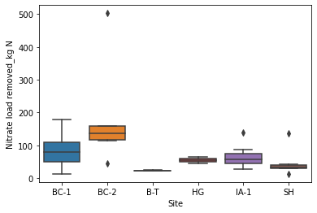
    


```python
sns.boxplot(x = summary_df["Site"],
           y = summary_df["EOF Removal Percentage"])
plt.savefig("EOF removal boxplot.png")
```


    
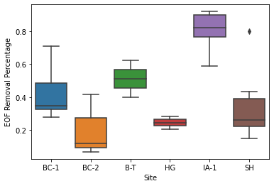
    


```python
sns.boxplot(x = summary_df["Site"],
           y = summary_df["Buffer Removal Percentage"])
plt.savefig("buffer removal boxplot.png")
```


    
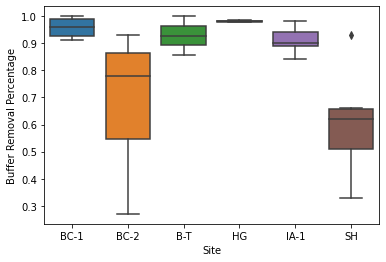
    


```python
sns.boxplot(x = summary_df["Site"],
           y = summary_df["Flow Diversion Percentage"])
```


    <AxesSubplot:xlabel='Site', ylabel='Flow Diversion Percentage'>


    
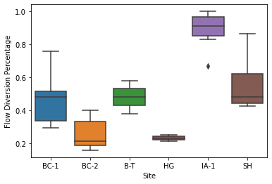
    


```python
plt.scatter(summary_df["Flow Diversion Percentage"], summary_df["EOF Removal Percentage"])
plt.ylabel("EOF Removal Percentage")
plt.xlabel("Flow Diversion Percentage")
plt.savefig("EOF vs flow percent.png")
```


    
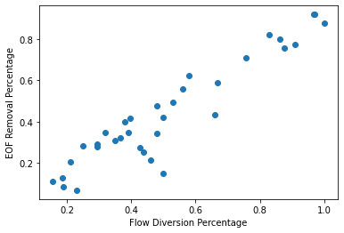
    


```python
plt.figure(figsize = (8,6))
plt.scatter(summary_df["pipe_length_times_DA"], summary_df["Nitrate load removed_kg N"])
plt.ylabel("Nitrate Load Removed (kg N)")
plt.xlabel("Product of Pipe Length and Drainage Area (m*ha)")
plt.savefig("pipelength_da_loadremoval.png")
```


    
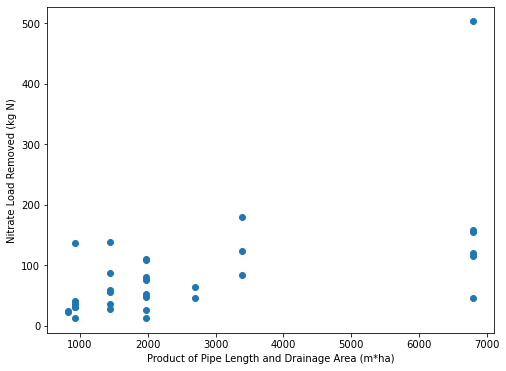
    


```python
sns.pairplot(summary_df.iloc[:, 0:15])
```


    <seaborn.axisgrid.PairGrid at 0x251a2ac3fa0>


    
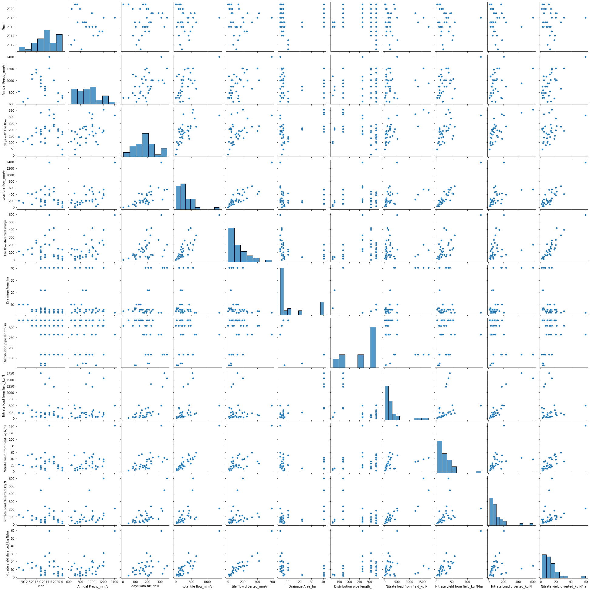
    


```python
summary_df.corr(method='pearson')
```


<div>
<style scoped>
    .dataframe tbody tr th:only-of-type {
        vertical-align: middle;
    }

    .dataframe tbody tr th {
        vertical-align: top;
    }

    .dataframe thead th {
        text-align: right;
    }
</style>
<table border="1" class="dataframe">
  <thead>
    <tr style="text-align: right;">
      <th></th>
      <th>Year</th>
      <th>Annual Precip_mm/y</th>
      <th>days with tile flow</th>
      <th>total tile flow_mm/y</th>
      <th>tile flow diverted_mm/y</th>
      <th>Drainage Area_ha</th>
      <th>Distribution pipe length_m</th>
      <th>Nitrate load from field_kg N</th>
      <th>Nitrate yield from field_kg N/ha</th>
      <th>Nitrate Load diverted_kg N</th>
      <th>Nitrate yield diverted_kg N/ha</th>
      <th>Nitrate load removed_kg N</th>
      <th>Nitrate yield removed_kg N/ha</th>
      <th>Buffer Removal Percentage</th>
      <th>EOF Removal Percentage</th>
      <th>Flow Diversion Percentage</th>
      <th>NO3-N removal rate_g/m/d</th>
      <th>pipe_length_times_DA</th>
    </tr>
  </thead>
  <tbody>
    <tr>
      <th>Year</th>
      <td>1.000000</td>
      <td>-0.115922</td>
      <td>0.177456</td>
      <td>-0.038675</td>
      <td>0.005435</td>
      <td>0.152965</td>
      <td>-0.200269</td>
      <td>-0.011943</td>
      <td>-0.088111</td>
      <td>-0.062649</td>
      <td>-0.065933</td>
      <td>-0.077225</td>
      <td>-0.137841</td>
      <td>-0.110689</td>
      <td>-0.013181</td>
      <td>0.019298</td>
      <td>-0.114634</td>
      <td>0.057789</td>
    </tr>
    <tr>
      <th>Annual Precip_mm/y</th>
      <td>-0.115922</td>
      <td>1.000000</td>
      <td>0.466565</td>
      <td>0.574747</td>
      <td>0.598812</td>
      <td>-0.099704</td>
      <td>0.062888</td>
      <td>0.178737</td>
      <td>0.520280</td>
      <td>0.307870</td>
      <td>0.590563</td>
      <td>0.322343</td>
      <td>0.607299</td>
      <td>-0.095132</td>
      <td>0.051435</td>
      <td>0.102754</td>
      <td>0.079394</td>
      <td>-0.134338</td>
    </tr>
    <tr>
      <th>days with tile flow</th>
      <td>0.177456</td>
      <td>0.466565</td>
      <td>1.000000</td>
      <td>0.644748</td>
      <td>0.427904</td>
      <td>0.505193</td>
      <td>-0.346970</td>
      <td>0.694286</td>
      <td>0.534968</td>
      <td>0.684957</td>
      <td>0.385606</td>
      <td>0.547922</td>
      <td>0.239648</td>
      <td>-0.485811</td>
      <td>-0.479517</td>
      <td>-0.365988</td>
      <td>0.309075</td>
      <td>0.449703</td>
    </tr>
    <tr>
      <th>total tile flow_mm/y</th>
      <td>-0.038675</td>
      <td>0.574747</td>
      <td>0.644748</td>
      <td>1.000000</td>
      <td>0.835044</td>
      <td>-0.030422</td>
      <td>0.071569</td>
      <td>0.345911</td>
      <td>0.939239</td>
      <td>0.466715</td>
      <td>0.887132</td>
      <td>0.359891</td>
      <td>0.719434</td>
      <td>-0.452228</td>
      <td>-0.274330</td>
      <td>-0.109186</td>
      <td>0.096778</td>
      <td>-0.027071</td>
    </tr>
    <tr>
      <th>tile flow diverted_mm/y</th>
      <td>0.005435</td>
      <td>0.598812</td>
      <td>0.427904</td>
      <td>0.835044</td>
      <td>1.000000</td>
      <td>-0.330687</td>
      <td>0.285258</td>
      <td>-0.016453</td>
      <td>0.703197</td>
      <td>0.211273</td>
      <td>0.914747</td>
      <td>0.202311</td>
      <td>0.841579</td>
      <td>-0.248873</td>
      <td>0.210877</td>
      <td>0.387192</td>
      <td>-0.081170</td>
      <td>-0.321512</td>
    </tr>
    <tr>
      <th>Drainage Area_ha</th>
      <td>0.152965</td>
      <td>-0.099704</td>
      <td>0.505193</td>
      <td>-0.030422</td>
      <td>-0.330687</td>
      <td>1.000000</td>
      <td>-0.664673</td>
      <td>0.803032</td>
      <td>-0.076926</td>
      <td>0.636075</td>
      <td>-0.341112</td>
      <td>0.517234</td>
      <td>-0.402292</td>
      <td>-0.252063</td>
      <td>-0.523804</td>
      <td>-0.590142</td>
      <td>0.629545</td>
      <td>0.961777</td>
    </tr>
    <tr>
      <th>Distribution pipe length_m</th>
      <td>-0.200269</td>
      <td>0.062888</td>
      <td>-0.346970</td>
      <td>0.071569</td>
      <td>0.285258</td>
      <td>-0.664673</td>
      <td>1.000000</td>
      <td>-0.432622</td>
      <td>0.151413</td>
      <td>-0.287756</td>
      <td>0.318541</td>
      <td>-0.169134</td>
      <td>0.452928</td>
      <td>0.259428</td>
      <td>0.407938</td>
      <td>0.462046</td>
      <td>-0.376087</td>
      <td>-0.454232</td>
    </tr>
    <tr>
      <th>Nitrate load from field_kg N</th>
      <td>-0.011943</td>
      <td>0.178737</td>
      <td>0.694286</td>
      <td>0.345911</td>
      <td>-0.016453</td>
      <td>0.803032</td>
      <td>-0.432622</td>
      <td>1.000000</td>
      <td>0.302171</td>
      <td>0.888017</td>
      <td>0.016734</td>
      <td>0.678698</td>
      <td>-0.081618</td>
      <td>-0.443928</td>
      <td>-0.537272</td>
      <td>-0.521710</td>
      <td>0.611819</td>
      <td>0.812159</td>
    </tr>
    <tr>
      <th>Nitrate yield from field_kg N/ha</th>
      <td>-0.088111</td>
      <td>0.520280</td>
      <td>0.534968</td>
      <td>0.939239</td>
      <td>0.703197</td>
      <td>-0.076926</td>
      <td>0.151413</td>
      <td>0.302171</td>
      <td>1.000000</td>
      <td>0.382397</td>
      <td>0.877709</td>
      <td>0.307408</td>
      <td>0.738267</td>
      <td>-0.342163</td>
      <td>-0.344064</td>
      <td>-0.226522</td>
      <td>0.072231</td>
      <td>-0.042264</td>
    </tr>
    <tr>
      <th>Nitrate Load diverted_kg N</th>
      <td>-0.062649</td>
      <td>0.307870</td>
      <td>0.684957</td>
      <td>0.466715</td>
      <td>0.211273</td>
      <td>0.636075</td>
      <td>-0.287756</td>
      <td>0.888017</td>
      <td>0.382397</td>
      <td>1.000000</td>
      <td>0.230191</td>
      <td>0.880618</td>
      <td>0.171770</td>
      <td>-0.334355</td>
      <td>-0.322694</td>
      <td>-0.307720</td>
      <td>0.764373</td>
      <td>0.665552</td>
    </tr>
    <tr>
      <th>Nitrate yield diverted_kg N/ha</th>
      <td>-0.065933</td>
      <td>0.590563</td>
      <td>0.385606</td>
      <td>0.887132</td>
      <td>0.914747</td>
      <td>-0.341112</td>
      <td>0.318541</td>
      <td>0.016734</td>
      <td>0.877709</td>
      <td>0.230191</td>
      <td>1.000000</td>
      <td>0.225958</td>
      <td>0.921252</td>
      <td>-0.219658</td>
      <td>0.070421</td>
      <td>0.205854</td>
      <td>-0.034750</td>
      <td>-0.307932</td>
    </tr>
    <tr>
      <th>Nitrate load removed_kg N</th>
      <td>-0.077225</td>
      <td>0.322343</td>
      <td>0.547922</td>
      <td>0.359891</td>
      <td>0.202311</td>
      <td>0.517234</td>
      <td>-0.169134</td>
      <td>0.678698</td>
      <td>0.307408</td>
      <td>0.880618</td>
      <td>0.225958</td>
      <td>1.000000</td>
      <td>0.287375</td>
      <td>0.033459</td>
      <td>-0.154450</td>
      <td>-0.212492</td>
      <td>0.900185</td>
      <td>0.570258</td>
    </tr>
    <tr>
      <th>Nitrate yield removed_kg N/ha</th>
      <td>-0.137841</td>
      <td>0.607299</td>
      <td>0.239648</td>
      <td>0.719434</td>
      <td>0.841579</td>
      <td>-0.402292</td>
      <td>0.452928</td>
      <td>-0.081618</td>
      <td>0.738267</td>
      <td>0.171770</td>
      <td>0.921252</td>
      <td>0.287375</td>
      <td>1.000000</td>
      <td>0.113759</td>
      <td>0.277133</td>
      <td>0.317650</td>
      <td>0.043802</td>
      <td>-0.330003</td>
    </tr>
    <tr>
      <th>Buffer Removal Percentage</th>
      <td>-0.110689</td>
      <td>-0.095132</td>
      <td>-0.485811</td>
      <td>-0.452228</td>
      <td>-0.248873</td>
      <td>-0.252063</td>
      <td>0.259428</td>
      <td>-0.443928</td>
      <td>-0.342163</td>
      <td>-0.334355</td>
      <td>-0.219658</td>
      <td>0.033459</td>
      <td>0.113759</td>
      <td>1.000000</td>
      <td>0.506705</td>
      <td>0.233981</td>
      <td>0.146464</td>
      <td>-0.198471</td>
    </tr>
    <tr>
      <th>EOF Removal Percentage</th>
      <td>-0.013181</td>
      <td>0.051435</td>
      <td>-0.479517</td>
      <td>-0.274330</td>
      <td>0.210877</td>
      <td>-0.523804</td>
      <td>0.407938</td>
      <td>-0.537272</td>
      <td>-0.344064</td>
      <td>-0.322694</td>
      <td>0.070421</td>
      <td>-0.154450</td>
      <td>0.277133</td>
      <td>0.506705</td>
      <td>1.000000</td>
      <td>0.939538</td>
      <td>-0.150463</td>
      <td>-0.490001</td>
    </tr>
    <tr>
      <th>Flow Diversion Percentage</th>
      <td>0.019298</td>
      <td>0.102754</td>
      <td>-0.365988</td>
      <td>-0.109186</td>
      <td>0.387192</td>
      <td>-0.590142</td>
      <td>0.462046</td>
      <td>-0.521710</td>
      <td>-0.226522</td>
      <td>-0.307720</td>
      <td>0.205854</td>
      <td>-0.212492</td>
      <td>0.317650</td>
      <td>0.233981</td>
      <td>0.939538</td>
      <td>1.000000</td>
      <td>-0.286546</td>
      <td>-0.561224</td>
    </tr>
    <tr>
      <th>NO3-N removal rate_g/m/d</th>
      <td>-0.114634</td>
      <td>0.079394</td>
      <td>0.309075</td>
      <td>0.096778</td>
      <td>-0.081170</td>
      <td>0.629545</td>
      <td>-0.376087</td>
      <td>0.611819</td>
      <td>0.072231</td>
      <td>0.764373</td>
      <td>-0.034750</td>
      <td>0.900185</td>
      <td>0.043802</td>
      <td>0.146464</td>
      <td>-0.150463</td>
      <td>-0.286546</td>
      <td>1.000000</td>
      <td>0.650617</td>
    </tr>
    <tr>
      <th>pipe_length_times_DA</th>
      <td>0.057789</td>
      <td>-0.134338</td>
      <td>0.449703</td>
      <td>-0.027071</td>
      <td>-0.321512</td>
      <td>0.961777</td>
      <td>-0.454232</td>
      <td>0.812159</td>
      <td>-0.042264</td>
      <td>0.665552</td>
      <td>-0.307932</td>
      <td>0.570258</td>
      <td>-0.330003</td>
      <td>-0.198471</td>
      <td>-0.490001</td>
      <td>-0.561224</td>
      <td>0.650617</td>
      <td>1.000000</td>
    </tr>
  </tbody>
</table>
</div>


## Linear Regression


```python
import statsmodels.api as sm
from sklearn.linear_model import LinearRegression
from sklearn import metrics
from sklearn.model_selection import train_test_split
```

**Start with single linear regression with "pipe length times DA" variable**


```python
X = summary_df["pipe_length_times_DA"]
X = X[:, np.newaxis]
Y = summary_df["Nitrate load removed_kg N"]
```

    C:\Users\gjohnson\AppData\Local\Temp\ipykernel_10696\3154619909.py:3: FutureWarning: Support for multi-dimensional indexing (e.g. `obj[:, None]`) is deprecated and will be removed in a future version.  Convert to a numpy array before indexing instead.
      X = X[:, np.newaxis]
    


```python
model = LinearRegression()
```


```python
model.fit(X, Y)
```


    LinearRegression()


```python
model.score(X, Y)
```


    0.32519413361502725


**Multiple Linear Regression with "pipe_length_times_DA" and annual precipitation**


```python
X = summary_df[["pipe_length_times_DA", "Annual Precip_mm/y"]]
Y = summary_df["Nitrate load removed_kg N"]
```


```python
model = LinearRegression()
model.fit(X, Y)
```


    LinearRegression()


```python
model.score(X,Y)
```


    0.4872812481495662


This improves the regression, increasing the R^2 to 0.49.

**Regression with statsmodels ols**


```python
X = summary_df[["pipe_length_times_DA", "Annual Precip_mm/y"]]
Y = summary_df["Nitrate load removed_kg N"]
```


```python
model1 = sm.OLS(Y, X)
#model1.params
results = model1.fit()
print("Nitrate Load Removed vs pipe lenth times drainage area")
print(results.summary())
```

    Nitrate Load Removed vs pipe lenth times drainage area
                                        OLS Regression Results                                    
    ==============================================================================================
    Dep. Variable:     Nitrate load removed_kg N   R-squared (uncentered):                   0.686
    Model:                                   OLS   Adj. R-squared (uncentered):              0.666
    Method:                        Least Squares   F-statistic:                              34.88
    Date:                       Mon, 01 May 2023   Prob (F-statistic):                    9.16e-09
    Time:                               00:04:14   Log-Likelihood:                         -191.64
    No. Observations:                         34   AIC:                                      387.3
    Df Residuals:                             32   BIC:                                      390.3
    Df Model:                                  2                                                  
    Covariance Type:                   nonrobust                                                  
    ========================================================================================
                               coef    std err          t      P>|t|      [0.025      0.975]
    ----------------------------------------------------------------------------------------
    pipe_length_times_DA     0.0210      0.006      3.815      0.001       0.010       0.032
    Annual Precip_mm/y       0.0376      0.019      1.953      0.060      -0.002       0.077
    ==============================================================================
    Omnibus:                       48.063   Durbin-Watson:                   2.103
    Prob(Omnibus):                  0.000   Jarque-Bera (JB):              260.898
    Skew:                           2.995   Prob(JB):                     2.22e-57
    Kurtosis:                      15.177   Cond. No.                         5.62
    ==============================================================================
    
    Notes:
    [1] R² is computed without centering (uncentered) since the model does not contain a constant.
    [2] Standard Errors assume that the covariance matrix of the errors is correctly specified.
    

The statsmodel method resulted in a different R^2 due to not including a constant. 


```python
xfit = {"pipe_length_times_DA": [0, 1000, 2000, 3000, 4000, 5000, 6000, 7000],
       "Annual Precip_mm/y": [500, 600, 700, 800, 900, 1000, 1100, 1200]}
xfit = pd.DataFrame(xfit)
xfit
```


<div>
<style scoped>
    .dataframe tbody tr th:only-of-type {
        vertical-align: middle;
    }

    .dataframe tbody tr th {
        vertical-align: top;
    }

    .dataframe thead th {
        text-align: right;
    }
</style>
<table border="1" class="dataframe">
  <thead>
    <tr style="text-align: right;">
      <th></th>
      <th>pipe_length_times_DA</th>
      <th>Annual Precip_mm/y</th>
    </tr>
  </thead>
  <tbody>
    <tr>
      <th>0</th>
      <td>0</td>
      <td>500</td>
    </tr>
    <tr>
      <th>1</th>
      <td>1000</td>
      <td>600</td>
    </tr>
    <tr>
      <th>2</th>
      <td>2000</td>
      <td>700</td>
    </tr>
    <tr>
      <th>3</th>
      <td>3000</td>
      <td>800</td>
    </tr>
    <tr>
      <th>4</th>
      <td>4000</td>
      <td>900</td>
    </tr>
    <tr>
      <th>5</th>
      <td>5000</td>
      <td>1000</td>
    </tr>
    <tr>
      <th>6</th>
      <td>6000</td>
      <td>1100</td>
    </tr>
    <tr>
      <th>7</th>
      <td>7000</td>
      <td>1200</td>
    </tr>
  </tbody>
</table>
</div>


```python
yfit = model.predict(xfit)
```


```python
yfit
```


    array([-66.40156727, -21.36215286,  23.67726156,  68.71667597,
           113.75609038, 158.79550479, 203.83491921, 248.87433362])


**Plot Fitted Data on top of raw data**


```python
plt.figure(figsize = (8,6))
plt.scatter(summary_df["pipe_length_times_DA"], summary_df["Nitrate load removed_kg N"])
plt.scatter(xfit["pipe_length_times_DA"], yfit, color = "red")
plt.ylabel("Nitrate Load Removed (kg N)")
plt.xlabel("Product of Pipe Length and Drainage Area (m*ha)")
plt.savefig("pipelength_da_loadremoval_regression.png")
```


    
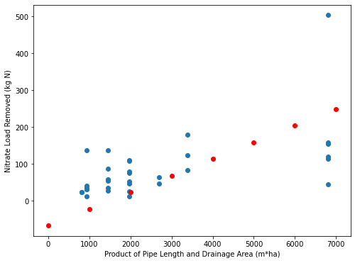
    


## PCA


```python
summary_df.shape
```


    (34, 23)


```python
from sklearn.preprocessing import StandardScaler

X_data = summary_df.drop(["Nitrate load removed_kg N", "Study", "State", "County", "Year", "Site", "Notes"], axis = 1)
Y_data = summary_df["Nitrate load removed_kg N"]
```

**Scale Data**


```python
scaled_data = StandardScaler()
scaled_X = scaled_data.fit_transform(X_data)
```


```python
sns.kdeplot(X_data.iloc[:,0])
sns.kdeplot(X_data.iloc[:,1])
sns.kdeplot(X_data.iloc[:,2])
```


    <AxesSubplot:xlabel='Annual Precip_mm/y', ylabel='Density'>


    

    


```python
sns.kdeplot(scaled_X[0])
sns.kdeplot(scaled_X[1])
sns.kdeplot(scaled_X[2])
```


    <AxesSubplot:ylabel='Density'>


    
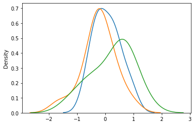
    


**Run PCA**


```python
from sklearn.decomposition import PCA
```


```python
pca1 = PCA(n_components = 4)
pca1.fit(scaled_X)
trained_pca1 = pca1.transform(scaled_X)
```


```python
trained_pca1.shape
```


    (34, 4)


```python
pc_df = pd.DataFrame(data = trained_pca1, columns = ['PC1', 'PC2', 'PC3', 'PC4'])
pc_df
```


<div>
<style scoped>
    .dataframe tbody tr th:only-of-type {
        vertical-align: middle;
    }

    .dataframe tbody tr th {
        vertical-align: top;
    }

    .dataframe thead th {
        text-align: right;
    }
</style>
<table border="1" class="dataframe">
  <thead>
    <tr style="text-align: right;">
      <th></th>
      <th>PC1</th>
      <th>PC2</th>
      <th>PC3</th>
      <th>PC4</th>
    </tr>
  </thead>
  <tbody>
    <tr>
      <th>0</th>
      <td>-0.894648</td>
      <td>-0.246986</td>
      <td>1.006084</td>
      <td>0.826345</td>
    </tr>
    <tr>
      <th>1</th>
      <td>-1.200007</td>
      <td>-1.160331</td>
      <td>0.156672</td>
      <td>0.947845</td>
    </tr>
    <tr>
      <th>2</th>
      <td>0.716080</td>
      <td>0.311457</td>
      <td>0.768884</td>
      <td>2.248284</td>
    </tr>
    <tr>
      <th>3</th>
      <td>0.062206</td>
      <td>1.464109</td>
      <td>0.082704</td>
      <td>1.758783</td>
    </tr>
    <tr>
      <th>4</th>
      <td>-0.026593</td>
      <td>1.534125</td>
      <td>-0.349580</td>
      <td>0.655338</td>
    </tr>
    <tr>
      <th>5</th>
      <td>-1.416594</td>
      <td>-0.072852</td>
      <td>-0.180123</td>
      <td>0.583780</td>
    </tr>
    <tr>
      <th>6</th>
      <td>-1.298977</td>
      <td>-0.561841</td>
      <td>-0.668233</td>
      <td>1.280113</td>
    </tr>
    <tr>
      <th>7</th>
      <td>-0.131499</td>
      <td>1.899019</td>
      <td>0.419830</td>
      <td>0.570278</td>
    </tr>
    <tr>
      <th>8</th>
      <td>-0.137524</td>
      <td>0.381668</td>
      <td>-0.798270</td>
      <td>1.344416</td>
    </tr>
    <tr>
      <th>9</th>
      <td>-1.651331</td>
      <td>-1.257809</td>
      <td>-1.115828</td>
      <td>1.263773</td>
    </tr>
    <tr>
      <th>10</th>
      <td>-3.363941</td>
      <td>-1.456670</td>
      <td>0.265807</td>
      <td>-0.185114</td>
    </tr>
    <tr>
      <th>11</th>
      <td>6.010005</td>
      <td>-1.693914</td>
      <td>-0.905629</td>
      <td>-1.907511</td>
    </tr>
    <tr>
      <th>12</th>
      <td>4.053335</td>
      <td>-2.632237</td>
      <td>-0.640124</td>
      <td>-0.635899</td>
    </tr>
    <tr>
      <th>13</th>
      <td>6.686397</td>
      <td>-0.763170</td>
      <td>3.795857</td>
      <td>-0.137867</td>
    </tr>
    <tr>
      <th>14</th>
      <td>3.639495</td>
      <td>-2.680356</td>
      <td>0.183692</td>
      <td>0.122539</td>
    </tr>
    <tr>
      <th>15</th>
      <td>1.474660</td>
      <td>-3.608084</td>
      <td>-1.175132</td>
      <td>-0.059309</td>
    </tr>
    <tr>
      <th>16</th>
      <td>1.480684</td>
      <td>-3.380085</td>
      <td>1.711054</td>
      <td>0.321208</td>
    </tr>
    <tr>
      <th>17</th>
      <td>-1.274314</td>
      <td>-1.713823</td>
      <td>-0.567907</td>
      <td>-0.162792</td>
    </tr>
    <tr>
      <th>18</th>
      <td>-2.169861</td>
      <td>-1.913511</td>
      <td>0.223596</td>
      <td>-0.299624</td>
    </tr>
    <tr>
      <th>19</th>
      <td>0.191839</td>
      <td>-2.439916</td>
      <td>-0.785960</td>
      <td>0.426070</td>
    </tr>
    <tr>
      <th>20</th>
      <td>0.191517</td>
      <td>-2.473468</td>
      <td>-0.356689</td>
      <td>0.364451</td>
    </tr>
    <tr>
      <th>21</th>
      <td>-2.421798</td>
      <td>0.397249</td>
      <td>1.527166</td>
      <td>-0.177885</td>
    </tr>
    <tr>
      <th>22</th>
      <td>-1.535850</td>
      <td>1.733434</td>
      <td>0.896788</td>
      <td>-1.341836</td>
    </tr>
    <tr>
      <th>23</th>
      <td>-2.223966</td>
      <td>1.071980</td>
      <td>1.296882</td>
      <td>-1.247340</td>
    </tr>
    <tr>
      <th>24</th>
      <td>-2.661245</td>
      <td>0.579668</td>
      <td>0.971237</td>
      <td>-1.408584</td>
    </tr>
    <tr>
      <th>25</th>
      <td>-0.643534</td>
      <td>3.992760</td>
      <td>2.359304</td>
      <td>-0.703941</td>
    </tr>
    <tr>
      <th>26</th>
      <td>-0.787917</td>
      <td>2.848622</td>
      <td>0.954368</td>
      <td>-1.094423</td>
    </tr>
    <tr>
      <th>27</th>
      <td>-2.560837</td>
      <td>-0.814074</td>
      <td>-0.031311</td>
      <td>-0.013005</td>
    </tr>
    <tr>
      <th>28</th>
      <td>-0.718401</td>
      <td>-0.160068</td>
      <td>-2.288196</td>
      <td>-1.013847</td>
    </tr>
    <tr>
      <th>29</th>
      <td>1.097444</td>
      <td>2.222856</td>
      <td>-2.865142</td>
      <td>-1.066561</td>
    </tr>
    <tr>
      <th>30</th>
      <td>4.509633</td>
      <td>8.404386</td>
      <td>-1.102124</td>
      <td>1.043009</td>
    </tr>
    <tr>
      <th>31</th>
      <td>0.810776</td>
      <td>1.957756</td>
      <td>-2.029155</td>
      <td>-0.560943</td>
    </tr>
    <tr>
      <th>32</th>
      <td>-1.324938</td>
      <td>0.045826</td>
      <td>-1.272757</td>
      <td>-0.844543</td>
    </tr>
    <tr>
      <th>33</th>
      <td>-2.480298</td>
      <td>0.184279</td>
      <td>0.512235</td>
      <td>-0.895210</td>
    </tr>
  </tbody>
</table>
</div>


```python
pc_df['nitrate removed'] = Y_data
pc_df
```


<div>
<style scoped>
    .dataframe tbody tr th:only-of-type {
        vertical-align: middle;
    }

    .dataframe tbody tr th {
        vertical-align: top;
    }

    .dataframe thead th {
        text-align: right;
    }
</style>
<table border="1" class="dataframe">
  <thead>
    <tr style="text-align: right;">
      <th></th>
      <th>PC1</th>
      <th>PC2</th>
      <th>PC3</th>
      <th>PC4</th>
      <th>nitrate removed</th>
    </tr>
  </thead>
  <tbody>
    <tr>
      <th>0</th>
      <td>-0.894648</td>
      <td>-0.246986</td>
      <td>1.006084</td>
      <td>0.826345</td>
      <td>123.0</td>
    </tr>
    <tr>
      <th>1</th>
      <td>-1.200007</td>
      <td>-1.160331</td>
      <td>0.156672</td>
      <td>0.947845</td>
      <td>84.0</td>
    </tr>
    <tr>
      <th>2</th>
      <td>0.716080</td>
      <td>0.311457</td>
      <td>0.768884</td>
      <td>2.248284</td>
      <td>179.0</td>
    </tr>
    <tr>
      <th>3</th>
      <td>0.062206</td>
      <td>1.464109</td>
      <td>0.082704</td>
      <td>1.758783</td>
      <td>111.0</td>
    </tr>
    <tr>
      <th>4</th>
      <td>-0.026593</td>
      <td>1.534125</td>
      <td>-0.349580</td>
      <td>0.655338</td>
      <td>80.0</td>
    </tr>
    <tr>
      <th>5</th>
      <td>-1.416594</td>
      <td>-0.072852</td>
      <td>-0.180123</td>
      <td>0.583780</td>
      <td>53.0</td>
    </tr>
    <tr>
      <th>6</th>
      <td>-1.298977</td>
      <td>-0.561841</td>
      <td>-0.668233</td>
      <td>1.280113</td>
      <td>47.0</td>
    </tr>
    <tr>
      <th>7</th>
      <td>-0.131499</td>
      <td>1.899019</td>
      <td>0.419830</td>
      <td>0.570278</td>
      <td>108.0</td>
    </tr>
    <tr>
      <th>8</th>
      <td>-0.137524</td>
      <td>0.381668</td>
      <td>-0.798270</td>
      <td>1.344416</td>
      <td>75.3</td>
    </tr>
    <tr>
      <th>9</th>
      <td>-1.651331</td>
      <td>-1.257809</td>
      <td>-1.115828</td>
      <td>1.263773</td>
      <td>26.2</td>
    </tr>
    <tr>
      <th>10</th>
      <td>-3.363941</td>
      <td>-1.456670</td>
      <td>0.265807</td>
      <td>-0.185114</td>
      <td>12.8</td>
    </tr>
    <tr>
      <th>11</th>
      <td>6.010005</td>
      <td>-1.693914</td>
      <td>-0.905629</td>
      <td>-1.907511</td>
      <td>120.0</td>
    </tr>
    <tr>
      <th>12</th>
      <td>4.053335</td>
      <td>-2.632237</td>
      <td>-0.640124</td>
      <td>-0.635899</td>
      <td>115.0</td>
    </tr>
    <tr>
      <th>13</th>
      <td>6.686397</td>
      <td>-0.763170</td>
      <td>3.795857</td>
      <td>-0.137867</td>
      <td>503.0</td>
    </tr>
    <tr>
      <th>14</th>
      <td>3.639495</td>
      <td>-2.680356</td>
      <td>0.183692</td>
      <td>0.122539</td>
      <td>155.0</td>
    </tr>
    <tr>
      <th>15</th>
      <td>1.474660</td>
      <td>-3.608084</td>
      <td>-1.175132</td>
      <td>-0.059309</td>
      <td>45.7</td>
    </tr>
    <tr>
      <th>16</th>
      <td>1.480684</td>
      <td>-3.380085</td>
      <td>1.711054</td>
      <td>0.321208</td>
      <td>159.0</td>
    </tr>
    <tr>
      <th>17</th>
      <td>-1.274314</td>
      <td>-1.713823</td>
      <td>-0.567907</td>
      <td>-0.162792</td>
      <td>24.0</td>
    </tr>
    <tr>
      <th>18</th>
      <td>-2.169861</td>
      <td>-1.913511</td>
      <td>0.223596</td>
      <td>-0.299624</td>
      <td>23.0</td>
    </tr>
    <tr>
      <th>19</th>
      <td>0.191839</td>
      <td>-2.439916</td>
      <td>-0.785960</td>
      <td>0.426070</td>
      <td>46.0</td>
    </tr>
    <tr>
      <th>20</th>
      <td>0.191517</td>
      <td>-2.473468</td>
      <td>-0.356689</td>
      <td>0.364451</td>
      <td>64.0</td>
    </tr>
    <tr>
      <th>21</th>
      <td>-2.421798</td>
      <td>0.397249</td>
      <td>1.527166</td>
      <td>-0.177885</td>
      <td>55.0</td>
    </tr>
    <tr>
      <th>22</th>
      <td>-1.535850</td>
      <td>1.733434</td>
      <td>0.896788</td>
      <td>-1.341836</td>
      <td>59.0</td>
    </tr>
    <tr>
      <th>23</th>
      <td>-2.223966</td>
      <td>1.071980</td>
      <td>1.296882</td>
      <td>-1.247340</td>
      <td>57.0</td>
    </tr>
    <tr>
      <th>24</th>
      <td>-2.661245</td>
      <td>0.579668</td>
      <td>0.971237</td>
      <td>-1.408584</td>
      <td>36.0</td>
    </tr>
    <tr>
      <th>25</th>
      <td>-0.643534</td>
      <td>3.992760</td>
      <td>2.359304</td>
      <td>-0.703941</td>
      <td>138.0</td>
    </tr>
    <tr>
      <th>26</th>
      <td>-0.787917</td>
      <td>2.848622</td>
      <td>0.954368</td>
      <td>-1.094423</td>
      <td>87.9</td>
    </tr>
    <tr>
      <th>27</th>
      <td>-2.560837</td>
      <td>-0.814074</td>
      <td>-0.031311</td>
      <td>-0.013005</td>
      <td>28.0</td>
    </tr>
    <tr>
      <th>28</th>
      <td>-0.718401</td>
      <td>-0.160068</td>
      <td>-2.288196</td>
      <td>-1.013847</td>
      <td>NaN</td>
    </tr>
    <tr>
      <th>29</th>
      <td>1.097444</td>
      <td>2.222856</td>
      <td>-2.865142</td>
      <td>-1.066561</td>
      <td>13.0</td>
    </tr>
    <tr>
      <th>30</th>
      <td>4.509633</td>
      <td>8.404386</td>
      <td>-1.102124</td>
      <td>1.043009</td>
      <td>31.0</td>
    </tr>
    <tr>
      <th>31</th>
      <td>0.810776</td>
      <td>1.957756</td>
      <td>-2.029155</td>
      <td>-0.560943</td>
      <td>137.0</td>
    </tr>
    <tr>
      <th>32</th>
      <td>-1.324938</td>
      <td>0.045826</td>
      <td>-1.272757</td>
      <td>-0.844543</td>
      <td>41.5</td>
    </tr>
    <tr>
      <th>33</th>
      <td>-2.480298</td>
      <td>0.184279</td>
      <td>0.512235</td>
      <td>-0.895210</td>
      <td>31.1</td>
    </tr>
  </tbody>
</table>
</div>


```python
pca1.explained_variance_ratio_
```


    array([0.36815118, 0.33693547, 0.10728418, 0.06004578])


```python
df = pd.DataFrame({'var':pca1.explained_variance_ratio_, 'PC': ['PC1', 'PC2', 'PC3', 'PC4']})
df
```


<div>
<style scoped>
    .dataframe tbody tr th:only-of-type {
        vertical-align: middle;
    }

    .dataframe tbody tr th {
        vertical-align: top;
    }

    .dataframe thead th {
        text-align: right;
    }
</style>
<table border="1" class="dataframe">
  <thead>
    <tr style="text-align: right;">
      <th></th>
      <th>var</th>
      <th>PC</th>
    </tr>
  </thead>
  <tbody>
    <tr>
      <th>0</th>
      <td>0.368151</td>
      <td>PC1</td>
    </tr>
    <tr>
      <th>1</th>
      <td>0.336935</td>
      <td>PC2</td>
    </tr>
    <tr>
      <th>2</th>
      <td>0.107284</td>
      <td>PC3</td>
    </tr>
    <tr>
      <th>3</th>
      <td>0.060046</td>
      <td>PC4</td>
    </tr>
  </tbody>
</table>
</div>


```python
sns.barplot(x='PC', y = 'var', data = df, color = 'red')
plt.savefig("PCA_plot.png")
```


    
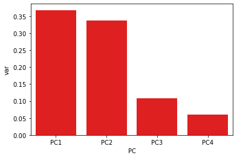
    


```python
plt.scatter(pc_df["PC1"], Y_data)
plt.xlabel("PC1")
plt.ylabel("Nitrate Load Removed (kg)")
plt.savefig("PCA_regression_plot.png")
```


    
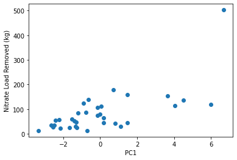
    


### Linear Regression on PCA Data


```python
x_pca = pc_df["PC1"]
X_pca = x_pca[:, np.newaxis]
```

    C:\Users\gjohnson\AppData\Local\Temp\ipykernel_10696\3836034575.py:2: FutureWarning: Support for multi-dimensional indexing (e.g. `obj[:, None]`) is deprecated and will be removed in a future version.  Convert to a numpy array before indexing instead.
      X_pca = x_pca[:, np.newaxis]
    


```python
model_pca = LinearRegression()
model_pca.fit(X_pca, Y_data)
```


    LinearRegression()


```python
model_pca.score(X_pca, Y_data)
```


    0.4804857118119634


The R^2 was nearly the same using PC1 as the x (predictor) variable compared to the original regression using both the product of drainage area and pipe length and the annual precipitation.


```python
x_pca = pc_df[["PC1", "PC2"]]
#X_pca = x_pca[:, np.newaxis]
x_pca
```


<div>
<style scoped>
    .dataframe tbody tr th:only-of-type {
        vertical-align: middle;
    }

    .dataframe tbody tr th {
        vertical-align: top;
    }

    .dataframe thead th {
        text-align: right;
    }
</style>
<table border="1" class="dataframe">
  <thead>
    <tr style="text-align: right;">
      <th></th>
      <th>PC1</th>
      <th>PC2</th>
    </tr>
  </thead>
  <tbody>
    <tr>
      <th>0</th>
      <td>-0.894648</td>
      <td>-0.246986</td>
    </tr>
    <tr>
      <th>1</th>
      <td>-1.200007</td>
      <td>-1.160331</td>
    </tr>
    <tr>
      <th>2</th>
      <td>0.716080</td>
      <td>0.311457</td>
    </tr>
    <tr>
      <th>3</th>
      <td>0.062206</td>
      <td>1.464109</td>
    </tr>
    <tr>
      <th>4</th>
      <td>-0.026593</td>
      <td>1.534125</td>
    </tr>
    <tr>
      <th>5</th>
      <td>-1.416594</td>
      <td>-0.072852</td>
    </tr>
    <tr>
      <th>6</th>
      <td>-1.298977</td>
      <td>-0.561841</td>
    </tr>
    <tr>
      <th>7</th>
      <td>-0.131499</td>
      <td>1.899019</td>
    </tr>
    <tr>
      <th>8</th>
      <td>-0.137524</td>
      <td>0.381668</td>
    </tr>
    <tr>
      <th>9</th>
      <td>-1.651331</td>
      <td>-1.257809</td>
    </tr>
    <tr>
      <th>10</th>
      <td>-3.363941</td>
      <td>-1.456670</td>
    </tr>
    <tr>
      <th>11</th>
      <td>6.010005</td>
      <td>-1.693914</td>
    </tr>
    <tr>
      <th>12</th>
      <td>4.053335</td>
      <td>-2.632237</td>
    </tr>
    <tr>
      <th>13</th>
      <td>6.686397</td>
      <td>-0.763170</td>
    </tr>
    <tr>
      <th>14</th>
      <td>3.639495</td>
      <td>-2.680356</td>
    </tr>
    <tr>
      <th>15</th>
      <td>1.474660</td>
      <td>-3.608084</td>
    </tr>
    <tr>
      <th>16</th>
      <td>1.480684</td>
      <td>-3.380085</td>
    </tr>
    <tr>
      <th>17</th>
      <td>-1.274314</td>
      <td>-1.713823</td>
    </tr>
    <tr>
      <th>18</th>
      <td>-2.169861</td>
      <td>-1.913511</td>
    </tr>
    <tr>
      <th>19</th>
      <td>0.191839</td>
      <td>-2.439916</td>
    </tr>
    <tr>
      <th>20</th>
      <td>0.191517</td>
      <td>-2.473468</td>
    </tr>
    <tr>
      <th>21</th>
      <td>-2.421798</td>
      <td>0.397249</td>
    </tr>
    <tr>
      <th>22</th>
      <td>-1.535850</td>
      <td>1.733434</td>
    </tr>
    <tr>
      <th>23</th>
      <td>-2.223966</td>
      <td>1.071980</td>
    </tr>
    <tr>
      <th>24</th>
      <td>-2.661245</td>
      <td>0.579668</td>
    </tr>
    <tr>
      <th>25</th>
      <td>-0.643534</td>
      <td>3.992760</td>
    </tr>
    <tr>
      <th>26</th>
      <td>-0.787917</td>
      <td>2.848622</td>
    </tr>
    <tr>
      <th>27</th>
      <td>-2.560837</td>
      <td>-0.814074</td>
    </tr>
    <tr>
      <th>28</th>
      <td>-0.718401</td>
      <td>-0.160068</td>
    </tr>
    <tr>
      <th>29</th>
      <td>1.097444</td>
      <td>2.222856</td>
    </tr>
    <tr>
      <th>30</th>
      <td>4.509633</td>
      <td>8.404386</td>
    </tr>
    <tr>
      <th>31</th>
      <td>0.810776</td>
      <td>1.957756</td>
    </tr>
    <tr>
      <th>32</th>
      <td>-1.324938</td>
      <td>0.045826</td>
    </tr>
    <tr>
      <th>33</th>
      <td>-2.480298</td>
      <td>0.184279</td>
    </tr>
  </tbody>
</table>
</div>


```python
model_pca.fit(x_pca, Y_data)
```


    LinearRegression()


```python
model_pca.score(x_pca, Y_data)
```


    0.48237190170086675


Using both PC1 and PC2 barely improves the R^2, by about 0.002

## Kmeans Clustering


```python
from sklearn.cluster import KMeans
```


```python
reduced_data = summary_df.drop(["Study", "State", "County", "Notes"], axis = 1)
reduced_data
```


<div>
<style scoped>
    .dataframe tbody tr th:only-of-type {
        vertical-align: middle;
    }

    .dataframe tbody tr th {
        vertical-align: top;
    }

    .dataframe thead th {
        text-align: right;
    }
</style>
<table border="1" class="dataframe">
  <thead>
    <tr style="text-align: right;">
      <th></th>
      <th>Site</th>
      <th>Year</th>
      <th>Annual Precip_mm/y</th>
      <th>days with tile flow</th>
      <th>total tile flow_mm/y</th>
      <th>tile flow diverted_mm/y</th>
      <th>Drainage Area_ha</th>
      <th>Distribution pipe length_m</th>
      <th>Nitrate load from field_kg N</th>
      <th>Nitrate yield from field_kg N/ha</th>
      <th>Nitrate Load diverted_kg N</th>
      <th>Nitrate yield diverted_kg N/ha</th>
      <th>Nitrate load removed_kg N</th>
      <th>Nitrate yield removed_kg N/ha</th>
      <th>Buffer Removal Percentage</th>
      <th>EOF Removal Percentage</th>
      <th>Flow Diversion Percentage</th>
      <th>NO3-N removal rate_g/m/d</th>
      <th>pipe_length_times_DA</th>
    </tr>
  </thead>
  <tbody>
    <tr>
      <th>0</th>
      <td>BC-1</td>
      <td>2011</td>
      <td>815.0</td>
      <td>143</td>
      <td>198.0</td>
      <td>111.0</td>
      <td>10.1</td>
      <td>335</td>
      <td>220.0</td>
      <td>21.80</td>
      <td>123.0</td>
      <td>12.2</td>
      <td>123.0</td>
      <td>12.20</td>
      <td>1.000</td>
      <td>0.559</td>
      <td>0.560</td>
      <td>2.568</td>
      <td>3383.5</td>
    </tr>
    <tr>
      <th>1</th>
      <td>BC-1</td>
      <td>2012</td>
      <td>637.0</td>
      <td>108</td>
      <td>140.0</td>
      <td>70.0</td>
      <td>10.1</td>
      <td>335</td>
      <td>200.0</td>
      <td>19.80</td>
      <td>92.0</td>
      <td>9.1</td>
      <td>84.0</td>
      <td>8.30</td>
      <td>0.913</td>
      <td>0.420</td>
      <td>0.500</td>
      <td>2.322</td>
      <td>3383.5</td>
    </tr>
    <tr>
      <th>2</th>
      <td>BC-1</td>
      <td>2013</td>
      <td>695.0</td>
      <td>129</td>
      <td>429.0</td>
      <td>135.0</td>
      <td>10.1</td>
      <td>335</td>
      <td>514.0</td>
      <td>50.90</td>
      <td>181.0</td>
      <td>17.9</td>
      <td>179.0</td>
      <td>17.70</td>
      <td>0.989</td>
      <td>0.348</td>
      <td>0.320</td>
      <td>4.142</td>
      <td>3383.5</td>
    </tr>
    <tr>
      <th>3</th>
      <td>BC-1</td>
      <td>2014</td>
      <td>1027.0</td>
      <td>153</td>
      <td>406.0</td>
      <td>157.0</td>
      <td>5.9</td>
      <td>335</td>
      <td>320.0</td>
      <td>54.20</td>
      <td>111.0</td>
      <td>18.8</td>
      <td>111.0</td>
      <td>18.80</td>
      <td>1.000</td>
      <td>0.347</td>
      <td>0.390</td>
      <td>2.166</td>
      <td>1976.5</td>
    </tr>
    <tr>
      <th>4</th>
      <td>BC-1</td>
      <td>2015</td>
      <td>1133.0</td>
      <td>212</td>
      <td>468.0</td>
      <td>223.0</td>
      <td>5.9</td>
      <td>335</td>
      <td>233.0</td>
      <td>39.50</td>
      <td>85.0</td>
      <td>14.4</td>
      <td>80.0</td>
      <td>13.60</td>
      <td>0.941</td>
      <td>0.343</td>
      <td>0.480</td>
      <td>1.126</td>
      <td>1976.5</td>
    </tr>
    <tr>
      <th>5</th>
      <td>BC-1</td>
      <td>2016</td>
      <td>955.0</td>
      <td>161</td>
      <td>204.0</td>
      <td>99.0</td>
      <td>5.9</td>
      <td>335</td>
      <td>111.0</td>
      <td>18.80</td>
      <td>55.0</td>
      <td>9.3</td>
      <td>53.0</td>
      <td>9.00</td>
      <td>0.964</td>
      <td>0.477</td>
      <td>0.480</td>
      <td>0.983</td>
      <td>1976.5</td>
    </tr>
    <tr>
      <th>6</th>
      <td>BC-1</td>
      <td>2017</td>
      <td>899.0</td>
      <td>97</td>
      <td>187.0</td>
      <td>66.0</td>
      <td>5.9</td>
      <td>335</td>
      <td>151.0</td>
      <td>25.60</td>
      <td>51.0</td>
      <td>8.6</td>
      <td>47.0</td>
      <td>8.00</td>
      <td>0.922</td>
      <td>0.311</td>
      <td>0.350</td>
      <td>1.446</td>
      <td>1976.5</td>
    </tr>
    <tr>
      <th>7</th>
      <td>BC-1</td>
      <td>2018</td>
      <td>1208.4</td>
      <td>194</td>
      <td>367.0</td>
      <td>195.0</td>
      <td>5.9</td>
      <td>335</td>
      <td>219.0</td>
      <td>37.12</td>
      <td>117.0</td>
      <td>19.8</td>
      <td>108.0</td>
      <td>18.31</td>
      <td>0.923</td>
      <td>0.493</td>
      <td>0.531</td>
      <td>1.662</td>
      <td>1976.5</td>
    </tr>
    <tr>
      <th>8</th>
      <td>BC-1</td>
      <td>2019</td>
      <td>1007.1</td>
      <td>240</td>
      <td>215.0</td>
      <td>63.0</td>
      <td>5.9</td>
      <td>335</td>
      <td>260.0</td>
      <td>44.07</td>
      <td>78.3</td>
      <td>13.3</td>
      <td>75.3</td>
      <td>12.76</td>
      <td>0.962</td>
      <td>0.290</td>
      <td>0.293</td>
      <td>0.937</td>
      <td>1976.5</td>
    </tr>
    <tr>
      <th>9</th>
      <td>BC-1</td>
      <td>2020</td>
      <td>788.6</td>
      <td>138</td>
      <td>140.0</td>
      <td>41.0</td>
      <td>5.9</td>
      <td>335</td>
      <td>94.5</td>
      <td>16.02</td>
      <td>26.5</td>
      <td>4.5</td>
      <td>26.2</td>
      <td>4.44</td>
      <td>0.989</td>
      <td>0.277</td>
      <td>0.293</td>
      <td>0.567</td>
      <td>1976.5</td>
    </tr>
    <tr>
      <th>10</th>
      <td>BC-1</td>
      <td>2021</td>
      <td>707.3</td>
      <td>45</td>
      <td>28.5</td>
      <td>21.6</td>
      <td>5.9</td>
      <td>335</td>
      <td>18.0</td>
      <td>3.05</td>
      <td>13.8</td>
      <td>2.3</td>
      <td>12.8</td>
      <td>2.17</td>
      <td>0.928</td>
      <td>0.711</td>
      <td>0.758</td>
      <td>0.849</td>
      <td>1976.5</td>
    </tr>
    <tr>
      <th>11</th>
      <td>BC-2</td>
      <td>2016</td>
      <td>955.0</td>
      <td>333</td>
      <td>537.0</td>
      <td>127.0</td>
      <td>40.5</td>
      <td>168</td>
      <td>1758.0</td>
      <td>43.40</td>
      <td>444.0</td>
      <td>11.0</td>
      <td>120.0</td>
      <td>3.00</td>
      <td>0.270</td>
      <td>0.068</td>
      <td>0.230</td>
      <td>2.145</td>
      <td>6804.0</td>
    </tr>
    <tr>
      <th>12</th>
      <td>BC-2</td>
      <td>2017</td>
      <td>899.0</td>
      <td>226</td>
      <td>392.0</td>
      <td>69.0</td>
      <td>40.5</td>
      <td>168</td>
      <td>1334.0</td>
      <td>32.90</td>
      <td>234.0</td>
      <td>5.8</td>
      <td>115.0</td>
      <td>2.80</td>
      <td>0.491</td>
      <td>0.086</td>
      <td>0.190</td>
      <td>3.029</td>
      <td>6804.0</td>
    </tr>
    <tr>
      <th>13</th>
      <td>BC-2</td>
      <td>2018</td>
      <td>1208.4</td>
      <td>356</td>
      <td>551.0</td>
      <td>201.0</td>
      <td>40.5</td>
      <td>168</td>
      <td>1560.0</td>
      <td>38.52</td>
      <td>601.0</td>
      <td>14.8</td>
      <td>503.0</td>
      <td>12.42</td>
      <td>0.837</td>
      <td>0.322</td>
      <td>0.365</td>
      <td>8.410</td>
      <td>6804.0</td>
    </tr>
    <tr>
      <th>14</th>
      <td>BC-2</td>
      <td>2019</td>
      <td>1007.1</td>
      <td>320</td>
      <td>242.0</td>
      <td>44.9</td>
      <td>40.5</td>
      <td>168</td>
      <td>1230.0</td>
      <td>30.37</td>
      <td>178.0</td>
      <td>4.4</td>
      <td>155.0</td>
      <td>3.83</td>
      <td>0.871</td>
      <td>0.126</td>
      <td>0.186</td>
      <td>2.883</td>
      <td>6804.0</td>
    </tr>
    <tr>
      <th>15</th>
      <td>BC-2</td>
      <td>2020</td>
      <td>788.6</td>
      <td>205</td>
      <td>101.0</td>
      <td>15.9</td>
      <td>40.5</td>
      <td>168</td>
      <td>410.0</td>
      <td>10.12</td>
      <td>63.6</td>
      <td>1.6</td>
      <td>45.7</td>
      <td>1.13</td>
      <td>0.719</td>
      <td>0.111</td>
      <td>0.157</td>
      <td>1.327</td>
      <td>6804.0</td>
    </tr>
    <tr>
      <th>16</th>
      <td>BC-2</td>
      <td>2021</td>
      <td>707.3</td>
      <td>182</td>
      <td>113.0</td>
      <td>45.0</td>
      <td>40.5</td>
      <td>168</td>
      <td>383.0</td>
      <td>9.46</td>
      <td>171.0</td>
      <td>4.2</td>
      <td>159.0</td>
      <td>3.93</td>
      <td>0.930</td>
      <td>0.415</td>
      <td>0.398</td>
      <td>5.200</td>
      <td>6804.0</td>
    </tr>
    <tr>
      <th>17</th>
      <td>B-T</td>
      <td>2016</td>
      <td>1073.0</td>
      <td>105</td>
      <td>34.0</td>
      <td>13.0</td>
      <td>7.1</td>
      <td>115</td>
      <td>60.0</td>
      <td>8.50</td>
      <td>28.0</td>
      <td>3.9</td>
      <td>24.0</td>
      <td>3.40</td>
      <td>0.857</td>
      <td>0.400</td>
      <td>0.380</td>
      <td>1.988</td>
      <td>816.5</td>
    </tr>
    <tr>
      <th>18</th>
      <td>B-T</td>
      <td>2017</td>
      <td>749.0</td>
      <td>96</td>
      <td>67.0</td>
      <td>39.0</td>
      <td>7.1</td>
      <td>115</td>
      <td>37.0</td>
      <td>5.20</td>
      <td>23.0</td>
      <td>3.2</td>
      <td>23.0</td>
      <td>3.20</td>
      <td>1.000</td>
      <td>0.622</td>
      <td>0.580</td>
      <td>2.083</td>
      <td>816.5</td>
    </tr>
    <tr>
      <th>19</th>
      <td>HG</td>
      <td>2016</td>
      <td>896.0</td>
      <td>200</td>
      <td>191.0</td>
      <td>39.0</td>
      <td>21.8</td>
      <td>124</td>
      <td>222.0</td>
      <td>10.20</td>
      <td>47.0</td>
      <td>2.2</td>
      <td>46.0</td>
      <td>2.10</td>
      <td>0.979</td>
      <td>0.207</td>
      <td>0.210</td>
      <td>1.855</td>
      <td>2703.2</td>
    </tr>
    <tr>
      <th>20</th>
      <td>HG</td>
      <td>2017</td>
      <td>836.0</td>
      <td>212</td>
      <td>149.0</td>
      <td>37.0</td>
      <td>21.8</td>
      <td>124</td>
      <td>225.0</td>
      <td>10.30</td>
      <td>65.0</td>
      <td>3.0</td>
      <td>64.0</td>
      <td>2.90</td>
      <td>0.985</td>
      <td>0.284</td>
      <td>0.250</td>
      <td>2.435</td>
      <td>2703.2</td>
    </tr>
    <tr>
      <th>21</th>
      <td>IA-1</td>
      <td>2014</td>
      <td>1104.0</td>
      <td>82</td>
      <td>94.0</td>
      <td>78.0</td>
      <td>4.7</td>
      <td>308</td>
      <td>67.0</td>
      <td>14.30</td>
      <td>56.0</td>
      <td>11.9</td>
      <td>55.0</td>
      <td>11.70</td>
      <td>0.982</td>
      <td>0.821</td>
      <td>0.830</td>
      <td>2.178</td>
      <td>1447.6</td>
    </tr>
    <tr>
      <th>22</th>
      <td>IA-1</td>
      <td>2015</td>
      <td>1186.0</td>
      <td>179</td>
      <td>281.0</td>
      <td>257.0</td>
      <td>4.7</td>
      <td>308</td>
      <td>76.0</td>
      <td>16.20</td>
      <td>70.0</td>
      <td>14.9</td>
      <td>59.0</td>
      <td>12.60</td>
      <td>0.843</td>
      <td>0.776</td>
      <td>0.910</td>
      <td>1.070</td>
      <td>1447.6</td>
    </tr>
    <tr>
      <th>23</th>
      <td>IA-1</td>
      <td>2016</td>
      <td>1009.0</td>
      <td>185</td>
      <td>177.0</td>
      <td>173.0</td>
      <td>4.7</td>
      <td>308</td>
      <td>62.0</td>
      <td>13.20</td>
      <td>61.0</td>
      <td>13.0</td>
      <td>57.0</td>
      <td>12.10</td>
      <td>0.934</td>
      <td>0.919</td>
      <td>0.970</td>
      <td>1.000</td>
      <td>1447.6</td>
    </tr>
    <tr>
      <th>24</th>
      <td>IA-1</td>
      <td>2017</td>
      <td>898.0</td>
      <td>133</td>
      <td>210.0</td>
      <td>209.0</td>
      <td>4.7</td>
      <td>308</td>
      <td>41.0</td>
      <td>8.70</td>
      <td>40.0</td>
      <td>8.5</td>
      <td>36.0</td>
      <td>7.70</td>
      <td>0.900</td>
      <td>0.878</td>
      <td>1.000</td>
      <td>0.879</td>
      <td>1447.6</td>
    </tr>
    <tr>
      <th>25</th>
      <td>IA-1</td>
      <td>2018</td>
      <td>1208.4</td>
      <td>191</td>
      <td>412.0</td>
      <td>399.0</td>
      <td>4.7</td>
      <td>308</td>
      <td>150.0</td>
      <td>31.91</td>
      <td>145.0</td>
      <td>30.9</td>
      <td>138.0</td>
      <td>29.36</td>
      <td>0.952</td>
      <td>0.920</td>
      <td>0.968</td>
      <td>2.346</td>
      <td>1447.6</td>
    </tr>
    <tr>
      <th>26</th>
      <td>IA-1</td>
      <td>2019</td>
      <td>1007.1</td>
      <td>228</td>
      <td>480.0</td>
      <td>420.0</td>
      <td>4.7</td>
      <td>308</td>
      <td>116.0</td>
      <td>24.68</td>
      <td>98.8</td>
      <td>21.0</td>
      <td>87.9</td>
      <td>18.70</td>
      <td>0.890</td>
      <td>0.758</td>
      <td>0.875</td>
      <td>1.252</td>
      <td>1447.6</td>
    </tr>
    <tr>
      <th>27</th>
      <td>IA-1</td>
      <td>2020</td>
      <td>788.6</td>
      <td>79</td>
      <td>87.9</td>
      <td>58.6</td>
      <td>4.7</td>
      <td>308</td>
      <td>47.5</td>
      <td>10.11</td>
      <td>31.5</td>
      <td>6.7</td>
      <td>28.0</td>
      <td>5.96</td>
      <td>0.889</td>
      <td>0.589</td>
      <td>0.667</td>
      <td>1.151</td>
      <td>1447.6</td>
    </tr>
    <tr>
      <th>29</th>
      <td>SH</td>
      <td>2016</td>
      <td>1067.0</td>
      <td>172</td>
      <td>248.0</td>
      <td>115.0</td>
      <td>3.5</td>
      <td>266</td>
      <td>61.0</td>
      <td>17.40</td>
      <td>27.0</td>
      <td>7.7</td>
      <td>13.0</td>
      <td>3.70</td>
      <td>0.481</td>
      <td>0.213</td>
      <td>0.460</td>
      <td>0.284</td>
      <td>931.0</td>
    </tr>
    <tr>
      <th>30</th>
      <td>SH</td>
      <td>2017</td>
      <td>863.0</td>
      <td>222</td>
      <td>654.0</td>
      <td>325.0</td>
      <td>3.5</td>
      <td>266</td>
      <td>205.0</td>
      <td>58.60</td>
      <td>94.0</td>
      <td>26.9</td>
      <td>31.0</td>
      <td>8.90</td>
      <td>0.330</td>
      <td>0.151</td>
      <td>0.500</td>
      <td>0.525</td>
      <td>931.0</td>
    </tr>
    <tr>
      <th>31</th>
      <td>SH</td>
      <td>2018</td>
      <td>1401.6</td>
      <td>310</td>
      <td>1388.0</td>
      <td>593.0</td>
      <td>3.5</td>
      <td>266</td>
      <td>499.0</td>
      <td>142.57</td>
      <td>207.0</td>
      <td>59.1</td>
      <td>137.0</td>
      <td>39.14</td>
      <td>0.662</td>
      <td>0.275</td>
      <td>0.427</td>
      <td>1.661</td>
      <td>931.0</td>
    </tr>
    <tr>
      <th>32</th>
      <td>SH</td>
      <td>2019</td>
      <td>999.6</td>
      <td>288</td>
      <td>601.0</td>
      <td>264.0</td>
      <td>3.5</td>
      <td>266</td>
      <td>165.0</td>
      <td>47.14</td>
      <td>70.1</td>
      <td>20.0</td>
      <td>41.5</td>
      <td>11.86</td>
      <td>0.592</td>
      <td>0.252</td>
      <td>0.439</td>
      <td>0.542</td>
      <td>931.0</td>
    </tr>
    <tr>
      <th>33</th>
      <td>SH</td>
      <td>2020</td>
      <td>645.3</td>
      <td>190</td>
      <td>224.0</td>
      <td>148.0</td>
      <td>3.5</td>
      <td>266</td>
      <td>72.0</td>
      <td>20.57</td>
      <td>47.9</td>
      <td>13.7</td>
      <td>31.1</td>
      <td>8.89</td>
      <td>0.649</td>
      <td>0.432</td>
      <td>0.661</td>
      <td>0.615</td>
      <td>931.0</td>
    </tr>
    <tr>
      <th>34</th>
      <td>SH</td>
      <td>2021</td>
      <td>740.8</td>
      <td>163</td>
      <td>160.0</td>
      <td>138.0</td>
      <td>3.5</td>
      <td>266</td>
      <td>44.3</td>
      <td>12.66</td>
      <td>38.2</td>
      <td>10.9</td>
      <td>35.5</td>
      <td>10.14</td>
      <td>0.929</td>
      <td>0.801</td>
      <td>0.863</td>
      <td>0.819</td>
      <td>931.0</td>
    </tr>
  </tbody>
</table>
</div>


```python
X_clust = reduced_data.drop(["Site", "Year"], axis = 1)
```

**Try 6 clusters**


```python
kmeans = KMeans(n_clusters=6)
kmeans.fit(X_clust)
y_kmeans = kmeans.predict(X_clust)
```


```python
y_kmeans
```


    array([2, 2, 2, 3, 3, 3, 3, 3, 3, 3, 3, 1, 1, 1, 1, 4, 4, 0, 0, 2, 2, 3,
           3, 3, 3, 3, 3, 3, 0, 0, 5, 0, 0, 0])


```python
cluster_sites = pd.DataFrame(y_kmeans, columns = ["cluster_site"])
cluster_sites["Site"] = reduced_data["Site"]
cluster_sites["Year"] = reduced_data["Year"]
cluster_sites
```


<div>
<style scoped>
    .dataframe tbody tr th:only-of-type {
        vertical-align: middle;
    }

    .dataframe tbody tr th {
        vertical-align: top;
    }

    .dataframe thead th {
        text-align: right;
    }
</style>
<table border="1" class="dataframe">
  <thead>
    <tr style="text-align: right;">
      <th></th>
      <th>cluster_site</th>
      <th>Site</th>
      <th>Year</th>
    </tr>
  </thead>
  <tbody>
    <tr>
      <th>0</th>
      <td>2</td>
      <td>BC-1</td>
      <td>2011.0</td>
    </tr>
    <tr>
      <th>1</th>
      <td>2</td>
      <td>BC-1</td>
      <td>2012.0</td>
    </tr>
    <tr>
      <th>2</th>
      <td>2</td>
      <td>BC-1</td>
      <td>2013.0</td>
    </tr>
    <tr>
      <th>3</th>
      <td>3</td>
      <td>BC-1</td>
      <td>2014.0</td>
    </tr>
    <tr>
      <th>4</th>
      <td>3</td>
      <td>BC-1</td>
      <td>2015.0</td>
    </tr>
    <tr>
      <th>5</th>
      <td>3</td>
      <td>BC-1</td>
      <td>2016.0</td>
    </tr>
    <tr>
      <th>6</th>
      <td>3</td>
      <td>BC-1</td>
      <td>2017.0</td>
    </tr>
    <tr>
      <th>7</th>
      <td>3</td>
      <td>BC-1</td>
      <td>2018.0</td>
    </tr>
    <tr>
      <th>8</th>
      <td>3</td>
      <td>BC-1</td>
      <td>2019.0</td>
    </tr>
    <tr>
      <th>9</th>
      <td>3</td>
      <td>BC-1</td>
      <td>2020.0</td>
    </tr>
    <tr>
      <th>10</th>
      <td>3</td>
      <td>BC-1</td>
      <td>2021.0</td>
    </tr>
    <tr>
      <th>11</th>
      <td>1</td>
      <td>BC-2</td>
      <td>2016.0</td>
    </tr>
    <tr>
      <th>12</th>
      <td>1</td>
      <td>BC-2</td>
      <td>2017.0</td>
    </tr>
    <tr>
      <th>13</th>
      <td>1</td>
      <td>BC-2</td>
      <td>2018.0</td>
    </tr>
    <tr>
      <th>14</th>
      <td>1</td>
      <td>BC-2</td>
      <td>2019.0</td>
    </tr>
    <tr>
      <th>15</th>
      <td>4</td>
      <td>BC-2</td>
      <td>2020.0</td>
    </tr>
    <tr>
      <th>16</th>
      <td>4</td>
      <td>BC-2</td>
      <td>2021.0</td>
    </tr>
    <tr>
      <th>17</th>
      <td>0</td>
      <td>B-T</td>
      <td>2016.0</td>
    </tr>
    <tr>
      <th>18</th>
      <td>0</td>
      <td>B-T</td>
      <td>2017.0</td>
    </tr>
    <tr>
      <th>19</th>
      <td>2</td>
      <td>HG</td>
      <td>2016.0</td>
    </tr>
    <tr>
      <th>20</th>
      <td>2</td>
      <td>HG</td>
      <td>2017.0</td>
    </tr>
    <tr>
      <th>21</th>
      <td>3</td>
      <td>IA-1</td>
      <td>2014.0</td>
    </tr>
    <tr>
      <th>22</th>
      <td>3</td>
      <td>IA-1</td>
      <td>2015.0</td>
    </tr>
    <tr>
      <th>23</th>
      <td>3</td>
      <td>IA-1</td>
      <td>2016.0</td>
    </tr>
    <tr>
      <th>24</th>
      <td>3</td>
      <td>IA-1</td>
      <td>2017.0</td>
    </tr>
    <tr>
      <th>25</th>
      <td>3</td>
      <td>IA-1</td>
      <td>2018.0</td>
    </tr>
    <tr>
      <th>26</th>
      <td>3</td>
      <td>IA-1</td>
      <td>2019.0</td>
    </tr>
    <tr>
      <th>27</th>
      <td>3</td>
      <td>IA-1</td>
      <td>2020.0</td>
    </tr>
    <tr>
      <th>28</th>
      <td>0</td>
      <td>NaN</td>
      <td>NaN</td>
    </tr>
    <tr>
      <th>29</th>
      <td>0</td>
      <td>SH</td>
      <td>2016.0</td>
    </tr>
    <tr>
      <th>30</th>
      <td>5</td>
      <td>SH</td>
      <td>2017.0</td>
    </tr>
    <tr>
      <th>31</th>
      <td>0</td>
      <td>SH</td>
      <td>2018.0</td>
    </tr>
    <tr>
      <th>32</th>
      <td>0</td>
      <td>SH</td>
      <td>2019.0</td>
    </tr>
    <tr>
      <th>33</th>
      <td>0</td>
      <td>SH</td>
      <td>2020.0</td>
    </tr>
  </tbody>
</table>
</div>


**Try 4 Clusters**


```python
kmeans = KMeans(n_clusters=4)
kmeans.fit(X_clust)
y_kmeans = kmeans.predict(X_clust)
```


```python
cluster_sites = pd.DataFrame(y_kmeans, columns = ["cluster_site"])
cluster_sites["Site"] = reduced_data["Site"]
cluster_sites["Year"] = reduced_data["Year"]
cluster_sites
```


<div>
<style scoped>
    .dataframe tbody tr th:only-of-type {
        vertical-align: middle;
    }

    .dataframe tbody tr th {
        vertical-align: top;
    }

    .dataframe thead th {
        text-align: right;
    }
</style>
<table border="1" class="dataframe">
  <thead>
    <tr style="text-align: right;">
      <th></th>
      <th>cluster_site</th>
      <th>Site</th>
      <th>Year</th>
    </tr>
  </thead>
  <tbody>
    <tr>
      <th>0</th>
      <td>3</td>
      <td>BC-1</td>
      <td>2011.0</td>
    </tr>
    <tr>
      <th>1</th>
      <td>3</td>
      <td>BC-1</td>
      <td>2012.0</td>
    </tr>
    <tr>
      <th>2</th>
      <td>3</td>
      <td>BC-1</td>
      <td>2013.0</td>
    </tr>
    <tr>
      <th>3</th>
      <td>2</td>
      <td>BC-1</td>
      <td>2014.0</td>
    </tr>
    <tr>
      <th>4</th>
      <td>2</td>
      <td>BC-1</td>
      <td>2015.0</td>
    </tr>
    <tr>
      <th>5</th>
      <td>2</td>
      <td>BC-1</td>
      <td>2016.0</td>
    </tr>
    <tr>
      <th>6</th>
      <td>2</td>
      <td>BC-1</td>
      <td>2017.0</td>
    </tr>
    <tr>
      <th>7</th>
      <td>2</td>
      <td>BC-1</td>
      <td>2018.0</td>
    </tr>
    <tr>
      <th>8</th>
      <td>2</td>
      <td>BC-1</td>
      <td>2019.0</td>
    </tr>
    <tr>
      <th>9</th>
      <td>2</td>
      <td>BC-1</td>
      <td>2020.0</td>
    </tr>
    <tr>
      <th>10</th>
      <td>2</td>
      <td>BC-1</td>
      <td>2021.0</td>
    </tr>
    <tr>
      <th>11</th>
      <td>1</td>
      <td>BC-2</td>
      <td>2016.0</td>
    </tr>
    <tr>
      <th>12</th>
      <td>1</td>
      <td>BC-2</td>
      <td>2017.0</td>
    </tr>
    <tr>
      <th>13</th>
      <td>1</td>
      <td>BC-2</td>
      <td>2018.0</td>
    </tr>
    <tr>
      <th>14</th>
      <td>1</td>
      <td>BC-2</td>
      <td>2019.0</td>
    </tr>
    <tr>
      <th>15</th>
      <td>1</td>
      <td>BC-2</td>
      <td>2020.0</td>
    </tr>
    <tr>
      <th>16</th>
      <td>1</td>
      <td>BC-2</td>
      <td>2021.0</td>
    </tr>
    <tr>
      <th>17</th>
      <td>0</td>
      <td>B-T</td>
      <td>2016.0</td>
    </tr>
    <tr>
      <th>18</th>
      <td>0</td>
      <td>B-T</td>
      <td>2017.0</td>
    </tr>
    <tr>
      <th>19</th>
      <td>3</td>
      <td>HG</td>
      <td>2016.0</td>
    </tr>
    <tr>
      <th>20</th>
      <td>3</td>
      <td>HG</td>
      <td>2017.0</td>
    </tr>
    <tr>
      <th>21</th>
      <td>2</td>
      <td>IA-1</td>
      <td>2014.0</td>
    </tr>
    <tr>
      <th>22</th>
      <td>2</td>
      <td>IA-1</td>
      <td>2015.0</td>
    </tr>
    <tr>
      <th>23</th>
      <td>2</td>
      <td>IA-1</td>
      <td>2016.0</td>
    </tr>
    <tr>
      <th>24</th>
      <td>2</td>
      <td>IA-1</td>
      <td>2017.0</td>
    </tr>
    <tr>
      <th>25</th>
      <td>2</td>
      <td>IA-1</td>
      <td>2018.0</td>
    </tr>
    <tr>
      <th>26</th>
      <td>2</td>
      <td>IA-1</td>
      <td>2019.0</td>
    </tr>
    <tr>
      <th>27</th>
      <td>2</td>
      <td>IA-1</td>
      <td>2020.0</td>
    </tr>
    <tr>
      <th>28</th>
      <td>0</td>
      <td>NaN</td>
      <td>NaN</td>
    </tr>
    <tr>
      <th>29</th>
      <td>0</td>
      <td>SH</td>
      <td>2016.0</td>
    </tr>
    <tr>
      <th>30</th>
      <td>0</td>
      <td>SH</td>
      <td>2017.0</td>
    </tr>
    <tr>
      <th>31</th>
      <td>0</td>
      <td>SH</td>
      <td>2018.0</td>
    </tr>
    <tr>
      <th>32</th>
      <td>0</td>
      <td>SH</td>
      <td>2019.0</td>
    </tr>
    <tr>
      <th>33</th>
      <td>0</td>
      <td>SH</td>
      <td>2020.0</td>
    </tr>
  </tbody>
</table>
</div>


Using four clusters results in good grouping across the sites and site conditions. Notable, the BC-1 drainage area was reduced from 2013 to 2014, and the clusters picked up on that difference. BC-2 is clearly clustered separate from the other sites, which matches reality as it has a much larger drainage area, and thus much larger flows and loads. 
