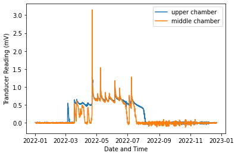
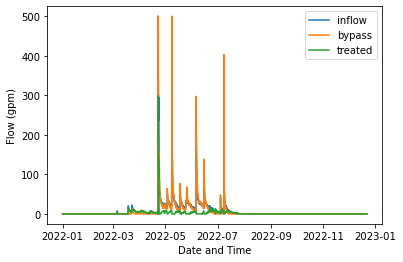
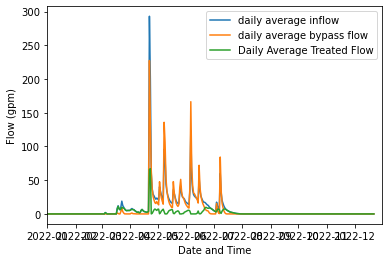
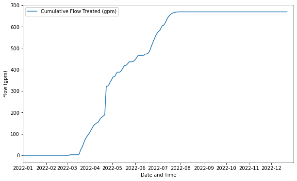

# ABE 516 Project - initial data wrangling

### Load in raw data for flow calculations


```python
#imports
import pandas as pd
import seaborn as sns
import matplotlib.pyplot as plt
import math
import numpy as np
import datetime as dt

# allow plots to appear directly in the notebook
%matplotlib inline
```


```python

base_url = "http://mesonet.agron.iastate.edu/pickup/.jaynes/"
year = "2022"
site = "Shearer_Level"
file_type = ".dat"
combo = "/"

full_url = base_url+year+combo+site+file_type
print(full_url)
```

    http://mesonet.agron.iastate.edu/pickup/.jaynes/2022/Shearer_Level.dat
    


```python
data = pd.read_csv(full_url, header = 1)
data.head(10)
```


<div>
<style scoped>
    .dataframe tbody tr th:only-of-type {
        vertical-align: middle;
    }

    .dataframe tbody tr th {
        vertical-align: top;
    }

    .dataframe thead th {
        text-align: right;
    }
</style>
<table border="1" class="dataframe">
  <thead>
    <tr style="text-align: right;">
      <th></th>
      <th>TIMESTAMP</th>
      <th>RECORD</th>
      <th>BattV_Avg</th>
      <th>PTemp_Avg</th>
      <th>AirTC_Avg</th>
      <th>Rain_mm_Tot</th>
      <th>D_1_Avg</th>
      <th>D_2_Avg</th>
      <th>VWC_Shearer1</th>
      <th>EC_Shearer1</th>
      <th>...</th>
      <th>T_Shearer4</th>
      <th>P_Shearer4</th>
      <th>PA_Shearer4</th>
      <th>VR_Shearer4</th>
      <th>VWC_Shearer5</th>
      <th>EC_Shearer5</th>
      <th>T_Shearer5</th>
      <th>P_Shearer5</th>
      <th>PA_Shearer5</th>
      <th>VR_Shearer5</th>
    </tr>
  </thead>
  <tbody>
    <tr>
      <th>0</th>
      <td>TS</td>
      <td>RN</td>
      <td>Volts</td>
      <td>C</td>
      <td>C</td>
      <td>mm</td>
      <td>mV</td>
      <td>mV</td>
      <td>m^3/m^3</td>
      <td>dS/m</td>
      <td>...</td>
      <td>Deg C</td>
      <td>unitless</td>
      <td>nSec</td>
      <td>unitless</td>
      <td>m^3/m^3</td>
      <td>dS/m</td>
      <td>Deg C</td>
      <td>unitless</td>
      <td>nSec</td>
      <td>unitless</td>
    </tr>
    <tr>
      <th>1</th>
      <td>NaN</td>
      <td>NaN</td>
      <td>Avg</td>
      <td>Avg</td>
      <td>Avg</td>
      <td>Tot</td>
      <td>Avg</td>
      <td>Avg</td>
      <td>Smp</td>
      <td>Smp</td>
      <td>...</td>
      <td>Smp</td>
      <td>Smp</td>
      <td>Smp</td>
      <td>Smp</td>
      <td>Smp</td>
      <td>Smp</td>
      <td>Smp</td>
      <td>Smp</td>
      <td>Smp</td>
      <td>Smp</td>
    </tr>
    <tr>
      <th>2</th>
      <td>2022-01-01 00:00:00</td>
      <td>48754</td>
      <td>12.01</td>
      <td>-11.58</td>
      <td>NAN</td>
      <td>0</td>
      <td>0.009</td>
      <td>0.006</td>
      <td>0.18</td>
      <td>0.04</td>
      <td>...</td>
      <td>4.485</td>
      <td>21.76</td>
      <td>1.784</td>
      <td>1.279</td>
      <td>0.391</td>
      <td>0.386</td>
      <td>5.869</td>
      <td>24.07</td>
      <td>1.847</td>
      <td>1.482</td>
    </tr>
    <tr>
      <th>3</th>
      <td>2022-01-01 01:00:00</td>
      <td>48755</td>
      <td>11.99</td>
      <td>-12.72</td>
      <td>NAN</td>
      <td>0</td>
      <td>0.007</td>
      <td>0</td>
      <td>0.169</td>
      <td>0.036</td>
      <td>...</td>
      <td>4.451</td>
      <td>21.76</td>
      <td>1.784</td>
      <td>1.28</td>
      <td>0.391</td>
      <td>0.381</td>
      <td>5.86</td>
      <td>24.09</td>
      <td>1.847</td>
      <td>1.476</td>
    </tr>
    <tr>
      <th>4</th>
      <td>2022-01-01 02:00:00</td>
      <td>48756</td>
      <td>11.97</td>
      <td>-13.59</td>
      <td>NAN</td>
      <td>0</td>
      <td>0.005</td>
      <td>0.001</td>
      <td>0.157</td>
      <td>0.03</td>
      <td>...</td>
      <td>4.469</td>
      <td>21.76</td>
      <td>1.784</td>
      <td>1.28</td>
      <td>0.391</td>
      <td>0.383</td>
      <td>5.848</td>
      <td>24.08</td>
      <td>1.847</td>
      <td>1.478</td>
    </tr>
    <tr>
      <th>5</th>
      <td>2022-01-01 03:00:00</td>
      <td>48757</td>
      <td>11.95</td>
      <td>-14.61</td>
      <td>NAN</td>
      <td>0</td>
      <td>0.007</td>
      <td>0</td>
      <td>0.142</td>
      <td>0.024</td>
      <td>...</td>
      <td>4.451</td>
      <td>21.76</td>
      <td>1.784</td>
      <td>1.279</td>
      <td>0.391</td>
      <td>0.382</td>
      <td>5.857</td>
      <td>24.09</td>
      <td>1.847</td>
      <td>1.477</td>
    </tr>
    <tr>
      <th>6</th>
      <td>2022-01-01 04:00:00</td>
      <td>48758</td>
      <td>11.93</td>
      <td>-15.46</td>
      <td>NAN</td>
      <td>0</td>
      <td>0.004</td>
      <td>-0.001</td>
      <td>0.132</td>
      <td>0.021</td>
      <td>...</td>
      <td>4.429</td>
      <td>21.76</td>
      <td>1.784</td>
      <td>1.279</td>
      <td>0.391</td>
      <td>0.383</td>
      <td>5.866</td>
      <td>24.08</td>
      <td>1.847</td>
      <td>1.478</td>
    </tr>
    <tr>
      <th>7</th>
      <td>2022-01-01 05:00:00</td>
      <td>48759</td>
      <td>11.92</td>
      <td>-15.63</td>
      <td>NAN</td>
      <td>0</td>
      <td>0.002</td>
      <td>0</td>
      <td>0.124</td>
      <td>0.019</td>
      <td>...</td>
      <td>4.479</td>
      <td>21.76</td>
      <td>1.784</td>
      <td>1.279</td>
      <td>0.391</td>
      <td>0.385</td>
      <td>5.824</td>
      <td>24.08</td>
      <td>1.847</td>
      <td>1.481</td>
    </tr>
    <tr>
      <th>8</th>
      <td>2022-01-01 06:00:00</td>
      <td>48760</td>
      <td>11.9</td>
      <td>-15.81</td>
      <td>NAN</td>
      <td>0</td>
      <td>0.005</td>
      <td>0.002</td>
      <td>0.118</td>
      <td>0.017</td>
      <td>...</td>
      <td>4.436</td>
      <td>21.76</td>
      <td>1.784</td>
      <td>1.279</td>
      <td>0.391</td>
      <td>0.386</td>
      <td>5.875</td>
      <td>24.07</td>
      <td>1.847</td>
      <td>1.482</td>
    </tr>
    <tr>
      <th>9</th>
      <td>2022-01-01 07:00:00</td>
      <td>48761</td>
      <td>11.88</td>
      <td>-16.21</td>
      <td>NAN</td>
      <td>0</td>
      <td>0.004</td>
      <td>0</td>
      <td>0.113</td>
      <td>0.015</td>
      <td>...</td>
      <td>4.457</td>
      <td>21.76</td>
      <td>1.784</td>
      <td>1.279</td>
      <td>0.391</td>
      <td>0.386</td>
      <td>5.848</td>
      <td>24.07</td>
      <td>1.847</td>
      <td>1.482</td>
    </tr>
  </tbody>
</table>
<p>10 rows × 38 columns</p>
</div>


### Subset and Change Data Types


```python
#data.iloc[-0:2]
#data2 = data.drop([0,1], axis = 0)
data2 = data[2:]
```


```python
data2.head(10)
```


<div>
<style scoped>
    .dataframe tbody tr th:only-of-type {
        vertical-align: middle;
    }

    .dataframe tbody tr th {
        vertical-align: top;
    }

    .dataframe thead th {
        text-align: right;
    }
</style>
<table border="1" class="dataframe">
  <thead>
    <tr style="text-align: right;">
      <th></th>
      <th>TIMESTAMP</th>
      <th>RECORD</th>
      <th>BattV_Avg</th>
      <th>PTemp_Avg</th>
      <th>AirTC_Avg</th>
      <th>Rain_mm_Tot</th>
      <th>D_1_Avg</th>
      <th>D_2_Avg</th>
      <th>VWC_Shearer1</th>
      <th>EC_Shearer1</th>
      <th>...</th>
      <th>T_Shearer4</th>
      <th>P_Shearer4</th>
      <th>PA_Shearer4</th>
      <th>VR_Shearer4</th>
      <th>VWC_Shearer5</th>
      <th>EC_Shearer5</th>
      <th>T_Shearer5</th>
      <th>P_Shearer5</th>
      <th>PA_Shearer5</th>
      <th>VR_Shearer5</th>
    </tr>
  </thead>
  <tbody>
    <tr>
      <th>2</th>
      <td>2022-01-01 00:00:00</td>
      <td>48754</td>
      <td>12.01</td>
      <td>-11.58</td>
      <td>NAN</td>
      <td>0</td>
      <td>0.009</td>
      <td>0.006</td>
      <td>0.18</td>
      <td>0.04</td>
      <td>...</td>
      <td>4.485</td>
      <td>21.76</td>
      <td>1.784</td>
      <td>1.279</td>
      <td>0.391</td>
      <td>0.386</td>
      <td>5.869</td>
      <td>24.07</td>
      <td>1.847</td>
      <td>1.482</td>
    </tr>
    <tr>
      <th>3</th>
      <td>2022-01-01 01:00:00</td>
      <td>48755</td>
      <td>11.99</td>
      <td>-12.72</td>
      <td>NAN</td>
      <td>0</td>
      <td>0.007</td>
      <td>0</td>
      <td>0.169</td>
      <td>0.036</td>
      <td>...</td>
      <td>4.451</td>
      <td>21.76</td>
      <td>1.784</td>
      <td>1.28</td>
      <td>0.391</td>
      <td>0.381</td>
      <td>5.86</td>
      <td>24.09</td>
      <td>1.847</td>
      <td>1.476</td>
    </tr>
    <tr>
      <th>4</th>
      <td>2022-01-01 02:00:00</td>
      <td>48756</td>
      <td>11.97</td>
      <td>-13.59</td>
      <td>NAN</td>
      <td>0</td>
      <td>0.005</td>
      <td>0.001</td>
      <td>0.157</td>
      <td>0.03</td>
      <td>...</td>
      <td>4.469</td>
      <td>21.76</td>
      <td>1.784</td>
      <td>1.28</td>
      <td>0.391</td>
      <td>0.383</td>
      <td>5.848</td>
      <td>24.08</td>
      <td>1.847</td>
      <td>1.478</td>
    </tr>
    <tr>
      <th>5</th>
      <td>2022-01-01 03:00:00</td>
      <td>48757</td>
      <td>11.95</td>
      <td>-14.61</td>
      <td>NAN</td>
      <td>0</td>
      <td>0.007</td>
      <td>0</td>
      <td>0.142</td>
      <td>0.024</td>
      <td>...</td>
      <td>4.451</td>
      <td>21.76</td>
      <td>1.784</td>
      <td>1.279</td>
      <td>0.391</td>
      <td>0.382</td>
      <td>5.857</td>
      <td>24.09</td>
      <td>1.847</td>
      <td>1.477</td>
    </tr>
    <tr>
      <th>6</th>
      <td>2022-01-01 04:00:00</td>
      <td>48758</td>
      <td>11.93</td>
      <td>-15.46</td>
      <td>NAN</td>
      <td>0</td>
      <td>0.004</td>
      <td>-0.001</td>
      <td>0.132</td>
      <td>0.021</td>
      <td>...</td>
      <td>4.429</td>
      <td>21.76</td>
      <td>1.784</td>
      <td>1.279</td>
      <td>0.391</td>
      <td>0.383</td>
      <td>5.866</td>
      <td>24.08</td>
      <td>1.847</td>
      <td>1.478</td>
    </tr>
    <tr>
      <th>7</th>
      <td>2022-01-01 05:00:00</td>
      <td>48759</td>
      <td>11.92</td>
      <td>-15.63</td>
      <td>NAN</td>
      <td>0</td>
      <td>0.002</td>
      <td>0</td>
      <td>0.124</td>
      <td>0.019</td>
      <td>...</td>
      <td>4.479</td>
      <td>21.76</td>
      <td>1.784</td>
      <td>1.279</td>
      <td>0.391</td>
      <td>0.385</td>
      <td>5.824</td>
      <td>24.08</td>
      <td>1.847</td>
      <td>1.481</td>
    </tr>
    <tr>
      <th>8</th>
      <td>2022-01-01 06:00:00</td>
      <td>48760</td>
      <td>11.9</td>
      <td>-15.81</td>
      <td>NAN</td>
      <td>0</td>
      <td>0.005</td>
      <td>0.002</td>
      <td>0.118</td>
      <td>0.017</td>
      <td>...</td>
      <td>4.436</td>
      <td>21.76</td>
      <td>1.784</td>
      <td>1.279</td>
      <td>0.391</td>
      <td>0.386</td>
      <td>5.875</td>
      <td>24.07</td>
      <td>1.847</td>
      <td>1.482</td>
    </tr>
    <tr>
      <th>9</th>
      <td>2022-01-01 07:00:00</td>
      <td>48761</td>
      <td>11.88</td>
      <td>-16.21</td>
      <td>NAN</td>
      <td>0</td>
      <td>0.004</td>
      <td>0</td>
      <td>0.113</td>
      <td>0.015</td>
      <td>...</td>
      <td>4.457</td>
      <td>21.76</td>
      <td>1.784</td>
      <td>1.279</td>
      <td>0.391</td>
      <td>0.386</td>
      <td>5.848</td>
      <td>24.07</td>
      <td>1.847</td>
      <td>1.482</td>
    </tr>
    <tr>
      <th>10</th>
      <td>2022-01-01 08:00:00</td>
      <td>48762</td>
      <td>11.86</td>
      <td>-16.55</td>
      <td>NAN</td>
      <td>0</td>
      <td>0.005</td>
      <td>0.002</td>
      <td>0.109</td>
      <td>0.014</td>
      <td>...</td>
      <td>4.436</td>
      <td>21.76</td>
      <td>1.784</td>
      <td>1.28</td>
      <td>0.391</td>
      <td>0.382</td>
      <td>5.845</td>
      <td>24.09</td>
      <td>1.847</td>
      <td>1.477</td>
    </tr>
    <tr>
      <th>11</th>
      <td>2022-01-01 09:00:00</td>
      <td>48763</td>
      <td>11.88</td>
      <td>-16.56</td>
      <td>NAN</td>
      <td>0</td>
      <td>0.005</td>
      <td>0</td>
      <td>0.106</td>
      <td>0.014</td>
      <td>...</td>
      <td>4.429</td>
      <td>21.76</td>
      <td>1.784</td>
      <td>1.28</td>
      <td>0.391</td>
      <td>0.381</td>
      <td>5.833</td>
      <td>24.09</td>
      <td>1.847</td>
      <td>1.476</td>
    </tr>
  </tbody>
</table>
<p>10 rows × 38 columns</p>
</div>


```python
data2.reset_index(drop = True, inplace = True)
data2.head(-10)
```


<div>
<style scoped>
    .dataframe tbody tr th:only-of-type {
        vertical-align: middle;
    }

    .dataframe tbody tr th {
        vertical-align: top;
    }

    .dataframe thead th {
        text-align: right;
    }
</style>
<table border="1" class="dataframe">
  <thead>
    <tr style="text-align: right;">
      <th></th>
      <th>TIMESTAMP</th>
      <th>RECORD</th>
      <th>BattV_Avg</th>
      <th>PTemp_Avg</th>
      <th>AirTC_Avg</th>
      <th>Rain_mm_Tot</th>
      <th>D_1_Avg</th>
      <th>D_2_Avg</th>
      <th>VWC_Shearer1</th>
      <th>EC_Shearer1</th>
      <th>...</th>
      <th>T_Shearer4</th>
      <th>P_Shearer4</th>
      <th>PA_Shearer4</th>
      <th>VR_Shearer4</th>
      <th>VWC_Shearer5</th>
      <th>EC_Shearer5</th>
      <th>T_Shearer5</th>
      <th>P_Shearer5</th>
      <th>PA_Shearer5</th>
      <th>VR_Shearer5</th>
    </tr>
  </thead>
  <tbody>
    <tr>
      <th>0</th>
      <td>2022-01-01 00:00:00</td>
      <td>48754</td>
      <td>12.01</td>
      <td>-11.58</td>
      <td>NAN</td>
      <td>0</td>
      <td>0.009</td>
      <td>0.006</td>
      <td>0.18</td>
      <td>0.04</td>
      <td>...</td>
      <td>4.485</td>
      <td>21.76</td>
      <td>1.784</td>
      <td>1.279</td>
      <td>0.391</td>
      <td>0.386</td>
      <td>5.869</td>
      <td>24.07</td>
      <td>1.847</td>
      <td>1.482</td>
    </tr>
    <tr>
      <th>1</th>
      <td>2022-01-01 01:00:00</td>
      <td>48755</td>
      <td>11.99</td>
      <td>-12.72</td>
      <td>NAN</td>
      <td>0</td>
      <td>0.007</td>
      <td>0</td>
      <td>0.169</td>
      <td>0.036</td>
      <td>...</td>
      <td>4.451</td>
      <td>21.76</td>
      <td>1.784</td>
      <td>1.28</td>
      <td>0.391</td>
      <td>0.381</td>
      <td>5.86</td>
      <td>24.09</td>
      <td>1.847</td>
      <td>1.476</td>
    </tr>
    <tr>
      <th>2</th>
      <td>2022-01-01 02:00:00</td>
      <td>48756</td>
      <td>11.97</td>
      <td>-13.59</td>
      <td>NAN</td>
      <td>0</td>
      <td>0.005</td>
      <td>0.001</td>
      <td>0.157</td>
      <td>0.03</td>
      <td>...</td>
      <td>4.469</td>
      <td>21.76</td>
      <td>1.784</td>
      <td>1.28</td>
      <td>0.391</td>
      <td>0.383</td>
      <td>5.848</td>
      <td>24.08</td>
      <td>1.847</td>
      <td>1.478</td>
    </tr>
    <tr>
      <th>3</th>
      <td>2022-01-01 03:00:00</td>
      <td>48757</td>
      <td>11.95</td>
      <td>-14.61</td>
      <td>NAN</td>
      <td>0</td>
      <td>0.007</td>
      <td>0</td>
      <td>0.142</td>
      <td>0.024</td>
      <td>...</td>
      <td>4.451</td>
      <td>21.76</td>
      <td>1.784</td>
      <td>1.279</td>
      <td>0.391</td>
      <td>0.382</td>
      <td>5.857</td>
      <td>24.09</td>
      <td>1.847</td>
      <td>1.477</td>
    </tr>
    <tr>
      <th>4</th>
      <td>2022-01-01 04:00:00</td>
      <td>48758</td>
      <td>11.93</td>
      <td>-15.46</td>
      <td>NAN</td>
      <td>0</td>
      <td>0.004</td>
      <td>-0.001</td>
      <td>0.132</td>
      <td>0.021</td>
      <td>...</td>
      <td>4.429</td>
      <td>21.76</td>
      <td>1.784</td>
      <td>1.279</td>
      <td>0.391</td>
      <td>0.383</td>
      <td>5.866</td>
      <td>24.08</td>
      <td>1.847</td>
      <td>1.478</td>
    </tr>
    <tr>
      <th>...</th>
      <td>...</td>
      <td>...</td>
      <td>...</td>
      <td>...</td>
      <td>...</td>
      <td>...</td>
      <td>...</td>
      <td>...</td>
      <td>...</td>
      <td>...</td>
      <td>...</td>
      <td>...</td>
      <td>...</td>
      <td>...</td>
      <td>...</td>
      <td>...</td>
      <td>...</td>
      <td>...</td>
      <td>...</td>
      <td>...</td>
      <td>...</td>
    </tr>
    <tr>
      <th>8446</th>
      <td>2022-12-21 17:00:00</td>
      <td>57200</td>
      <td>12.44</td>
      <td>-9.83</td>
      <td>NAN</td>
      <td>0</td>
      <td>-0.004</td>
      <td>-0.01</td>
      <td>0.173</td>
      <td>0.036</td>
      <td>...</td>
      <td>4.177</td>
      <td>21.2</td>
      <td>1.772</td>
      <td>1.297</td>
      <td>0.368</td>
      <td>0.362</td>
      <td>5.559</td>
      <td>21.93</td>
      <td>1.803</td>
      <td>1.452</td>
    </tr>
    <tr>
      <th>8447</th>
      <td>2022-12-21 18:00:00</td>
      <td>57201</td>
      <td>12.38</td>
      <td>-9.5</td>
      <td>NAN</td>
      <td>0</td>
      <td>-0.006</td>
      <td>-0.015</td>
      <td>0.17</td>
      <td>0.036</td>
      <td>...</td>
      <td>4.168</td>
      <td>21.2</td>
      <td>1.772</td>
      <td>1.297</td>
      <td>0.368</td>
      <td>0.364</td>
      <td>5.553</td>
      <td>21.93</td>
      <td>1.803</td>
      <td>1.454</td>
    </tr>
    <tr>
      <th>8448</th>
      <td>2022-12-21 19:00:00</td>
      <td>57202</td>
      <td>12.3</td>
      <td>-9.26</td>
      <td>NAN</td>
      <td>0</td>
      <td>-0.007</td>
      <td>-0.013</td>
      <td>0.167</td>
      <td>0.035</td>
      <td>...</td>
      <td>4.171</td>
      <td>21.25</td>
      <td>1.773</td>
      <td>1.296</td>
      <td>0.368</td>
      <td>0.363</td>
      <td>5.495</td>
      <td>21.93</td>
      <td>1.803</td>
      <td>1.453</td>
    </tr>
    <tr>
      <th>8449</th>
      <td>2022-12-21 20:00:00</td>
      <td>57203</td>
      <td>12.24</td>
      <td>-9.21</td>
      <td>NAN</td>
      <td>0</td>
      <td>-0.004</td>
      <td>-0.01</td>
      <td>0.166</td>
      <td>0.034</td>
      <td>...</td>
      <td>4.171</td>
      <td>21.31</td>
      <td>1.775</td>
      <td>1.297</td>
      <td>0.368</td>
      <td>0.362</td>
      <td>5.498</td>
      <td>21.88</td>
      <td>1.802</td>
      <td>1.452</td>
    </tr>
    <tr>
      <th>8450</th>
      <td>2022-12-21 21:00:00</td>
      <td>57204</td>
      <td>12.2</td>
      <td>-9.35</td>
      <td>NAN</td>
      <td>0</td>
      <td>-0.002</td>
      <td>-0.009</td>
      <td>0.165</td>
      <td>0.034</td>
      <td>...</td>
      <td>4.134</td>
      <td>21.25</td>
      <td>1.773</td>
      <td>1.296</td>
      <td>0.368</td>
      <td>0.362</td>
      <td>5.522</td>
      <td>21.88</td>
      <td>1.802</td>
      <td>1.452</td>
    </tr>
  </tbody>
</table>
<p>8451 rows × 38 columns</p>
</div>


```python
data2.dtypes
```


    TIMESTAMP       object
    RECORD          object
    BattV_Avg       object
    PTemp_Avg       object
    AirTC_Avg       object
    Rain_mm_Tot     object
    D_1_Avg         object
    D_2_Avg         object
    VWC_Shearer1    object
    EC_Shearer1     object
    T_Shearer1      object
    P_Shearer1      object
    PA_Shearer1     object
    VR_Shearer1     object
    VWC_Shearer2    object
    EC_Shearer2     object
    T_Shearer2      object
    P_Shearer2      object
    PA_Shearer2     object
    VR_Shearer2     object
    VWC_Shearer3    object
    EC_Shearer3     object
    T_Shearer3      object
    P_Shearer3      object
    PA_Shearer3     object
    VR_Shearer3     object
    VWC_Shearer4    object
    EC_Shearer4     object
    T_Shearer4      object
    P_Shearer4      object
    PA_Shearer4     object
    VR_Shearer4     object
    VWC_Shearer5    object
    EC_Shearer5     object
    T_Shearer5      object
    P_Shearer5      object
    PA_Shearer5     object
    VR_Shearer5     object
    dtype: object


```python
data3 = data2.iloc[:,0:8]
```


```python
data3["BattV_Avg"]=data3["BattV_Avg"].astype("float64")
data3["PTemp_Avg"]=data3["PTemp_Avg"].astype("float64")
data3["AirTC_Avg"]=data3["AirTC_Avg"].astype("float64")
data3["Rain_mm_Tot"]=data3["Rain_mm_Tot"].astype("float64")
data3["D_1_Avg"]=data3["D_1_Avg"].astype("float64")
data3["D_2_Avg"]=data3["D_2_Avg"].astype("float64")
data3["TIMESTAMP"]=pd.to_datetime(data3["TIMESTAMP"])
```

    C:\Users\gjohnson\AppData\Local\Temp\ipykernel_14076\3206388027.py:1: SettingWithCopyWarning: 
    A value is trying to be set on a copy of a slice from a DataFrame.
    Try using .loc[row_indexer,col_indexer] = value instead
    
    See the caveats in the documentation: https://pandas.pydata.org/pandas-docs/stable/user_guide/indexing.html#returning-a-view-versus-a-copy
      data3["BattV_Avg"]=data3["BattV_Avg"].astype("float64")
    C:\Users\gjohnson\AppData\Local\Temp\ipykernel_14076\3206388027.py:2: SettingWithCopyWarning: 
    A value is trying to be set on a copy of a slice from a DataFrame.
    Try using .loc[row_indexer,col_indexer] = value instead
    
    See the caveats in the documentation: https://pandas.pydata.org/pandas-docs/stable/user_guide/indexing.html#returning-a-view-versus-a-copy
      data3["PTemp_Avg"]=data3["PTemp_Avg"].astype("float64")
    C:\Users\gjohnson\AppData\Local\Temp\ipykernel_14076\3206388027.py:3: SettingWithCopyWarning: 
    A value is trying to be set on a copy of a slice from a DataFrame.
    Try using .loc[row_indexer,col_indexer] = value instead
    
    See the caveats in the documentation: https://pandas.pydata.org/pandas-docs/stable/user_guide/indexing.html#returning-a-view-versus-a-copy
      data3["AirTC_Avg"]=data3["AirTC_Avg"].astype("float64")
    C:\Users\gjohnson\AppData\Local\Temp\ipykernel_14076\3206388027.py:4: SettingWithCopyWarning: 
    A value is trying to be set on a copy of a slice from a DataFrame.
    Try using .loc[row_indexer,col_indexer] = value instead
    
    See the caveats in the documentation: https://pandas.pydata.org/pandas-docs/stable/user_guide/indexing.html#returning-a-view-versus-a-copy
      data3["Rain_mm_Tot"]=data3["Rain_mm_Tot"].astype("float64")
    C:\Users\gjohnson\AppData\Local\Temp\ipykernel_14076\3206388027.py:5: SettingWithCopyWarning: 
    A value is trying to be set on a copy of a slice from a DataFrame.
    Try using .loc[row_indexer,col_indexer] = value instead
    
    See the caveats in the documentation: https://pandas.pydata.org/pandas-docs/stable/user_guide/indexing.html#returning-a-view-versus-a-copy
      data3["D_1_Avg"]=data3["D_1_Avg"].astype("float64")
    C:\Users\gjohnson\AppData\Local\Temp\ipykernel_14076\3206388027.py:6: SettingWithCopyWarning: 
    A value is trying to be set on a copy of a slice from a DataFrame.
    Try using .loc[row_indexer,col_indexer] = value instead
    
    See the caveats in the documentation: https://pandas.pydata.org/pandas-docs/stable/user_guide/indexing.html#returning-a-view-versus-a-copy
      data3["D_2_Avg"]=data3["D_2_Avg"].astype("float64")
    C:\Users\gjohnson\AppData\Local\Temp\ipykernel_14076\3206388027.py:7: SettingWithCopyWarning: 
    A value is trying to be set on a copy of a slice from a DataFrame.
    Try using .loc[row_indexer,col_indexer] = value instead
    
    See the caveats in the documentation: https://pandas.pydata.org/pandas-docs/stable/user_guide/indexing.html#returning-a-view-versus-a-copy
      data3["TIMESTAMP"]=pd.to_datetime(data3["TIMESTAMP"])
    


```python
data3.dtypes
```


    TIMESTAMP      datetime64[ns]
    RECORD                 object
    BattV_Avg             float64
    PTemp_Avg             float64
    AirTC_Avg             float64
    Rain_mm_Tot           float64
    D_1_Avg               float64
    D_2_Avg               float64
    dtype: object


### Plot Transducer Readings Over Time


```python
plt.plot(data3["TIMESTAMP"], data3["D_1_Avg"], label = "upper chamber")
plt.plot(data3["TIMESTAMP"], data3["D_2_Avg"], label = "middle chamber")
plt.ylabel("Tranducer Reading (mV)")
plt.xlabel("Date and Time")
plt.legend()
plt.show()

```


    

    


```python
data3.head()
```


<div>
<style scoped>
    .dataframe tbody tr th:only-of-type {
        vertical-align: middle;
    }

    .dataframe tbody tr th {
        vertical-align: top;
    }

    .dataframe thead th {
        text-align: right;
    }
</style>
<table border="1" class="dataframe">
  <thead>
    <tr style="text-align: right;">
      <th></th>
      <th>TIMESTAMP</th>
      <th>RECORD</th>
      <th>BattV_Avg</th>
      <th>PTemp_Avg</th>
      <th>AirTC_Avg</th>
      <th>Rain_mm_Tot</th>
      <th>D_1_Avg</th>
      <th>D_2_Avg</th>
    </tr>
  </thead>
  <tbody>
    <tr>
      <th>0</th>
      <td>2022-01-01 00:00:00</td>
      <td>48754</td>
      <td>12.01</td>
      <td>-11.58</td>
      <td>NaN</td>
      <td>0.0</td>
      <td>0.009</td>
      <td>0.006</td>
    </tr>
    <tr>
      <th>1</th>
      <td>2022-01-01 01:00:00</td>
      <td>48755</td>
      <td>11.99</td>
      <td>-12.72</td>
      <td>NaN</td>
      <td>0.0</td>
      <td>0.007</td>
      <td>0.000</td>
    </tr>
    <tr>
      <th>2</th>
      <td>2022-01-01 02:00:00</td>
      <td>48756</td>
      <td>11.97</td>
      <td>-13.59</td>
      <td>NaN</td>
      <td>0.0</td>
      <td>0.005</td>
      <td>0.001</td>
    </tr>
    <tr>
      <th>3</th>
      <td>2022-01-01 03:00:00</td>
      <td>48757</td>
      <td>11.95</td>
      <td>-14.61</td>
      <td>NaN</td>
      <td>0.0</td>
      <td>0.007</td>
      <td>0.000</td>
    </tr>
    <tr>
      <th>4</th>
      <td>2022-01-01 04:00:00</td>
      <td>48758</td>
      <td>11.93</td>
      <td>-15.46</td>
      <td>NaN</td>
      <td>0.0</td>
      <td>0.004</td>
      <td>-0.001</td>
    </tr>
  </tbody>
</table>
</div>


### Calculate Water Levels and Flows


```python
# Transducer Calibration
slope1 = 1.0101667
intercept1 = 0.1407917
trans_offset1 = 0.53125
slope2 = 1.0096
intercept2 = 0.14698
trans_offset2 = 0.53125

```


```python
data3["Upper_WatLev_Weir_ft"] = slope1*data3["D_1_Avg"]+intercept1-trans_offset1
data3["Middle_WatLev_Weir_ft"] = slope2*data3["D_2_Avg"]+intercept2-trans_offset2
```

    C:\Users\gjohnson\AppData\Local\Temp\ipykernel_14076\261010027.py:1: SettingWithCopyWarning: 
    A value is trying to be set on a copy of a slice from a DataFrame.
    Try using .loc[row_indexer,col_indexer] = value instead
    
    See the caveats in the documentation: https://pandas.pydata.org/pandas-docs/stable/user_guide/indexing.html#returning-a-view-versus-a-copy
      data3["Upper_WatLev_Weir_ft"] = slope1*data3["D_1_Avg"]+intercept1-trans_offset1
    C:\Users\gjohnson\AppData\Local\Temp\ipykernel_14076\261010027.py:2: SettingWithCopyWarning: 
    A value is trying to be set on a copy of a slice from a DataFrame.
    Try using .loc[row_indexer,col_indexer] = value instead
    
    See the caveats in the documentation: https://pandas.pydata.org/pandas-docs/stable/user_guide/indexing.html#returning-a-view-versus-a-copy
      data3["Middle_WatLev_Weir_ft"] = slope2*data3["D_2_Avg"]+intercept2-trans_offset2
    


```python
data3.head()
```


<div>
<style scoped>
    .dataframe tbody tr th:only-of-type {
        vertical-align: middle;
    }

    .dataframe tbody tr th {
        vertical-align: top;
    }

    .dataframe thead th {
        text-align: right;
    }
</style>
<table border="1" class="dataframe">
  <thead>
    <tr style="text-align: right;">
      <th></th>
      <th>TIMESTAMP</th>
      <th>RECORD</th>
      <th>BattV_Avg</th>
      <th>PTemp_Avg</th>
      <th>AirTC_Avg</th>
      <th>Rain_mm_Tot</th>
      <th>D_1_Avg</th>
      <th>D_2_Avg</th>
      <th>Upper_WatLev_Weir_ft</th>
      <th>Middle_WatLev_Weir_ft</th>
    </tr>
  </thead>
  <tbody>
    <tr>
      <th>0</th>
      <td>2022-01-01 00:00:00</td>
      <td>48754</td>
      <td>12.01</td>
      <td>-11.58</td>
      <td>NaN</td>
      <td>0.0</td>
      <td>0.009</td>
      <td>0.006</td>
      <td>-0.381367</td>
      <td>-0.378212</td>
    </tr>
    <tr>
      <th>1</th>
      <td>2022-01-01 01:00:00</td>
      <td>48755</td>
      <td>11.99</td>
      <td>-12.72</td>
      <td>NaN</td>
      <td>0.0</td>
      <td>0.007</td>
      <td>0.000</td>
      <td>-0.383387</td>
      <td>-0.384270</td>
    </tr>
    <tr>
      <th>2</th>
      <td>2022-01-01 02:00:00</td>
      <td>48756</td>
      <td>11.97</td>
      <td>-13.59</td>
      <td>NaN</td>
      <td>0.0</td>
      <td>0.005</td>
      <td>0.001</td>
      <td>-0.385407</td>
      <td>-0.383260</td>
    </tr>
    <tr>
      <th>3</th>
      <td>2022-01-01 03:00:00</td>
      <td>48757</td>
      <td>11.95</td>
      <td>-14.61</td>
      <td>NaN</td>
      <td>0.0</td>
      <td>0.007</td>
      <td>0.000</td>
      <td>-0.383387</td>
      <td>-0.384270</td>
    </tr>
    <tr>
      <th>4</th>
      <td>2022-01-01 04:00:00</td>
      <td>48758</td>
      <td>11.93</td>
      <td>-15.46</td>
      <td>NaN</td>
      <td>0.0</td>
      <td>0.004</td>
      <td>-0.001</td>
      <td>-0.386418</td>
      <td>-0.385280</td>
    </tr>
  </tbody>
</table>
</div>


```python
#Weir Calibration - Flow Equation
coeff1 = 1.4774
exp1 = 2.3217
coeff2 = 0.9478
exp2 = 2.5388

```


```python
data3["flow_in_gpm"] = np.where(data3["Upper_WatLev_Weir_ft"] < 0, 0, coeff1*(data3["Upper_WatLev_Weir_ft"]*12)**exp1)
data3["flow_in_gpm"] = data3["flow_in_gpm"].where(data3["flow_in_gpm"]<500, other=500)

data3["flow_bypass_gpm"] = np.where(data3["Middle_WatLev_Weir_ft"] < 0, 0, coeff2*(data3["Middle_WatLev_Weir_ft"]*12)**exp2)
data3["flow_bypass_gpm"] = data3["flow_bypass_gpm"].where(data3["flow_bypass_gpm"]<500, other=500)

data3["flow_treated_gpm"] = data3["flow_in_gpm"] - data3["flow_bypass_gpm"]
data3["flow_treated_gpm"] = data3["flow_treated_gpm"].where(data3["flow_treated_gpm"]>0, other=0)
```

    C:\Users\gjohnson\AppData\Local\Temp\ipykernel_14076\3351044047.py:1: SettingWithCopyWarning: 
    A value is trying to be set on a copy of a slice from a DataFrame.
    Try using .loc[row_indexer,col_indexer] = value instead
    
    See the caveats in the documentation: https://pandas.pydata.org/pandas-docs/stable/user_guide/indexing.html#returning-a-view-versus-a-copy
      data3["flow_in_gpm"] = np.where(data3["Upper_WatLev_Weir_ft"] < 0, 0, coeff1*(data3["Upper_WatLev_Weir_ft"]*12)**exp1)
    C:\Users\gjohnson\AppData\Local\Temp\ipykernel_14076\3351044047.py:2: SettingWithCopyWarning: 
    A value is trying to be set on a copy of a slice from a DataFrame.
    Try using .loc[row_indexer,col_indexer] = value instead
    
    See the caveats in the documentation: https://pandas.pydata.org/pandas-docs/stable/user_guide/indexing.html#returning-a-view-versus-a-copy
      data3["flow_in_gpm"] = data3["flow_in_gpm"].where(data3["flow_in_gpm"]<500, other=500)
    C:\Users\gjohnson\AppData\Local\Temp\ipykernel_14076\3351044047.py:4: SettingWithCopyWarning: 
    A value is trying to be set on a copy of a slice from a DataFrame.
    Try using .loc[row_indexer,col_indexer] = value instead
    
    See the caveats in the documentation: https://pandas.pydata.org/pandas-docs/stable/user_guide/indexing.html#returning-a-view-versus-a-copy
      data3["flow_bypass_gpm"] = np.where(data3["Middle_WatLev_Weir_ft"] < 0, 0, coeff2*(data3["Middle_WatLev_Weir_ft"]*12)**exp2)
    C:\Users\gjohnson\AppData\Local\Temp\ipykernel_14076\3351044047.py:5: SettingWithCopyWarning: 
    A value is trying to be set on a copy of a slice from a DataFrame.
    Try using .loc[row_indexer,col_indexer] = value instead
    
    See the caveats in the documentation: https://pandas.pydata.org/pandas-docs/stable/user_guide/indexing.html#returning-a-view-versus-a-copy
      data3["flow_bypass_gpm"] = data3["flow_bypass_gpm"].where(data3["flow_bypass_gpm"]<500, other=500)
    C:\Users\gjohnson\AppData\Local\Temp\ipykernel_14076\3351044047.py:7: SettingWithCopyWarning: 
    A value is trying to be set on a copy of a slice from a DataFrame.
    Try using .loc[row_indexer,col_indexer] = value instead
    
    See the caveats in the documentation: https://pandas.pydata.org/pandas-docs/stable/user_guide/indexing.html#returning-a-view-versus-a-copy
      data3["flow_treated_gpm"] = data3["flow_in_gpm"] - data3["flow_bypass_gpm"]
    C:\Users\gjohnson\AppData\Local\Temp\ipykernel_14076\3351044047.py:8: SettingWithCopyWarning: 
    A value is trying to be set on a copy of a slice from a DataFrame.
    Try using .loc[row_indexer,col_indexer] = value instead
    
    See the caveats in the documentation: https://pandas.pydata.org/pandas-docs/stable/user_guide/indexing.html#returning-a-view-versus-a-copy
      data3["flow_treated_gpm"] = data3["flow_treated_gpm"].where(data3["flow_treated_gpm"]>0, other=0)
    


```python
data3.head(-10)
```


<div>
<style scoped>
    .dataframe tbody tr th:only-of-type {
        vertical-align: middle;
    }

    .dataframe tbody tr th {
        vertical-align: top;
    }

    .dataframe thead th {
        text-align: right;
    }
</style>
<table border="1" class="dataframe">
  <thead>
    <tr style="text-align: right;">
      <th></th>
      <th>TIMESTAMP</th>
      <th>RECORD</th>
      <th>BattV_Avg</th>
      <th>PTemp_Avg</th>
      <th>AirTC_Avg</th>
      <th>Rain_mm_Tot</th>
      <th>D_1_Avg</th>
      <th>D_2_Avg</th>
      <th>Upper_WatLev_Weir_ft</th>
      <th>Middle_WatLev_Weir_ft</th>
      <th>flow_in_gpm</th>
      <th>flow_bypass_gpm</th>
      <th>flow_treated_gpm</th>
    </tr>
  </thead>
  <tbody>
    <tr>
      <th>0</th>
      <td>2022-01-01 00:00:00</td>
      <td>48754</td>
      <td>12.01</td>
      <td>-11.58</td>
      <td>NaN</td>
      <td>0.0</td>
      <td>0.009</td>
      <td>0.006</td>
      <td>-0.381367</td>
      <td>-0.378212</td>
      <td>0.0</td>
      <td>0.0</td>
      <td>0.0</td>
    </tr>
    <tr>
      <th>1</th>
      <td>2022-01-01 01:00:00</td>
      <td>48755</td>
      <td>11.99</td>
      <td>-12.72</td>
      <td>NaN</td>
      <td>0.0</td>
      <td>0.007</td>
      <td>0.000</td>
      <td>-0.383387</td>
      <td>-0.384270</td>
      <td>0.0</td>
      <td>0.0</td>
      <td>0.0</td>
    </tr>
    <tr>
      <th>2</th>
      <td>2022-01-01 02:00:00</td>
      <td>48756</td>
      <td>11.97</td>
      <td>-13.59</td>
      <td>NaN</td>
      <td>0.0</td>
      <td>0.005</td>
      <td>0.001</td>
      <td>-0.385407</td>
      <td>-0.383260</td>
      <td>0.0</td>
      <td>0.0</td>
      <td>0.0</td>
    </tr>
    <tr>
      <th>3</th>
      <td>2022-01-01 03:00:00</td>
      <td>48757</td>
      <td>11.95</td>
      <td>-14.61</td>
      <td>NaN</td>
      <td>0.0</td>
      <td>0.007</td>
      <td>0.000</td>
      <td>-0.383387</td>
      <td>-0.384270</td>
      <td>0.0</td>
      <td>0.0</td>
      <td>0.0</td>
    </tr>
    <tr>
      <th>4</th>
      <td>2022-01-01 04:00:00</td>
      <td>48758</td>
      <td>11.93</td>
      <td>-15.46</td>
      <td>NaN</td>
      <td>0.0</td>
      <td>0.004</td>
      <td>-0.001</td>
      <td>-0.386418</td>
      <td>-0.385280</td>
      <td>0.0</td>
      <td>0.0</td>
      <td>0.0</td>
    </tr>
    <tr>
      <th>...</th>
      <td>...</td>
      <td>...</td>
      <td>...</td>
      <td>...</td>
      <td>...</td>
      <td>...</td>
      <td>...</td>
      <td>...</td>
      <td>...</td>
      <td>...</td>
      <td>...</td>
      <td>...</td>
      <td>...</td>
    </tr>
    <tr>
      <th>8446</th>
      <td>2022-12-21 17:00:00</td>
      <td>57200</td>
      <td>12.44</td>
      <td>-9.83</td>
      <td>NaN</td>
      <td>0.0</td>
      <td>-0.004</td>
      <td>-0.010</td>
      <td>-0.394499</td>
      <td>-0.394366</td>
      <td>0.0</td>
      <td>0.0</td>
      <td>0.0</td>
    </tr>
    <tr>
      <th>8447</th>
      <td>2022-12-21 18:00:00</td>
      <td>57201</td>
      <td>12.38</td>
      <td>-9.50</td>
      <td>NaN</td>
      <td>0.0</td>
      <td>-0.006</td>
      <td>-0.015</td>
      <td>-0.396519</td>
      <td>-0.399414</td>
      <td>0.0</td>
      <td>0.0</td>
      <td>0.0</td>
    </tr>
    <tr>
      <th>8448</th>
      <td>2022-12-21 19:00:00</td>
      <td>57202</td>
      <td>12.30</td>
      <td>-9.26</td>
      <td>NaN</td>
      <td>0.0</td>
      <td>-0.007</td>
      <td>-0.013</td>
      <td>-0.397529</td>
      <td>-0.397395</td>
      <td>0.0</td>
      <td>0.0</td>
      <td>0.0</td>
    </tr>
    <tr>
      <th>8449</th>
      <td>2022-12-21 20:00:00</td>
      <td>57203</td>
      <td>12.24</td>
      <td>-9.21</td>
      <td>NaN</td>
      <td>0.0</td>
      <td>-0.004</td>
      <td>-0.010</td>
      <td>-0.394499</td>
      <td>-0.394366</td>
      <td>0.0</td>
      <td>0.0</td>
      <td>0.0</td>
    </tr>
    <tr>
      <th>8450</th>
      <td>2022-12-21 21:00:00</td>
      <td>57204</td>
      <td>12.20</td>
      <td>-9.35</td>
      <td>NaN</td>
      <td>0.0</td>
      <td>-0.002</td>
      <td>-0.009</td>
      <td>-0.392479</td>
      <td>-0.393356</td>
      <td>0.0</td>
      <td>0.0</td>
      <td>0.0</td>
    </tr>
  </tbody>
</table>
<p>8451 rows × 13 columns</p>
</div>


```python
plt.plot(data3["TIMESTAMP"], data3["flow_in_gpm"], label = "inflow")
plt.plot(data3["TIMESTAMP"], data3["flow_bypass_gpm"], label = "bypass")
plt.plot(data3["TIMESTAMP"], data3["flow_treated_gpm"], label = "treated")
plt.ylabel("Flow (gpm)")
plt.xlabel("Date and Time")
plt.legend()
plt.show()

```


    

    


### Get daily average flow and cumulative flow


```python
data_date = pd.DataFrame(pd.to_datetime(data3["TIMESTAMP"]).dt.date.unique().tolist())
data_date = data_date.rename(columns = {data_date.columns[0]:"Date"})
data_date.head()
data_date["Date"] = pd.to_datetime(data_date["Date"])
data_date.dtypes
```


    Date    datetime64[ns]
    dtype: object


```python
data3["Date"] = data3["TIMESTAMP"].dt.date
data3.head(-20)
```

    C:\Users\gjohnson\AppData\Local\Temp\ipykernel_14076\2451804059.py:1: SettingWithCopyWarning: 
    A value is trying to be set on a copy of a slice from a DataFrame.
    Try using .loc[row_indexer,col_indexer] = value instead
    
    See the caveats in the documentation: https://pandas.pydata.org/pandas-docs/stable/user_guide/indexing.html#returning-a-view-versus-a-copy
      data3["Date"] = data3["TIMESTAMP"].dt.date
    


<div>
<style scoped>
    .dataframe tbody tr th:only-of-type {
        vertical-align: middle;
    }

    .dataframe tbody tr th {
        vertical-align: top;
    }

    .dataframe thead th {
        text-align: right;
    }
</style>
<table border="1" class="dataframe">
  <thead>
    <tr style="text-align: right;">
      <th></th>
      <th>TIMESTAMP</th>
      <th>RECORD</th>
      <th>BattV_Avg</th>
      <th>PTemp_Avg</th>
      <th>AirTC_Avg</th>
      <th>Rain_mm_Tot</th>
      <th>D_1_Avg</th>
      <th>D_2_Avg</th>
      <th>Upper_WatLev_Weir_ft</th>
      <th>Middle_WatLev_Weir_ft</th>
      <th>flow_in_gpm</th>
      <th>flow_bypass_gpm</th>
      <th>flow_treated_gpm</th>
      <th>Date</th>
    </tr>
  </thead>
  <tbody>
    <tr>
      <th>0</th>
      <td>2022-01-01 00:00:00</td>
      <td>48754</td>
      <td>12.01</td>
      <td>-11.58</td>
      <td>NaN</td>
      <td>0.0</td>
      <td>0.009</td>
      <td>0.006</td>
      <td>-0.381367</td>
      <td>-0.378212</td>
      <td>0.0</td>
      <td>0.0</td>
      <td>0.0</td>
      <td>2022-01-01</td>
    </tr>
    <tr>
      <th>1</th>
      <td>2022-01-01 01:00:00</td>
      <td>48755</td>
      <td>11.99</td>
      <td>-12.72</td>
      <td>NaN</td>
      <td>0.0</td>
      <td>0.007</td>
      <td>0.000</td>
      <td>-0.383387</td>
      <td>-0.384270</td>
      <td>0.0</td>
      <td>0.0</td>
      <td>0.0</td>
      <td>2022-01-01</td>
    </tr>
    <tr>
      <th>2</th>
      <td>2022-01-01 02:00:00</td>
      <td>48756</td>
      <td>11.97</td>
      <td>-13.59</td>
      <td>NaN</td>
      <td>0.0</td>
      <td>0.005</td>
      <td>0.001</td>
      <td>-0.385407</td>
      <td>-0.383260</td>
      <td>0.0</td>
      <td>0.0</td>
      <td>0.0</td>
      <td>2022-01-01</td>
    </tr>
    <tr>
      <th>3</th>
      <td>2022-01-01 03:00:00</td>
      <td>48757</td>
      <td>11.95</td>
      <td>-14.61</td>
      <td>NaN</td>
      <td>0.0</td>
      <td>0.007</td>
      <td>0.000</td>
      <td>-0.383387</td>
      <td>-0.384270</td>
      <td>0.0</td>
      <td>0.0</td>
      <td>0.0</td>
      <td>2022-01-01</td>
    </tr>
    <tr>
      <th>4</th>
      <td>2022-01-01 04:00:00</td>
      <td>48758</td>
      <td>11.93</td>
      <td>-15.46</td>
      <td>NaN</td>
      <td>0.0</td>
      <td>0.004</td>
      <td>-0.001</td>
      <td>-0.386418</td>
      <td>-0.385280</td>
      <td>0.0</td>
      <td>0.0</td>
      <td>0.0</td>
      <td>2022-01-01</td>
    </tr>
    <tr>
      <th>...</th>
      <td>...</td>
      <td>...</td>
      <td>...</td>
      <td>...</td>
      <td>...</td>
      <td>...</td>
      <td>...</td>
      <td>...</td>
      <td>...</td>
      <td>...</td>
      <td>...</td>
      <td>...</td>
      <td>...</td>
      <td>...</td>
    </tr>
    <tr>
      <th>8436</th>
      <td>2022-12-21 07:00:00</td>
      <td>57190</td>
      <td>12.07</td>
      <td>-17.25</td>
      <td>NaN</td>
      <td>0.0</td>
      <td>-0.002</td>
      <td>-0.008</td>
      <td>-0.392479</td>
      <td>-0.392347</td>
      <td>0.0</td>
      <td>0.0</td>
      <td>0.0</td>
      <td>2022-12-21</td>
    </tr>
    <tr>
      <th>8437</th>
      <td>2022-12-21 08:00:00</td>
      <td>57191</td>
      <td>12.07</td>
      <td>-16.99</td>
      <td>NaN</td>
      <td>0.0</td>
      <td>-0.001</td>
      <td>-0.008</td>
      <td>-0.391468</td>
      <td>-0.392347</td>
      <td>0.0</td>
      <td>0.0</td>
      <td>0.0</td>
      <td>2022-12-21</td>
    </tr>
    <tr>
      <th>8438</th>
      <td>2022-12-21 09:00:00</td>
      <td>57192</td>
      <td>12.14</td>
      <td>-16.66</td>
      <td>NaN</td>
      <td>0.0</td>
      <td>-0.002</td>
      <td>-0.008</td>
      <td>-0.392479</td>
      <td>-0.392347</td>
      <td>0.0</td>
      <td>0.0</td>
      <td>0.0</td>
      <td>2022-12-21</td>
    </tr>
    <tr>
      <th>8439</th>
      <td>2022-12-21 10:00:00</td>
      <td>57193</td>
      <td>12.44</td>
      <td>-15.80</td>
      <td>NaN</td>
      <td>0.0</td>
      <td>-0.006</td>
      <td>-0.011</td>
      <td>-0.396519</td>
      <td>-0.395376</td>
      <td>0.0</td>
      <td>0.0</td>
      <td>0.0</td>
      <td>2022-12-21</td>
    </tr>
    <tr>
      <th>8440</th>
      <td>2022-12-21 11:00:00</td>
      <td>57194</td>
      <td>13.07</td>
      <td>-14.58</td>
      <td>NaN</td>
      <td>0.0</td>
      <td>-0.009</td>
      <td>-0.014</td>
      <td>-0.399550</td>
      <td>-0.398404</td>
      <td>0.0</td>
      <td>0.0</td>
      <td>0.0</td>
      <td>2022-12-21</td>
    </tr>
  </tbody>
</table>
<p>8441 rows × 14 columns</p>
</div>


```python
daily_avg_df1 = data3.groupby(["Date"])["flow_in_gpm"].mean()
daily_avg_df2 = data3.groupby(["Date"])["flow_bypass_gpm"].mean()
daily_avg_df3 = data3.groupby(["Date"])["flow_treated_gpm"].mean()
daily_avg_df1 = pd.DataFrame(daily_avg_df1)
daily_avg_df1.reset_index(inplace = True)
daily_avg_df2 = pd.DataFrame(daily_avg_df2)
daily_avg_df2.reset_index(inplace = True)
daily_avg_df3 = pd.DataFrame(daily_avg_df3)
daily_avg_df3.reset_index(inplace = True)
#daily_avg_df1.head()
#data4["Date"] = data_date["Date"]
#data4 = data4.rename(columns = {"flow_treated_gpm":"flow_treated_daily_avg_gpm"})
#data4["Date"]=pd.to_datetime(data4["Date"])
#data4[104:116]
#data4.columns
#data4.head()
```


```python
data4 = pd.merge(daily_avg_df1, daily_avg_df2, how = "inner", on = "Date")
data4 = pd.merge(data4, daily_avg_df3, how = "inner", on = "Date")
data4.head()
```


<div>
<style scoped>
    .dataframe tbody tr th:only-of-type {
        vertical-align: middle;
    }

    .dataframe tbody tr th {
        vertical-align: top;
    }

    .dataframe thead th {
        text-align: right;
    }
</style>
<table border="1" class="dataframe">
  <thead>
    <tr style="text-align: right;">
      <th></th>
      <th>Date</th>
      <th>flow_in_gpm</th>
      <th>flow_bypass_gpm</th>
      <th>flow_treated_gpm</th>
    </tr>
  </thead>
  <tbody>
    <tr>
      <th>0</th>
      <td>2022-01-01</td>
      <td>0.0</td>
      <td>0.0</td>
      <td>0.0</td>
    </tr>
    <tr>
      <th>1</th>
      <td>2022-01-02</td>
      <td>0.0</td>
      <td>0.0</td>
      <td>0.0</td>
    </tr>
    <tr>
      <th>2</th>
      <td>2022-01-03</td>
      <td>0.0</td>
      <td>0.0</td>
      <td>0.0</td>
    </tr>
    <tr>
      <th>3</th>
      <td>2022-01-04</td>
      <td>0.0</td>
      <td>0.0</td>
      <td>0.0</td>
    </tr>
    <tr>
      <th>4</th>
      <td>2022-01-05</td>
      <td>0.0</td>
      <td>0.0</td>
      <td>0.0</td>
    </tr>
  </tbody>
</table>
</div>


```python
#data4["Date"] = data_date["Date"]
data4 = data4.rename(columns = {"flow_treated_gpm":"flow_treated_daily_avg_gpm"})
#data4["Date"]=pd.to_datetime(data4["Date"])
data4[104:116]
#data4.columns
#data4.head()
```


<div>
<style scoped>
    .dataframe tbody tr th:only-of-type {
        vertical-align: middle;
    }

    .dataframe tbody tr th {
        vertical-align: top;
    }

    .dataframe thead th {
        text-align: right;
    }
</style>
<table border="1" class="dataframe">
  <thead>
    <tr style="text-align: right;">
      <th></th>
      <th>Date</th>
      <th>flow_in_gpm</th>
      <th>flow_bypass_gpm</th>
      <th>flow_treated_daily_avg_gpm</th>
    </tr>
  </thead>
  <tbody>
    <tr>
      <th>104</th>
      <td>2022-04-15</td>
      <td>5.005351</td>
      <td>0.000000</td>
      <td>5.005351</td>
    </tr>
    <tr>
      <th>105</th>
      <td>2022-04-16</td>
      <td>3.722944</td>
      <td>0.000000</td>
      <td>3.722944</td>
    </tr>
    <tr>
      <th>106</th>
      <td>2022-04-17</td>
      <td>3.262958</td>
      <td>0.000000</td>
      <td>3.262958</td>
    </tr>
    <tr>
      <th>107</th>
      <td>2022-04-18</td>
      <td>2.745229</td>
      <td>0.000000</td>
      <td>2.745229</td>
    </tr>
    <tr>
      <th>108</th>
      <td>2022-04-19</td>
      <td>2.448966</td>
      <td>0.000000</td>
      <td>2.448966</td>
    </tr>
    <tr>
      <th>109</th>
      <td>2022-04-20</td>
      <td>2.765787</td>
      <td>0.000000</td>
      <td>2.765787</td>
    </tr>
    <tr>
      <th>110</th>
      <td>2022-04-21</td>
      <td>3.618306</td>
      <td>0.000000</td>
      <td>3.618306</td>
    </tr>
    <tr>
      <th>111</th>
      <td>2022-04-22</td>
      <td>293.055694</td>
      <td>227.485140</td>
      <td>65.749707</td>
    </tr>
    <tr>
      <th>112</th>
      <td>2022-04-23</td>
      <td>200.115572</td>
      <td>133.472091</td>
      <td>67.081230</td>
    </tr>
    <tr>
      <th>113</th>
      <td>2022-04-24</td>
      <td>59.865384</td>
      <td>64.245882</td>
      <td>0.000000</td>
    </tr>
    <tr>
      <th>114</th>
      <td>2022-04-25</td>
      <td>37.371186</td>
      <td>36.665079</td>
      <td>0.821811</td>
    </tr>
    <tr>
      <th>115</th>
      <td>2022-04-26</td>
      <td>29.210554</td>
      <td>25.845161</td>
      <td>3.365393</td>
    </tr>
  </tbody>
</table>
</div>


```python
plt.plot(data4["Date"], data4["flow_in_gpm"], label = "daily average inflow")
plt.plot(data4["Date"], data4["flow_bypass_gpm"], label = "daily average bypass flow")
plt.plot(data4["Date"], data4["flow_treated_daily_avg_gpm"], label = "Daily Average Treated Flow")
plt.ylabel("Flow (gpm)")
plt.xlabel("Date and Time")
plt.xlim([dt.date(2022, 1, 1), dt.date(2022, 12, 31)])
plt.legend()
plt.show()

```


    

    


```python
cumu_in = data4["flow_in_gpm"].sum()*60*24*0.003785
cumu_bypass = data4["flow_bypass_gpm"].sum()*60*24*0.003785
cumu_treated = data4["flow_treated_daily_avg_gpm"].sum()*60*24*0.003785
print(cumu_in)
```

    15424.407009805022
    


```python
plt.figure(figsize = (10,6))
data4["flow_in_cumu"] = np.cumsum(data4["flow_in_gpm"])
data4["flow_bypass_cumu"] = np.cumsum(data4["flow_bypass_gpm"])
data4["flow_treated_cumu"] = np.cumsum(data4["flow_treated_daily_avg_gpm"])
plt.plot(data4["Date"], data4["flow_treated_cumu"], label = "Cumulative Flow Treated (gpm)")
#plt.plot(data3["TIMESTAMP"], data3["flow_bypass_gpm"], label = "middle chamber")
#plt.plot(data3["TIMESTAMP"], data3["flow_treated_gpm"], label = "Treated")
plt.ylabel("Flow (gpm)")
plt.xlabel("Date and Time")
plt.xlim([dt.date(2022, 1, 1), dt.date(2022, 12, 31)])
plt.legend()

plt.show()
```


    

    


**Count # of days of flow**


```python
days_flow = len(data4[data4["flow_treated_daily_avg_gpm"] > 0])
print(days_flow)
```

    126
    


```python
data4.head()
```


<div>
<style scoped>
    .dataframe tbody tr th:only-of-type {
        vertical-align: middle;
    }

    .dataframe tbody tr th {
        vertical-align: top;
    }

    .dataframe thead th {
        text-align: right;
    }
</style>
<table border="1" class="dataframe">
  <thead>
    <tr style="text-align: right;">
      <th></th>
      <th>Date</th>
      <th>flow_in_gpm</th>
      <th>flow_bypass_gpm</th>
      <th>flow_treated_daily_avg_gpm</th>
      <th>flow_in_cumu</th>
      <th>flow_bypass_cumu</th>
      <th>flow_treated_cumu</th>
    </tr>
  </thead>
  <tbody>
    <tr>
      <th>0</th>
      <td>2022-01-01</td>
      <td>0.0</td>
      <td>0.0</td>
      <td>0.0</td>
      <td>0.0</td>
      <td>0.0</td>
      <td>0.0</td>
    </tr>
    <tr>
      <th>1</th>
      <td>2022-01-02</td>
      <td>0.0</td>
      <td>0.0</td>
      <td>0.0</td>
      <td>0.0</td>
      <td>0.0</td>
      <td>0.0</td>
    </tr>
    <tr>
      <th>2</th>
      <td>2022-01-03</td>
      <td>0.0</td>
      <td>0.0</td>
      <td>0.0</td>
      <td>0.0</td>
      <td>0.0</td>
      <td>0.0</td>
    </tr>
    <tr>
      <th>3</th>
      <td>2022-01-04</td>
      <td>0.0</td>
      <td>0.0</td>
      <td>0.0</td>
      <td>0.0</td>
      <td>0.0</td>
      <td>0.0</td>
    </tr>
    <tr>
      <th>4</th>
      <td>2022-01-05</td>
      <td>0.0</td>
      <td>0.0</td>
      <td>0.0</td>
      <td>0.0</td>
      <td>0.0</td>
      <td>0.0</td>
    </tr>
  </tbody>
</table>
</div>


**Export cumulative flow to csv**


```python
data4.to_csv("cumu_flow.csv", index = False)
```
