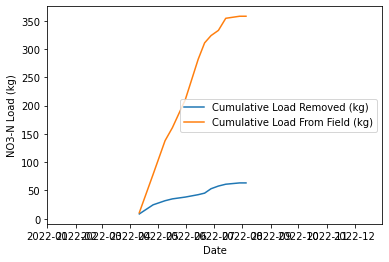

# ABE 516 Project Data Processing 3

## Nitrate Load Calculation


```python
#imports
import pandas as pd
import seaborn as sns
import matplotlib.pyplot as plt
import math
import numpy as np
import datetime as dt

# allow plots to appear directly in the notebook
%matplotlib inline
```

### Read in processed cumulative flow and nitrate concentration files


```python
conc_df = pd.read_csv("no3_conc.csv")
flow_df = pd.read_csv("cumu_flow.csv")
```


```python
conc_df.head()
```


<div>
<style scoped>
    .dataframe tbody tr th:only-of-type {
        vertical-align: middle;
    }

    .dataframe tbody tr th {
        vertical-align: top;
    }

    .dataframe thead th {
        text-align: right;
    }
</style>
<table border="1" class="dataframe">
  <thead>
    <tr style="text-align: right;">
      <th></th>
      <th>Sample Date</th>
      <th>Site ID</th>
      <th>Site Code</th>
      <th>Sample Location</th>
      <th>NO3-N-clean</th>
    </tr>
  </thead>
  <tbody>
    <tr>
      <th>0</th>
      <td>2022-04-11</td>
      <td>SH210101</td>
      <td>SH</td>
      <td>01</td>
      <td>3.3</td>
    </tr>
    <tr>
      <th>1</th>
      <td>2022-04-11</td>
      <td>SH210102</td>
      <td>SH</td>
      <td>02</td>
      <td>0.4</td>
    </tr>
    <tr>
      <th>2</th>
      <td>2022-04-11</td>
      <td>SH210103</td>
      <td>SH</td>
      <td>03</td>
      <td>0.0</td>
    </tr>
    <tr>
      <th>3</th>
      <td>2022-04-11</td>
      <td>SH210104</td>
      <td>SH</td>
      <td>04</td>
      <td>6.1</td>
    </tr>
    <tr>
      <th>4</th>
      <td>2022-04-11</td>
      <td>SH210105</td>
      <td>SH</td>
      <td>05</td>
      <td>5.8</td>
    </tr>
  </tbody>
</table>
</div>


```python
flow_df.head()
```


<div>
<style scoped>
    .dataframe tbody tr th:only-of-type {
        vertical-align: middle;
    }

    .dataframe tbody tr th {
        vertical-align: top;
    }

    .dataframe thead th {
        text-align: right;
    }
</style>
<table border="1" class="dataframe">
  <thead>
    <tr style="text-align: right;">
      <th></th>
      <th>Date</th>
      <th>flow_in_gpm</th>
      <th>flow_bypass_gpm</th>
      <th>flow_treated_daily_avg_gpm</th>
      <th>flow_in_cumu</th>
      <th>flow_bypass_cumu</th>
      <th>flow_treated_cumu</th>
    </tr>
  </thead>
  <tbody>
    <tr>
      <th>0</th>
      <td>2022-01-01</td>
      <td>0.0</td>
      <td>0.0</td>
      <td>0.0</td>
      <td>0.0</td>
      <td>0.0</td>
      <td>0.0</td>
    </tr>
    <tr>
      <th>1</th>
      <td>2022-01-02</td>
      <td>0.0</td>
      <td>0.0</td>
      <td>0.0</td>
      <td>0.0</td>
      <td>0.0</td>
      <td>0.0</td>
    </tr>
    <tr>
      <th>2</th>
      <td>2022-01-03</td>
      <td>0.0</td>
      <td>0.0</td>
      <td>0.0</td>
      <td>0.0</td>
      <td>0.0</td>
      <td>0.0</td>
    </tr>
    <tr>
      <th>3</th>
      <td>2022-01-04</td>
      <td>0.0</td>
      <td>0.0</td>
      <td>0.0</td>
      <td>0.0</td>
      <td>0.0</td>
      <td>0.0</td>
    </tr>
    <tr>
      <th>4</th>
      <td>2022-01-05</td>
      <td>0.0</td>
      <td>0.0</td>
      <td>0.0</td>
      <td>0.0</td>
      <td>0.0</td>
      <td>0.0</td>
    </tr>
  </tbody>
</table>
</div>


```python
conc_df.dtypes
```


    Sample Date         object
    Site ID             object
    Site Code           object
    Sample Location     object
    NO3-N-clean        float64
    dtype: object


```python
conc_df = conc_df.astype({"Site ID":"string",
                       "Site Code":"string",
                       "Sample Location":"string", 
                        })
conc_df["Sample Date"] = pd.to_datetime(conc_df["Sample Date"])
conc_df.dtypes
```


    Sample Date        datetime64[ns]
    Site ID                    string
    Site Code                  string
    Sample Location            string
    NO3-N-clean               float64
    dtype: object


**Extract Unique Sample Dates**


```python
sample_dates = pd.DataFrame(conc_df["Sample Date"].unique())
sample_dates
```


<div>
<style scoped>
    .dataframe tbody tr th:only-of-type {
        vertical-align: middle;
    }

    .dataframe tbody tr th {
        vertical-align: top;
    }

    .dataframe thead th {
        text-align: right;
    }
</style>
<table border="1" class="dataframe">
  <thead>
    <tr style="text-align: right;">
      <th></th>
      <th>0</th>
    </tr>
  </thead>
  <tbody>
    <tr>
      <th>0</th>
      <td>2022-04-11</td>
    </tr>
    <tr>
      <th>1</th>
      <td>2021-12-31</td>
    </tr>
    <tr>
      <th>2</th>
      <td>2022-04-26</td>
    </tr>
    <tr>
      <th>3</th>
      <td>2022-05-09</td>
    </tr>
    <tr>
      <th>4</th>
      <td>2022-05-17</td>
    </tr>
    <tr>
      <th>5</th>
      <td>2022-05-31</td>
    </tr>
    <tr>
      <th>6</th>
      <td>2022-06-14</td>
    </tr>
    <tr>
      <th>7</th>
      <td>2022-06-21</td>
    </tr>
    <tr>
      <th>8</th>
      <td>2022-06-28</td>
    </tr>
    <tr>
      <th>9</th>
      <td>2022-07-06</td>
    </tr>
    <tr>
      <th>10</th>
      <td>2022-07-14</td>
    </tr>
    <tr>
      <th>11</th>
      <td>2022-07-29</td>
    </tr>
    <tr>
      <th>12</th>
      <td>2022-08-05</td>
    </tr>
  </tbody>
</table>
</div>


```python
# Add well groups to concentration data
conc_df["well_group"] = np.where((conc_df["Sample Location"] == "01") | 
                                 (conc_df["Sample Location"] == "04"), "fieldside", conc_df["well_group"])
conc_df["well_group"] = np.where((conc_df["Sample Location"] == "02") | 
                                 (conc_df["Sample Location"] == "05"), "mid", conc_df["well_group"])
conc_df["well_group"] = np.where((conc_df["Sample Location"] == "03") | 
                                 (conc_df["Sample Location"] == "06"), "streamside", conc_df["well_group"])
conc_df["well_group"] = np.where((conc_df["Sample Location"] == "BX"), "box", conc_df["well_group"])
conc_df["well_group"] = np.where((conc_df["Sample Location"] == "CK"), "stream", conc_df["well_group"])
conc_df["well_group"] = np.where((conc_df["Sample Location"] == "BL"), "blank", conc_df["well_group"])
```


```python
conc_df[0:25]
```


<div>
<style scoped>
    .dataframe tbody tr th:only-of-type {
        vertical-align: middle;
    }

    .dataframe tbody tr th {
        vertical-align: top;
    }

    .dataframe thead th {
        text-align: right;
    }
</style>
<table border="1" class="dataframe">
  <thead>
    <tr style="text-align: right;">
      <th></th>
      <th>Sample Date</th>
      <th>Site ID</th>
      <th>Site Code</th>
      <th>Sample Location</th>
      <th>NO3-N-clean</th>
      <th>well_group</th>
    </tr>
  </thead>
  <tbody>
    <tr>
      <th>0</th>
      <td>2022-04-11</td>
      <td>SH210101</td>
      <td>SH</td>
      <td>01</td>
      <td>3.3</td>
      <td>fieldside</td>
    </tr>
    <tr>
      <th>1</th>
      <td>2022-04-11</td>
      <td>SH210102</td>
      <td>SH</td>
      <td>02</td>
      <td>0.4</td>
      <td>mid</td>
    </tr>
    <tr>
      <th>2</th>
      <td>2022-04-11</td>
      <td>SH210103</td>
      <td>SH</td>
      <td>03</td>
      <td>0.0</td>
      <td>streamside</td>
    </tr>
    <tr>
      <th>3</th>
      <td>2022-04-11</td>
      <td>SH210104</td>
      <td>SH</td>
      <td>04</td>
      <td>6.1</td>
      <td>fieldside</td>
    </tr>
    <tr>
      <th>4</th>
      <td>2022-04-11</td>
      <td>SH210105</td>
      <td>SH</td>
      <td>05</td>
      <td>5.8</td>
      <td>mid</td>
    </tr>
    <tr>
      <th>5</th>
      <td>2022-04-11</td>
      <td>SH210106</td>
      <td>SH</td>
      <td>06</td>
      <td>1.9</td>
      <td>streamside</td>
    </tr>
    <tr>
      <th>6</th>
      <td>2022-04-11</td>
      <td>SH2101BX</td>
      <td>SH</td>
      <td>BX</td>
      <td>11.2</td>
      <td>box</td>
    </tr>
    <tr>
      <th>7</th>
      <td>2022-04-11</td>
      <td>SH2101CK</td>
      <td>SH</td>
      <td>CK</td>
      <td>13.6</td>
      <td>stream</td>
    </tr>
    <tr>
      <th>8</th>
      <td>2021-12-31</td>
      <td>000000BL</td>
      <td>00</td>
      <td>BL</td>
      <td>0.0</td>
      <td>blank</td>
    </tr>
    <tr>
      <th>9</th>
      <td>2022-04-26</td>
      <td>SH211601</td>
      <td>SH</td>
      <td>01</td>
      <td>2.2</td>
      <td>fieldside</td>
    </tr>
    <tr>
      <th>10</th>
      <td>2022-04-26</td>
      <td>SH211602</td>
      <td>SH</td>
      <td>02</td>
      <td>0.6</td>
      <td>mid</td>
    </tr>
    <tr>
      <th>11</th>
      <td>2022-04-26</td>
      <td>SH211603</td>
      <td>SH</td>
      <td>03</td>
      <td>0.0</td>
      <td>streamside</td>
    </tr>
    <tr>
      <th>12</th>
      <td>2022-04-26</td>
      <td>SH211604</td>
      <td>SH</td>
      <td>04</td>
      <td>5.9</td>
      <td>fieldside</td>
    </tr>
    <tr>
      <th>13</th>
      <td>2022-04-26</td>
      <td>SH211605</td>
      <td>SH</td>
      <td>05</td>
      <td>6.6</td>
      <td>mid</td>
    </tr>
    <tr>
      <th>14</th>
      <td>2022-04-26</td>
      <td>SH211606</td>
      <td>SH</td>
      <td>06</td>
      <td>4.0</td>
      <td>streamside</td>
    </tr>
    <tr>
      <th>15</th>
      <td>2022-04-26</td>
      <td>SH2116BX</td>
      <td>SH</td>
      <td>BX</td>
      <td>18.9</td>
      <td>box</td>
    </tr>
    <tr>
      <th>16</th>
      <td>2022-04-26</td>
      <td>SH2116CK</td>
      <td>SH</td>
      <td>CK</td>
      <td>13.8</td>
      <td>stream</td>
    </tr>
    <tr>
      <th>17</th>
      <td>2021-12-31</td>
      <td>000000BL</td>
      <td>00</td>
      <td>BL</td>
      <td>0.0</td>
      <td>blank</td>
    </tr>
    <tr>
      <th>18</th>
      <td>2022-05-09</td>
      <td>SH212901</td>
      <td>SH</td>
      <td>01</td>
      <td>0.8</td>
      <td>fieldside</td>
    </tr>
    <tr>
      <th>19</th>
      <td>2022-05-09</td>
      <td>SH212902</td>
      <td>SH</td>
      <td>02</td>
      <td>0.0</td>
      <td>mid</td>
    </tr>
    <tr>
      <th>20</th>
      <td>2022-05-09</td>
      <td>SH212903</td>
      <td>SH</td>
      <td>03</td>
      <td>0.0</td>
      <td>streamside</td>
    </tr>
    <tr>
      <th>21</th>
      <td>2022-05-09</td>
      <td>SH212904</td>
      <td>SH</td>
      <td>04</td>
      <td>5.4</td>
      <td>fieldside</td>
    </tr>
    <tr>
      <th>22</th>
      <td>2022-05-09</td>
      <td>SH212905</td>
      <td>SH</td>
      <td>05</td>
      <td>3.2</td>
      <td>mid</td>
    </tr>
    <tr>
      <th>23</th>
      <td>2022-05-09</td>
      <td>SH212906</td>
      <td>SH</td>
      <td>06</td>
      <td>3.6</td>
      <td>streamside</td>
    </tr>
    <tr>
      <th>24</th>
      <td>2022-05-09</td>
      <td>SH2129BX</td>
      <td>SH</td>
      <td>BX</td>
      <td>23.5</td>
      <td>box</td>
    </tr>
  </tbody>
</table>
</div>


```python
#Average concentration by well group
conc_df2 = conc_df.groupby(["Sample Date", "well_group"])["NO3-N-clean"].mean()
conc_df2 = pd.DataFrame(conc_df2)
conc_df2 = conc_df2.reset_index()
conc_df2[0:15]
```


<div>
<style scoped>
    .dataframe tbody tr th:only-of-type {
        vertical-align: middle;
    }

    .dataframe tbody tr th {
        vertical-align: top;
    }

    .dataframe thead th {
        text-align: right;
    }
</style>
<table border="1" class="dataframe">
  <thead>
    <tr style="text-align: right;">
      <th></th>
      <th>Sample Date</th>
      <th>well_group</th>
      <th>NO3-N-clean</th>
    </tr>
  </thead>
  <tbody>
    <tr>
      <th>0</th>
      <td>2021-12-31</td>
      <td>blank</td>
      <td>0.00</td>
    </tr>
    <tr>
      <th>1</th>
      <td>2022-04-11</td>
      <td>box</td>
      <td>11.20</td>
    </tr>
    <tr>
      <th>2</th>
      <td>2022-04-11</td>
      <td>fieldside</td>
      <td>4.70</td>
    </tr>
    <tr>
      <th>3</th>
      <td>2022-04-11</td>
      <td>mid</td>
      <td>3.10</td>
    </tr>
    <tr>
      <th>4</th>
      <td>2022-04-11</td>
      <td>stream</td>
      <td>13.60</td>
    </tr>
    <tr>
      <th>5</th>
      <td>2022-04-11</td>
      <td>streamside</td>
      <td>0.95</td>
    </tr>
    <tr>
      <th>6</th>
      <td>2022-04-26</td>
      <td>box</td>
      <td>18.90</td>
    </tr>
    <tr>
      <th>7</th>
      <td>2022-04-26</td>
      <td>fieldside</td>
      <td>4.05</td>
    </tr>
    <tr>
      <th>8</th>
      <td>2022-04-26</td>
      <td>mid</td>
      <td>3.60</td>
    </tr>
    <tr>
      <th>9</th>
      <td>2022-04-26</td>
      <td>stream</td>
      <td>13.80</td>
    </tr>
    <tr>
      <th>10</th>
      <td>2022-04-26</td>
      <td>streamside</td>
      <td>2.00</td>
    </tr>
    <tr>
      <th>11</th>
      <td>2022-05-09</td>
      <td>box</td>
      <td>23.50</td>
    </tr>
    <tr>
      <th>12</th>
      <td>2022-05-09</td>
      <td>fieldside</td>
      <td>3.10</td>
    </tr>
    <tr>
      <th>13</th>
      <td>2022-05-09</td>
      <td>mid</td>
      <td>1.60</td>
    </tr>
    <tr>
      <th>14</th>
      <td>2022-05-09</td>
      <td>stream</td>
      <td>15.60</td>
    </tr>
  </tbody>
</table>
</div>


```python
conc_df3 = pd.pivot(conc_df2, index = "Sample Date", columns = "well_group", values = "NO3-N-clean")
conc_df3 = conc_df3.reset_index()
conc_df3.head()
```


<div>
<style scoped>
    .dataframe tbody tr th:only-of-type {
        vertical-align: middle;
    }

    .dataframe tbody tr th {
        vertical-align: top;
    }

    .dataframe thead th {
        text-align: right;
    }
</style>
<table border="1" class="dataframe">
  <thead>
    <tr style="text-align: right;">
      <th>well_group</th>
      <th>Sample Date</th>
      <th>blank</th>
      <th>box</th>
      <th>fieldside</th>
      <th>mid</th>
      <th>stream</th>
      <th>streamside</th>
    </tr>
  </thead>
  <tbody>
    <tr>
      <th>0</th>
      <td>2021-12-31</td>
      <td>0.0</td>
      <td>NaN</td>
      <td>NaN</td>
      <td>NaN</td>
      <td>NaN</td>
      <td>NaN</td>
    </tr>
    <tr>
      <th>1</th>
      <td>2022-04-11</td>
      <td>NaN</td>
      <td>11.20</td>
      <td>4.7000</td>
      <td>3.1000</td>
      <td>13.60</td>
      <td>0.9500</td>
    </tr>
    <tr>
      <th>2</th>
      <td>2022-04-26</td>
      <td>NaN</td>
      <td>18.90</td>
      <td>4.0500</td>
      <td>3.6000</td>
      <td>13.80</td>
      <td>2.0000</td>
    </tr>
    <tr>
      <th>3</th>
      <td>2022-05-09</td>
      <td>NaN</td>
      <td>23.50</td>
      <td>3.1000</td>
      <td>1.6000</td>
      <td>15.60</td>
      <td>1.8000</td>
    </tr>
    <tr>
      <th>4</th>
      <td>2022-05-17</td>
      <td>NaN</td>
      <td>21.39</td>
      <td>4.3425</td>
      <td>2.2475</td>
      <td>17.97</td>
      <td>1.4875</td>
    </tr>
  </tbody>
</table>
</div>


```python
conc_df3.dtypes
```


    well_group
    Sample Date    datetime64[ns]
    blank                 float64
    box                   float64
    fieldside             float64
    mid                   float64
    stream                float64
    streamside            float64
    dtype: object


```python
samples_flow_df = flow_df.loc[flow_df["Date"].isin(sample_dates[0])]
samples_flow_df = conc_flow_df.reset_index(drop=True)
samples_flow_df.rename(columns = {"Date":"Sample Date"}, inplace = True)
samples_flow_df[0:15]
```


<div>
<style scoped>
    .dataframe tbody tr th:only-of-type {
        vertical-align: middle;
    }

    .dataframe tbody tr th {
        vertical-align: top;
    }

    .dataframe thead th {
        text-align: right;
    }
</style>
<table border="1" class="dataframe">
  <thead>
    <tr style="text-align: right;">
      <th></th>
      <th>Sample Date</th>
      <th>flow_in_gpm</th>
      <th>flow_bypass_gpm</th>
      <th>flow_treated_daily_avg_gpm</th>
      <th>flow_in_cumu</th>
      <th>flow_bypass_cumu</th>
      <th>flow_treated_cumu</th>
    </tr>
  </thead>
  <tbody>
    <tr>
      <th>0</th>
      <td>2022-04-11</td>
      <td>1.531902</td>
      <td>0.000000</td>
      <td>1.531902</td>
      <td>174.826753</td>
      <td>22.792443</td>
      <td>152.034310</td>
    </tr>
    <tr>
      <th>1</th>
      <td>2022-04-26</td>
      <td>29.210554</td>
      <td>25.845161</td>
      <td>3.365393</td>
      <td>832.193502</td>
      <td>510.603255</td>
      <td>326.703352</td>
    </tr>
    <tr>
      <th>2</th>
      <td>2022-05-09</td>
      <td>82.595954</td>
      <td>106.099928</td>
      <td>0.000000</td>
      <td>1297.037233</td>
      <td>988.759559</td>
      <td>387.884079</td>
    </tr>
    <tr>
      <th>3</th>
      <td>2022-05-17</td>
      <td>15.335463</td>
      <td>9.221809</td>
      <td>6.113654</td>
      <td>1494.805670</td>
      <td>1166.168314</td>
      <td>417.973454</td>
    </tr>
    <tr>
      <th>4</th>
      <td>2022-05-31</td>
      <td>18.903223</td>
      <td>15.843741</td>
      <td>3.059482</td>
      <td>1843.684384</td>
      <td>1529.795369</td>
      <td>442.837762</td>
    </tr>
    <tr>
      <th>5</th>
      <td>2022-06-14</td>
      <td>20.399919</td>
      <td>16.090717</td>
      <td>4.309202</td>
      <td>2297.308846</td>
      <td>2038.672836</td>
      <td>472.033629</td>
    </tr>
    <tr>
      <th>6</th>
      <td>2022-06-21</td>
      <td>17.295003</td>
      <td>9.141324</td>
      <td>8.153679</td>
      <td>2488.646183</td>
      <td>2233.649192</td>
      <td>492.895132</td>
    </tr>
    <tr>
      <th>7</th>
      <td>2022-06-28</td>
      <td>8.126857</td>
      <td>0.123793</td>
      <td>8.003064</td>
      <td>2573.082362</td>
      <td>2256.517998</td>
      <td>554.462504</td>
    </tr>
    <tr>
      <th>8</th>
      <td>2022-07-06</td>
      <td>8.646066</td>
      <td>2.016111</td>
      <td>6.629955</td>
      <td>2636.723613</td>
      <td>2279.052602</td>
      <td>596.728831</td>
    </tr>
    <tr>
      <th>9</th>
      <td>2022-07-14</td>
      <td>7.132687</td>
      <td>0.394216</td>
      <td>6.738471</td>
      <td>2798.537637</td>
      <td>2429.817985</td>
      <td>637.588160</td>
    </tr>
    <tr>
      <th>10</th>
      <td>2022-07-29</td>
      <td>0.166972</td>
      <td>0.000000</td>
      <td>0.166972</td>
      <td>2829.864353</td>
      <td>2429.821701</td>
      <td>668.911161</td>
    </tr>
    <tr>
      <th>11</th>
      <td>2022-08-05</td>
      <td>0.000000</td>
      <td>0.000000</td>
      <td>0.000000</td>
      <td>2829.958720</td>
      <td>2429.821701</td>
      <td>669.005528</td>
    </tr>
  </tbody>
</table>
</div>


```python
samples_flow_df.dtypes
```


    Sample Date                    object
    flow_in_gpm                   float64
    flow_bypass_gpm               float64
    flow_treated_daily_avg_gpm    float64
    flow_in_cumu                  float64
    flow_bypass_cumu              float64
    flow_treated_cumu             float64
    dtype: object


```python
samples_flow_df["Sample Date"] = pd.to_datetime(samples_flow_df["Sample Date"])
```


```python
flow_conc_df = pd.merge(conc_df3, samples_flow_df, on = "Sample Date", how = "inner")
flow_conc_df[0:15]
flow_conc_df = flow_conc_df.drop(["blank","flow_in_gpm","flow_bypass_gpm","flow_treated_daily_avg_gpm"],  axis = 1)
```


```python
flow_conc_df
```


<div>
<style scoped>
    .dataframe tbody tr th:only-of-type {
        vertical-align: middle;
    }

    .dataframe tbody tr th {
        vertical-align: top;
    }

    .dataframe thead th {
        text-align: right;
    }
</style>
<table border="1" class="dataframe">
  <thead>
    <tr style="text-align: right;">
      <th></th>
      <th>Sample Date</th>
      <th>box</th>
      <th>fieldside</th>
      <th>mid</th>
      <th>stream</th>
      <th>streamside</th>
      <th>flow_in_cumu</th>
      <th>flow_bypass_cumu</th>
      <th>flow_treated_cumu</th>
    </tr>
  </thead>
  <tbody>
    <tr>
      <th>0</th>
      <td>2022-04-11</td>
      <td>11.2000</td>
      <td>4.70000</td>
      <td>3.100000</td>
      <td>13.6000</td>
      <td>0.950000</td>
      <td>174.826753</td>
      <td>22.792443</td>
      <td>152.034310</td>
    </tr>
    <tr>
      <th>1</th>
      <td>2022-04-26</td>
      <td>18.9000</td>
      <td>4.05000</td>
      <td>3.600000</td>
      <td>13.8000</td>
      <td>2.000000</td>
      <td>832.193502</td>
      <td>510.603255</td>
      <td>326.703352</td>
    </tr>
    <tr>
      <th>2</th>
      <td>2022-05-09</td>
      <td>23.5000</td>
      <td>3.10000</td>
      <td>1.600000</td>
      <td>15.6000</td>
      <td>1.800000</td>
      <td>1297.037233</td>
      <td>988.759559</td>
      <td>387.884079</td>
    </tr>
    <tr>
      <th>3</th>
      <td>2022-05-17</td>
      <td>21.3900</td>
      <td>4.34250</td>
      <td>2.247500</td>
      <td>17.9700</td>
      <td>1.487500</td>
      <td>1494.805670</td>
      <td>1166.168314</td>
      <td>417.973454</td>
    </tr>
    <tr>
      <th>4</th>
      <td>2022-05-31</td>
      <td>26.0300</td>
      <td>8.33000</td>
      <td>5.520000</td>
      <td>20.2200</td>
      <td>2.495000</td>
      <td>1843.684384</td>
      <td>1529.795369</td>
      <td>442.837762</td>
    </tr>
    <tr>
      <th>5</th>
      <td>2022-06-14</td>
      <td>28.8500</td>
      <td>3.95500</td>
      <td>7.265000</td>
      <td>23.1900</td>
      <td>2.320000</td>
      <td>2297.308846</td>
      <td>2038.672836</td>
      <td>472.033629</td>
    </tr>
    <tr>
      <th>6</th>
      <td>2022-06-21</td>
      <td>27.8500</td>
      <td>11.08500</td>
      <td>4.990000</td>
      <td>22.3100</td>
      <td>3.795000</td>
      <td>2488.646183</td>
      <td>2233.649192</td>
      <td>492.895132</td>
    </tr>
    <tr>
      <th>7</th>
      <td>2022-06-28</td>
      <td>28.0200</td>
      <td>17.16500</td>
      <td>9.030000</td>
      <td>22.5700</td>
      <td>4.805000</td>
      <td>2573.082362</td>
      <td>2256.517998</td>
      <td>554.462504</td>
    </tr>
    <tr>
      <th>8</th>
      <td>2022-07-06</td>
      <td>26.4570</td>
      <td>16.08250</td>
      <td>9.720500</td>
      <td>19.8670</td>
      <td>5.868175</td>
      <td>2636.723613</td>
      <td>2279.052602</td>
      <td>596.728831</td>
    </tr>
    <tr>
      <th>9</th>
      <td>2022-07-14</td>
      <td>24.2670</td>
      <td>17.25275</td>
      <td>8.929125</td>
      <td>18.4815</td>
      <td>9.771200</td>
      <td>2798.537637</td>
      <td>2429.817985</td>
      <td>637.588160</td>
    </tr>
    <tr>
      <th>10</th>
      <td>2022-07-29</td>
      <td>21.0945</td>
      <td>14.99250</td>
      <td>9.803550</td>
      <td>12.8220</td>
      <td>7.629800</td>
      <td>2829.864353</td>
      <td>2429.821701</td>
      <td>668.911161</td>
    </tr>
    <tr>
      <th>11</th>
      <td>2022-08-05</td>
      <td>19.4780</td>
      <td>17.42425</td>
      <td>12.581325</td>
      <td>8.5377</td>
      <td>7.631625</td>
      <td>2829.958720</td>
      <td>2429.821701</td>
      <td>669.005528</td>
    </tr>
  </tbody>
</table>
</div>


```python
flow_conc_df["flow_in_inc"] = flow_conc_df["flow_in_cumu"].diff().fillna(flow_conc_df["flow_in_cumu"])
flow_conc_df["flow_treated_inc"] = flow_conc_df["flow_treated_cumu"].diff().fillna(flow_conc_df["flow_treated_cumu"])
flow_conc_df[0:15]
```


<div>
<style scoped>
    .dataframe tbody tr th:only-of-type {
        vertical-align: middle;
    }

    .dataframe tbody tr th {
        vertical-align: top;
    }

    .dataframe thead th {
        text-align: right;
    }
</style>
<table border="1" class="dataframe">
  <thead>
    <tr style="text-align: right;">
      <th></th>
      <th>Sample Date</th>
      <th>box</th>
      <th>fieldside</th>
      <th>mid</th>
      <th>stream</th>
      <th>streamside</th>
      <th>flow_in_cumu</th>
      <th>flow_bypass_cumu</th>
      <th>flow_treated_cumu</th>
      <th>flow_in_inc</th>
      <th>flow_treated_inc</th>
    </tr>
  </thead>
  <tbody>
    <tr>
      <th>0</th>
      <td>2022-04-11</td>
      <td>11.2000</td>
      <td>4.70000</td>
      <td>3.100000</td>
      <td>13.6000</td>
      <td>0.950000</td>
      <td>174.826753</td>
      <td>22.792443</td>
      <td>152.034310</td>
      <td>174.826753</td>
      <td>152.034310</td>
    </tr>
    <tr>
      <th>1</th>
      <td>2022-04-26</td>
      <td>18.9000</td>
      <td>4.05000</td>
      <td>3.600000</td>
      <td>13.8000</td>
      <td>2.000000</td>
      <td>832.193502</td>
      <td>510.603255</td>
      <td>326.703352</td>
      <td>657.366749</td>
      <td>174.669042</td>
    </tr>
    <tr>
      <th>2</th>
      <td>2022-05-09</td>
      <td>23.5000</td>
      <td>3.10000</td>
      <td>1.600000</td>
      <td>15.6000</td>
      <td>1.800000</td>
      <td>1297.037233</td>
      <td>988.759559</td>
      <td>387.884079</td>
      <td>464.843731</td>
      <td>61.180727</td>
    </tr>
    <tr>
      <th>3</th>
      <td>2022-05-17</td>
      <td>21.3900</td>
      <td>4.34250</td>
      <td>2.247500</td>
      <td>17.9700</td>
      <td>1.487500</td>
      <td>1494.805670</td>
      <td>1166.168314</td>
      <td>417.973454</td>
      <td>197.768437</td>
      <td>30.089375</td>
    </tr>
    <tr>
      <th>4</th>
      <td>2022-05-31</td>
      <td>26.0300</td>
      <td>8.33000</td>
      <td>5.520000</td>
      <td>20.2200</td>
      <td>2.495000</td>
      <td>1843.684384</td>
      <td>1529.795369</td>
      <td>442.837762</td>
      <td>348.878714</td>
      <td>24.864307</td>
    </tr>
    <tr>
      <th>5</th>
      <td>2022-06-14</td>
      <td>28.8500</td>
      <td>3.95500</td>
      <td>7.265000</td>
      <td>23.1900</td>
      <td>2.320000</td>
      <td>2297.308846</td>
      <td>2038.672836</td>
      <td>472.033629</td>
      <td>453.624461</td>
      <td>29.195868</td>
    </tr>
    <tr>
      <th>6</th>
      <td>2022-06-21</td>
      <td>27.8500</td>
      <td>11.08500</td>
      <td>4.990000</td>
      <td>22.3100</td>
      <td>3.795000</td>
      <td>2488.646183</td>
      <td>2233.649192</td>
      <td>492.895132</td>
      <td>191.337338</td>
      <td>20.861503</td>
    </tr>
    <tr>
      <th>7</th>
      <td>2022-06-28</td>
      <td>28.0200</td>
      <td>17.16500</td>
      <td>9.030000</td>
      <td>22.5700</td>
      <td>4.805000</td>
      <td>2573.082362</td>
      <td>2256.517998</td>
      <td>554.462504</td>
      <td>84.436179</td>
      <td>61.567372</td>
    </tr>
    <tr>
      <th>8</th>
      <td>2022-07-06</td>
      <td>26.4570</td>
      <td>16.08250</td>
      <td>9.720500</td>
      <td>19.8670</td>
      <td>5.868175</td>
      <td>2636.723613</td>
      <td>2279.052602</td>
      <td>596.728831</td>
      <td>63.641251</td>
      <td>42.266327</td>
    </tr>
    <tr>
      <th>9</th>
      <td>2022-07-14</td>
      <td>24.2670</td>
      <td>17.25275</td>
      <td>8.929125</td>
      <td>18.4815</td>
      <td>9.771200</td>
      <td>2798.537637</td>
      <td>2429.817985</td>
      <td>637.588160</td>
      <td>161.814024</td>
      <td>40.859329</td>
    </tr>
    <tr>
      <th>10</th>
      <td>2022-07-29</td>
      <td>21.0945</td>
      <td>14.99250</td>
      <td>9.803550</td>
      <td>12.8220</td>
      <td>7.629800</td>
      <td>2829.864353</td>
      <td>2429.821701</td>
      <td>668.911161</td>
      <td>31.326717</td>
      <td>31.323001</td>
    </tr>
    <tr>
      <th>11</th>
      <td>2022-08-05</td>
      <td>19.4780</td>
      <td>17.42425</td>
      <td>12.581325</td>
      <td>8.5377</td>
      <td>7.631625</td>
      <td>2829.958720</td>
      <td>2429.821701</td>
      <td>669.005528</td>
      <td>0.094367</td>
      <td>0.094367</td>
    </tr>
  </tbody>
</table>
</div>


```python
flow_conc_df["Load_in_inc_kg"] = flow_conc_df["box"] * flow_conc_df["flow_in_inc"]*60*24*3.785/1000000
flow_conc_df["Load_diverted_inc_kg"] = flow_conc_df["box"] * flow_conc_df["flow_treated_inc"]*60*24*3.785/1000000
flow_conc_df["Load_removed_inc_kg"] = (flow_conc_df["box"]-flow_conc_df["streamside"]) * flow_conc_df["flow_treated_inc"]*60*24*3.785/1000000
flow_conc_df
```


<div>
<style scoped>
    .dataframe tbody tr th:only-of-type {
        vertical-align: middle;
    }

    .dataframe tbody tr th {
        vertical-align: top;
    }

    .dataframe thead th {
        text-align: right;
    }
</style>
<table border="1" class="dataframe">
  <thead>
    <tr style="text-align: right;">
      <th></th>
      <th>Sample Date</th>
      <th>box</th>
      <th>fieldside</th>
      <th>mid</th>
      <th>stream</th>
      <th>streamside</th>
      <th>flow_in_cumu</th>
      <th>flow_bypass_cumu</th>
      <th>flow_treated_cumu</th>
      <th>flow_in_inc</th>
      <th>flow_treated_inc</th>
      <th>Load_in_inc_kg</th>
      <th>Load_diverted_inc_kg</th>
      <th>Load_removed_inc_kg</th>
    </tr>
  </thead>
  <tbody>
    <tr>
      <th>0</th>
      <td>2022-04-11</td>
      <td>11.2000</td>
      <td>4.70000</td>
      <td>3.100000</td>
      <td>13.6000</td>
      <td>0.950000</td>
      <td>174.826753</td>
      <td>22.792443</td>
      <td>152.034310</td>
      <td>174.826753</td>
      <td>152.034310</td>
      <td>10.672208</td>
      <td>9.280855</td>
      <td>8.493640</td>
    </tr>
    <tr>
      <th>1</th>
      <td>2022-04-26</td>
      <td>18.9000</td>
      <td>4.05000</td>
      <td>3.600000</td>
      <td>13.8000</td>
      <td>2.000000</td>
      <td>832.193502</td>
      <td>510.603255</td>
      <td>326.703352</td>
      <td>657.366749</td>
      <td>174.669042</td>
      <td>67.717032</td>
      <td>17.993105</td>
      <td>16.089073</td>
    </tr>
    <tr>
      <th>2</th>
      <td>2022-05-09</td>
      <td>23.5000</td>
      <td>3.10000</td>
      <td>1.600000</td>
      <td>15.6000</td>
      <td>1.800000</td>
      <td>1297.037233</td>
      <td>988.759559</td>
      <td>387.884079</td>
      <td>464.843731</td>
      <td>61.180727</td>
      <td>59.539230</td>
      <td>7.836297</td>
      <td>7.236070</td>
    </tr>
    <tr>
      <th>3</th>
      <td>2022-05-17</td>
      <td>21.3900</td>
      <td>4.34250</td>
      <td>2.247500</td>
      <td>17.9700</td>
      <td>1.487500</td>
      <td>1494.805670</td>
      <td>1166.168314</td>
      <td>417.973454</td>
      <td>197.768437</td>
      <td>30.089375</td>
      <td>23.056647</td>
      <td>3.507941</td>
      <td>3.263993</td>
    </tr>
    <tr>
      <th>4</th>
      <td>2022-05-31</td>
      <td>26.0300</td>
      <td>8.33000</td>
      <td>5.520000</td>
      <td>20.2200</td>
      <td>2.495000</td>
      <td>1843.684384</td>
      <td>1529.795369</td>
      <td>442.837762</td>
      <td>348.878714</td>
      <td>24.864307</td>
      <td>49.496788</td>
      <td>3.527597</td>
      <td>3.189473</td>
    </tr>
    <tr>
      <th>5</th>
      <td>2022-06-14</td>
      <td>28.8500</td>
      <td>3.95500</td>
      <td>7.265000</td>
      <td>23.1900</td>
      <td>2.320000</td>
      <td>2297.308846</td>
      <td>2038.672836</td>
      <td>472.033629</td>
      <td>453.624461</td>
      <td>29.195868</td>
      <td>71.329743</td>
      <td>4.590876</td>
      <td>4.221697</td>
    </tr>
    <tr>
      <th>6</th>
      <td>2022-06-21</td>
      <td>27.8500</td>
      <td>11.08500</td>
      <td>4.990000</td>
      <td>22.3100</td>
      <td>3.795000</td>
      <td>2488.646183</td>
      <td>2233.649192</td>
      <td>492.895132</td>
      <td>191.337338</td>
      <td>20.861503</td>
      <td>29.043791</td>
      <td>3.166643</td>
      <td>2.735139</td>
    </tr>
    <tr>
      <th>7</th>
      <td>2022-06-28</td>
      <td>28.0200</td>
      <td>17.16500</td>
      <td>9.030000</td>
      <td>22.5700</td>
      <td>4.805000</td>
      <td>2573.082362</td>
      <td>2256.517998</td>
      <td>554.462504</td>
      <td>84.436179</td>
      <td>61.567372</td>
      <td>12.895111</td>
      <td>9.402582</td>
      <td>7.790183</td>
    </tr>
    <tr>
      <th>8</th>
      <td>2022-07-06</td>
      <td>26.4570</td>
      <td>16.08250</td>
      <td>9.720500</td>
      <td>19.8670</td>
      <td>5.868175</td>
      <td>2636.723613</td>
      <td>2279.052602</td>
      <td>596.728831</td>
      <td>63.641251</td>
      <td>42.266327</td>
      <td>9.177147</td>
      <td>6.094856</td>
      <td>4.743014</td>
    </tr>
    <tr>
      <th>9</th>
      <td>2022-07-14</td>
      <td>24.2670</td>
      <td>17.25275</td>
      <td>8.929125</td>
      <td>18.4815</td>
      <td>9.771200</td>
      <td>2798.537637</td>
      <td>2429.817985</td>
      <td>637.588160</td>
      <td>161.814024</td>
      <td>40.859329</td>
      <td>21.402309</td>
      <td>5.404253</td>
      <td>3.228210</td>
    </tr>
    <tr>
      <th>10</th>
      <td>2022-07-29</td>
      <td>21.0945</td>
      <td>14.99250</td>
      <td>9.803550</td>
      <td>12.8220</td>
      <td>7.629800</td>
      <td>2829.864353</td>
      <td>2429.821701</td>
      <td>668.911161</td>
      <td>31.326717</td>
      <td>31.323001</td>
      <td>3.601741</td>
      <td>3.601314</td>
      <td>2.298732</td>
    </tr>
    <tr>
      <th>11</th>
      <td>2022-08-05</td>
      <td>19.4780</td>
      <td>17.42425</td>
      <td>12.581325</td>
      <td>8.5377</td>
      <td>7.631625</td>
      <td>2829.958720</td>
      <td>2429.821701</td>
      <td>669.005528</td>
      <td>0.094367</td>
      <td>0.094367</td>
      <td>0.010018</td>
      <td>0.010018</td>
      <td>0.006093</td>
    </tr>
  </tbody>
</table>
</div>


```python
flow_conc_df["Load_in_cumu_kg"] = np.cumsum(flow_conc_df["Load_in_inc_kg"])
flow_conc_df["Load_diverted_cumu_kg"] = np.cumsum(flow_conc_df["Load_diverted_inc_kg"])
flow_conc_df["Load_removed_cumu_kg"] = np.cumsum(flow_conc_df["Load_removed_inc_kg"])
flow_conc_df
```


<div>
<style scoped>
    .dataframe tbody tr th:only-of-type {
        vertical-align: middle;
    }

    .dataframe tbody tr th {
        vertical-align: top;
    }

    .dataframe thead th {
        text-align: right;
    }
</style>
<table border="1" class="dataframe">
  <thead>
    <tr style="text-align: right;">
      <th></th>
      <th>Sample Date</th>
      <th>box</th>
      <th>fieldside</th>
      <th>mid</th>
      <th>stream</th>
      <th>streamside</th>
      <th>flow_in_cumu</th>
      <th>flow_bypass_cumu</th>
      <th>flow_treated_cumu</th>
      <th>flow_in_inc</th>
      <th>flow_treated_inc</th>
      <th>Load_in_inc_kg</th>
      <th>Load_diverted_inc_kg</th>
      <th>Load_removed_inc_kg</th>
      <th>Load_in_cumu_kg</th>
      <th>Load_diverted_cumu_kg</th>
      <th>Load_removed_cumu_kg</th>
    </tr>
  </thead>
  <tbody>
    <tr>
      <th>0</th>
      <td>2022-04-11</td>
      <td>11.2000</td>
      <td>4.70000</td>
      <td>3.100000</td>
      <td>13.6000</td>
      <td>0.950000</td>
      <td>174.826753</td>
      <td>22.792443</td>
      <td>152.034310</td>
      <td>174.826753</td>
      <td>152.034310</td>
      <td>10.672208</td>
      <td>9.280855</td>
      <td>8.493640</td>
      <td>10.672208</td>
      <td>9.280855</td>
      <td>8.493640</td>
    </tr>
    <tr>
      <th>1</th>
      <td>2022-04-26</td>
      <td>18.9000</td>
      <td>4.05000</td>
      <td>3.600000</td>
      <td>13.8000</td>
      <td>2.000000</td>
      <td>832.193502</td>
      <td>510.603255</td>
      <td>326.703352</td>
      <td>657.366749</td>
      <td>174.669042</td>
      <td>67.717032</td>
      <td>17.993105</td>
      <td>16.089073</td>
      <td>78.389240</td>
      <td>27.273961</td>
      <td>24.582713</td>
    </tr>
    <tr>
      <th>2</th>
      <td>2022-05-09</td>
      <td>23.5000</td>
      <td>3.10000</td>
      <td>1.600000</td>
      <td>15.6000</td>
      <td>1.800000</td>
      <td>1297.037233</td>
      <td>988.759559</td>
      <td>387.884079</td>
      <td>464.843731</td>
      <td>61.180727</td>
      <td>59.539230</td>
      <td>7.836297</td>
      <td>7.236070</td>
      <td>137.928470</td>
      <td>35.110257</td>
      <td>31.818783</td>
    </tr>
    <tr>
      <th>3</th>
      <td>2022-05-17</td>
      <td>21.3900</td>
      <td>4.34250</td>
      <td>2.247500</td>
      <td>17.9700</td>
      <td>1.487500</td>
      <td>1494.805670</td>
      <td>1166.168314</td>
      <td>417.973454</td>
      <td>197.768437</td>
      <td>30.089375</td>
      <td>23.056647</td>
      <td>3.507941</td>
      <td>3.263993</td>
      <td>160.985117</td>
      <td>38.618199</td>
      <td>35.082775</td>
    </tr>
    <tr>
      <th>4</th>
      <td>2022-05-31</td>
      <td>26.0300</td>
      <td>8.33000</td>
      <td>5.520000</td>
      <td>20.2200</td>
      <td>2.495000</td>
      <td>1843.684384</td>
      <td>1529.795369</td>
      <td>442.837762</td>
      <td>348.878714</td>
      <td>24.864307</td>
      <td>49.496788</td>
      <td>3.527597</td>
      <td>3.189473</td>
      <td>210.481905</td>
      <td>42.145795</td>
      <td>38.272248</td>
    </tr>
    <tr>
      <th>5</th>
      <td>2022-06-14</td>
      <td>28.8500</td>
      <td>3.95500</td>
      <td>7.265000</td>
      <td>23.1900</td>
      <td>2.320000</td>
      <td>2297.308846</td>
      <td>2038.672836</td>
      <td>472.033629</td>
      <td>453.624461</td>
      <td>29.195868</td>
      <td>71.329743</td>
      <td>4.590876</td>
      <td>4.221697</td>
      <td>281.811648</td>
      <td>46.736671</td>
      <td>42.493945</td>
    </tr>
    <tr>
      <th>6</th>
      <td>2022-06-21</td>
      <td>27.8500</td>
      <td>11.08500</td>
      <td>4.990000</td>
      <td>22.3100</td>
      <td>3.795000</td>
      <td>2488.646183</td>
      <td>2233.649192</td>
      <td>492.895132</td>
      <td>191.337338</td>
      <td>20.861503</td>
      <td>29.043791</td>
      <td>3.166643</td>
      <td>2.735139</td>
      <td>310.855439</td>
      <td>49.903315</td>
      <td>45.229083</td>
    </tr>
    <tr>
      <th>7</th>
      <td>2022-06-28</td>
      <td>28.0200</td>
      <td>17.16500</td>
      <td>9.030000</td>
      <td>22.5700</td>
      <td>4.805000</td>
      <td>2573.082362</td>
      <td>2256.517998</td>
      <td>554.462504</td>
      <td>84.436179</td>
      <td>61.567372</td>
      <td>12.895111</td>
      <td>9.402582</td>
      <td>7.790183</td>
      <td>323.750550</td>
      <td>59.305897</td>
      <td>53.019267</td>
    </tr>
    <tr>
      <th>8</th>
      <td>2022-07-06</td>
      <td>26.4570</td>
      <td>16.08250</td>
      <td>9.720500</td>
      <td>19.8670</td>
      <td>5.868175</td>
      <td>2636.723613</td>
      <td>2279.052602</td>
      <td>596.728831</td>
      <td>63.641251</td>
      <td>42.266327</td>
      <td>9.177147</td>
      <td>6.094856</td>
      <td>4.743014</td>
      <td>332.927696</td>
      <td>65.400753</td>
      <td>57.762281</td>
    </tr>
    <tr>
      <th>9</th>
      <td>2022-07-14</td>
      <td>24.2670</td>
      <td>17.25275</td>
      <td>8.929125</td>
      <td>18.4815</td>
      <td>9.771200</td>
      <td>2798.537637</td>
      <td>2429.817985</td>
      <td>637.588160</td>
      <td>161.814024</td>
      <td>40.859329</td>
      <td>21.402309</td>
      <td>5.404253</td>
      <td>3.228210</td>
      <td>354.330005</td>
      <td>70.805007</td>
      <td>60.990491</td>
    </tr>
    <tr>
      <th>10</th>
      <td>2022-07-29</td>
      <td>21.0945</td>
      <td>14.99250</td>
      <td>9.803550</td>
      <td>12.8220</td>
      <td>7.629800</td>
      <td>2829.864353</td>
      <td>2429.821701</td>
      <td>668.911161</td>
      <td>31.326717</td>
      <td>31.323001</td>
      <td>3.601741</td>
      <td>3.601314</td>
      <td>2.298732</td>
      <td>357.931746</td>
      <td>74.406320</td>
      <td>63.289224</td>
    </tr>
    <tr>
      <th>11</th>
      <td>2022-08-05</td>
      <td>19.4780</td>
      <td>17.42425</td>
      <td>12.581325</td>
      <td>8.5377</td>
      <td>7.631625</td>
      <td>2829.958720</td>
      <td>2429.821701</td>
      <td>669.005528</td>
      <td>0.094367</td>
      <td>0.094367</td>
      <td>0.010018</td>
      <td>0.010018</td>
      <td>0.006093</td>
      <td>357.941764</td>
      <td>74.416339</td>
      <td>63.295317</td>
    </tr>
  </tbody>
</table>
</div>


**Plot Cumulative NO3-N Load Removal**


```python
plt.plot(flow_conc_df["Sample Date"], flow_conc_df["Load_removed_cumu_kg"], label = "Cumulative Load Removed (kg)")
plt.plot(flow_conc_df["Sample Date"], flow_conc_df["Load_in_cumu_kg"], label = "Cumulative Load From Field (kg)")
plt.ylabel("NO3-N Load (kg)")
plt.xlabel("Date")
plt.xlim([dt.date(2022, 1, 1), dt.date(2022, 12, 31)])
plt.legend()
plt.show()
```


    

    


## Create final summary dataset


```python
summary_df = flow_conc_df.tail(1).reset_index(drop = True).drop(
    ["box", "fieldside", "mid", "stream", "streamside", "flow_in_inc", "flow_treated_inc",
    "Load_in_inc_kg", "Load_diverted_inc_kg", "Load_removed_inc_kg"], axis = 1)
summary_df["Year"] = summary_df["Sample Date"].dt.year
summary_df = summary_df.drop("Sample Date", axis =1)
summary_df
```


<div>
<style scoped>
    .dataframe tbody tr th:only-of-type {
        vertical-align: middle;
    }

    .dataframe tbody tr th {
        vertical-align: top;
    }

    .dataframe thead th {
        text-align: right;
    }
</style>
<table border="1" class="dataframe">
  <thead>
    <tr style="text-align: right;">
      <th></th>
      <th>flow_in_cumu</th>
      <th>flow_bypass_cumu</th>
      <th>flow_treated_cumu</th>
      <th>Load_in_cumu_kg</th>
      <th>Load_diverted_cumu_kg</th>
      <th>Load_removed_cumu_kg</th>
      <th>Year</th>
    </tr>
  </thead>
  <tbody>
    <tr>
      <th>0</th>
      <td>2829.95872</td>
      <td>2429.821701</td>
      <td>669.005528</td>
      <td>357.941764</td>
      <td>74.416339</td>
      <td>63.295317</td>
      <td>2022</td>
    </tr>
  </tbody>
</table>
</div>


```python
summary_df["in_buffer_removal_percent"] = summary_df["Load_removed_cumu_kg"] / summary_df["Load_diverted_cumu_kg"] * 100
summary_df["eof_removal_percent"] = summary_df["Load_removed_cumu_kg"] / summary_df["Load_in_cumu_kg"] * 100
summary_df
```


<div>
<style scoped>
    .dataframe tbody tr th:only-of-type {
        vertical-align: middle;
    }

    .dataframe tbody tr th {
        vertical-align: top;
    }

    .dataframe thead th {
        text-align: right;
    }
</style>
<table border="1" class="dataframe">
  <thead>
    <tr style="text-align: right;">
      <th></th>
      <th>flow_in_cumu</th>
      <th>flow_bypass_cumu</th>
      <th>flow_treated_cumu</th>
      <th>Load_in_cumu_kg</th>
      <th>Load_diverted_cumu_kg</th>
      <th>Load_removed_cumu_kg</th>
      <th>Year</th>
      <th>in_buffer_removal_percent</th>
      <th>eof_removal_percent</th>
    </tr>
  </thead>
  <tbody>
    <tr>
      <th>0</th>
      <td>2829.95872</td>
      <td>2429.821701</td>
      <td>669.005528</td>
      <td>357.941764</td>
      <td>74.416339</td>
      <td>63.295317</td>
      <td>2022</td>
      <td>85.055672</td>
      <td>17.683133</td>
    </tr>
  </tbody>
</table>
</div>


```python
drainage_area_ha = 3.4
summary_df["NO3-N_yield_in"] = summary_df["Load_in_cumu_kg"] / drainage_area_ha
summary_df["NO3-N_yield_diverted"] = summary_df["Load_diverted_cumu_kg"] / drainage_area_ha
summary_df["NO3-N_yield_removed"] = summary_df["Load_removed_cumu_kg"] / drainage_area_ha
summary_df
```


<div>
<style scoped>
    .dataframe tbody tr th:only-of-type {
        vertical-align: middle;
    }

    .dataframe tbody tr th {
        vertical-align: top;
    }

    .dataframe thead th {
        text-align: right;
    }
</style>
<table border="1" class="dataframe">
  <thead>
    <tr style="text-align: right;">
      <th></th>
      <th>flow_in_cumu</th>
      <th>flow_bypass_cumu</th>
      <th>flow_treated_cumu</th>
      <th>Load_in_cumu_kg</th>
      <th>Load_diverted_cumu_kg</th>
      <th>Load_removed_cumu_kg</th>
      <th>Year</th>
      <th>in_buffer_removal_percent</th>
      <th>eof_removal_percent</th>
      <th>NO3-N_yield_in</th>
      <th>NO3-N_yield_diverted</th>
      <th>NO3-N_yield_removed</th>
    </tr>
  </thead>
  <tbody>
    <tr>
      <th>0</th>
      <td>2829.95872</td>
      <td>2429.821701</td>
      <td>669.005528</td>
      <td>357.941764</td>
      <td>74.416339</td>
      <td>63.295317</td>
      <td>2022</td>
      <td>85.055672</td>
      <td>17.683133</td>
      <td>105.27699</td>
      <td>21.887158</td>
      <td>18.61627</td>
    </tr>
  </tbody>
</table>
</div>


```python
summary_df.to_csv("SH_2022_summary.csv", index = False)
```
